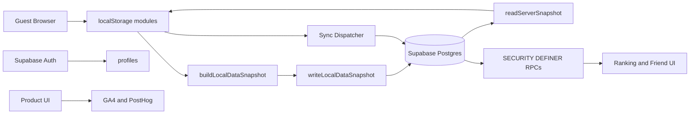
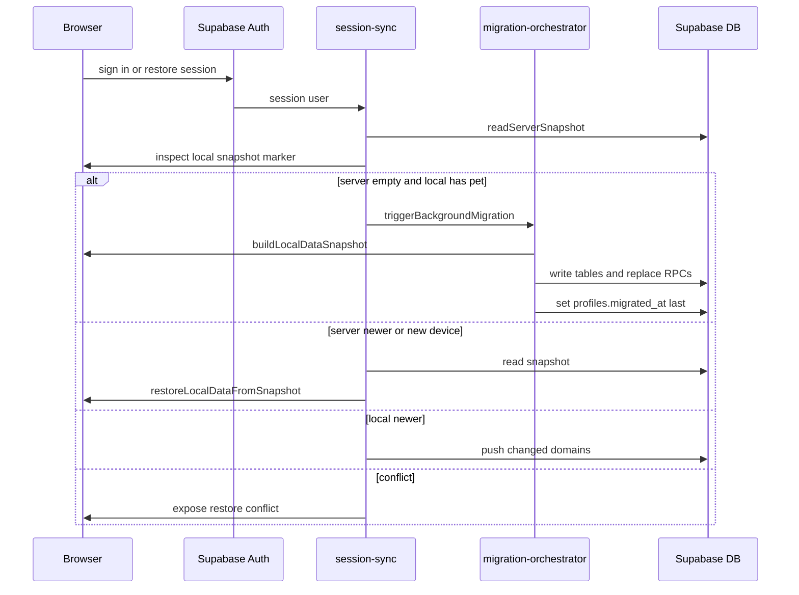
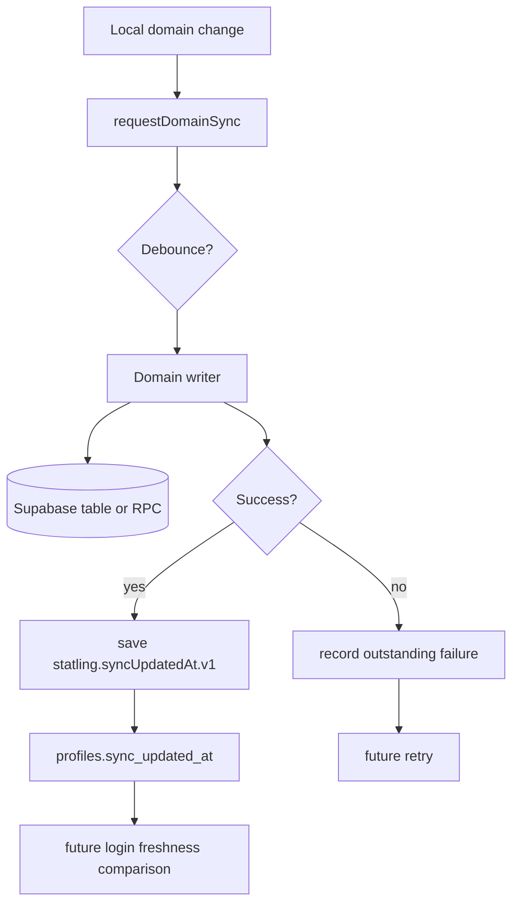
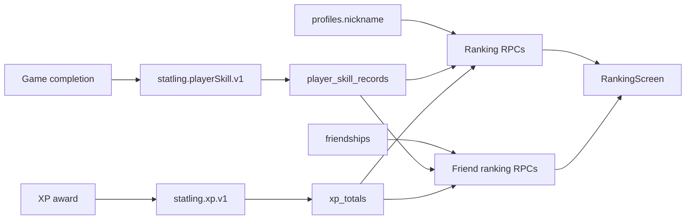
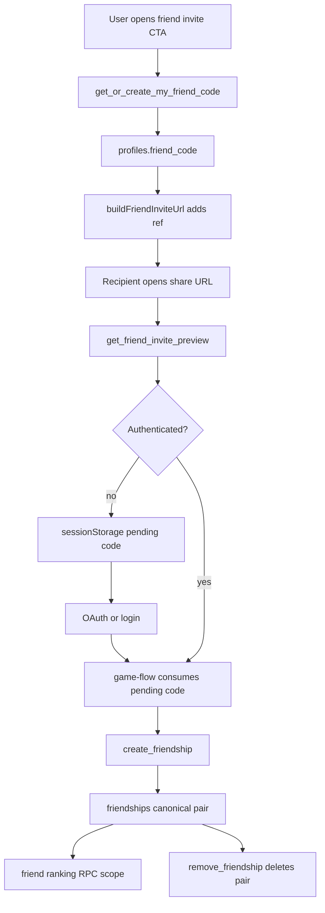

# Statling 데이터 아키텍처

> **기준**: 현재 repository HEAD의 실제 코드와 `supabase/migrations/` 전체를 기준으로 정리했다. 기존 문서는 방향 확인용으로만 보았고, 표와 설명은 migration, import/call chain, storage module, Supabase 호출부를 다시 확인해 작성했다.
> **주의**: 이 문서는 데이터가 "어디에 저장되는지"만 적은 DB 목록이 아니라, guest-first 로컬 데이터가 계정 데이터로 이동하고, 이후 여러 기기에서 복원/동기화되며, RPC/RLS 경계 안에서 보호되는 방식을 설명한다.

---

## 1. 전체 Data Map

Statling의 데이터는 하나의 저장소에만 있지 않다. 브라우저 로컬 상태, Supabase account 상태, RPC로만 계산되는 파생 데이터, analytics 이벤트가 분리되어 있다.

| 분류 | 설명 | 대표 데이터 | 근거 파일 |
|---|---|---|---|
| Device-local | 특정 브라우저/기기에서만 의미가 있는 값 | device id, audio 설정, onboarding seen, landing variant, feedback record, intro progress | `lib/room/room-storage.ts`, `lib/audio/*storage.ts`, `lib/onboarding-storage.ts`, `lib/experiments/landing-variant.ts`, `lib/feedback/feedback-storage.ts`, `lib/game/intro-progress-storage.ts` |
| Local-first + Server synced | guest도 먼저 만들 수 있고, 로그인 후 Supabase로 migration/restore/sync되는 값 | pet, skill records, XP, missions, achievements, care state, room/deco, inventory, Dex | `lib/migration/build-local-snapshot.ts`, `lib/migration/write-local-snapshot.ts`, `lib/migration/read-server-snapshot.ts`, `lib/migration/restore-local-snapshot.ts`, `lib/sync/sync-dispatcher.ts` |
| Server source of truth | 계정 row가 있어야 쓰며 로컬 mirror가 없는 값 | nickname, birth_date, gender, friend_code, friendships | `lib/profile/nickname.ts`, `lib/profile/birthday.ts`, `lib/friends/friend-connection.ts`, `supabase/migrations/*friend*.sql` |
| Derived / RPC-only | 클라이언트가 직접 정렬/집계하지 않고 서버 RPC가 계산하는 값 | global ranking, friend ranking, my rank | `lib/ranking/*leaderboard.ts`, `lib/ranking/friend-*.ts`, ranking RPC migrations |
| Ephemeral | 탭/렌더 생명주기에 묶인 일시 상태 | pending friend invite, ranking scope UI state, auth restore/conflict pending state | `lib/friends/pending-friend-code.ts`, `components/brain-bet/screens/ranking-screen.tsx`, `lib/auth/supabase-auth-provider.tsx` |
| Analytics | 제품 DB와 별개로 전송되는 이벤트 | GA4 custom events, PostHog product events | `lib/analytics/ga.ts`, `lib/analytics/analytics.ts` |

핵심 원칙은 두 가지다. 첫째, gameplay와 care 데이터는 guest-first로 로컬에 먼저 생긴다. 둘째, 계정/친구/랭킹처럼 cross-user 또는 개인정보 경계가 필요한 데이터는 Supabase와 RPC/RLS 안으로 들어간다.

---

## 2. Supabase Schema Catalog

현재 migration 기준 application table은 20개다. `auth.users`는 Supabase Auth의 시스템 테이블이므로 아래 application table 수에는 포함하지 않았다.

| Table | 역할 | 주요 Key | 직접 접근 | RLS | 주요 소비 기능 |
|---|---|---|---|---|---|
| `profiles` | 계정 프로필과 migration/sync marker | PK `id` -> `auth.users.id`; unique `nickname`; unique `friend_code` | profile 저장, migration marker, friend code RPC | 자기 row 접근 중심 | auth, nickname, birthday/profile, friend invite |
| `pets` | 확정 Statling identity와 능력 결과 | PK `user_id`; `character_id`, `statling_name`, `confirmed_at` | migration/sync upsert/read | 자기 row | onboarding, room, share source data |
| `player_skill_records` | 게임별/난이도별 최고 기록 | PK `user_id, game_id, difficulty` | migration/sync, ranking RPC read | 자기 row; ranking은 RPC | free play, ranking, achievements |
| `xp_totals` | 누적/주간 XP | PK `user_id` | migration/sync | 자기 row; ranking은 RPC | XP UI, XP ranking |
| `achievements` | 업적 unlock/claim/notification 상태 | PK `user_id, tier_id`; `claimed_at >= unlocked_at` check | migration/sync | 자기 row | achievements, notifications |
| `daily_missions` | 날짜별 mission 진행 | PK `user_id, date_key, mission_id` | migration/sync | 자기 row | missions |
| `attendance` | 방문/출석 streak | PK `user_id` | migration/restore | 자기 row | attendance rewards |
| `activity_counters` | 누적 행동 카운터 | PK `user_id` | migration/sync | 자기 row | missions, achievements |
| `pet_care_state` | Statling care 수치 | PK `user_id`; 0..100 범위 checks | migration/sync | 자기 row | room care |
| `room_state` | 방 배경 등 단일 room 상태 | PK `user_id` | migration/sync | 자기 row | room |
| `room_items` | 방 배치 item instance | PK `instance_id`; index by `user_id` | replace RPC + sync | 자기 row, delete own | room decoration |
| `room_inventory` | 방 item 보유 여부 | PK `user_id, asset_id` | migration/sync insert | 자기 row; append 성격 | room inventory |
| `room_care_state` | 방 청결 상태 | PK `user_id` | migration/sync | 자기 row | room care |
| `deco_placement_items` | Statling deco 배치 item instance | PK `instance_id`; index by `user_id` | replace RPC + sync | 자기 row, delete own | Statling decoration |
| `deco_inventory` | Statling deco 보유 여부 | PK `user_id, asset_id` | migration/sync insert | 자기 row; append 성격 | deco inventory |
| `pet_memory` | 관계/방문/반응 memory | PK `user_id` | migration/sync | 자기 row | autonomous/dialogue/care reactions |
| `dialogue_memory` | 질문 답변 memory | PK `user_id` | migration/sync | 자기 row | dialogue |
| `user_notes` | 사용자가 남긴 note | PK `id`; index by `user_id` | replace RPC + migration/restore | 자기 row, update 없음 | pet care note |
| `dex_entries` | 만난 Statling catalog id | PK `user_id, character_id` | migration/sync insert | 자기 row; append 성격 | Dex |
| `friendships` | 친구 관계 canonical pair | PK `user_id_a, user_id_b`; check ordered/no self | RPC-only mutation | SELECT own only | friend list/scope ranking |

주요 schema 변화는 phase migration들이 누적해 만든 최종 형태다. 예를 들어 `profiles`는 초기 account/migration row에서 출발해 `sync_updated_at`, `nickname`, `friend_code`, `birth_date`, `gender`를 후속 migration으로 얻었다. `friendships`는 초기 schema가 아니라 friend connection migration에서 추가되었다.

### Constraint / Index 특징

| 영역 | 구조 |
|---|---|
| Identity | 대부분 table은 `user_id uuid references auth.users(id) on delete cascade`를 소유자 키로 둔다. `profiles.id`도 auth user id와 1:1이다. |
| Canonical friendship | `friendships_ordered check (user_id_a < user_id_b)`, `friendships_no_self check (user_id_a <> user_id_b)`로 한 관계를 한 row만 저장한다. |
| Append membership | `room_inventory`, `deco_inventory`, `dex_entries`는 자연키 PK로 중복을 막고, migration/sync는 insert-ignore 성격으로 다룬다. |
| Surrogate instance rows | `room_items`, `deco_placement_items`, `user_notes`는 UUID instance/id를 사용하며, "replace all for this user"는 RPC로 처리한다. |
| Data validity | care 수치 범위, XP/mission counter nonnegative, profile birthday non-future, gender enum check 등이 migration에 있다. |

---

## 3. RPC Catalog

현재 client가 호출하는 distinct RPC는 16개다. migration 파일의 raw function create/replace statement는 24개지만, 여기에는 trigger/helper 함수와 return shape 변경을 위한 재생성 이력이 포함된다.

| RPC | 목적 | 호출 주체 | Auth | SECURITY | 반환값 | 호출 위치 |
|---|---|---|---|---|---|---|
| `replace_room_items` | 한 사용자의 room item snapshot 교체 | migration/sync | authenticated | INVOKER | void/row 없음 | `lib/migration/write-local-snapshot.ts`, sync writer |
| `replace_deco_placement_items` | deco placement snapshot 교체 | migration/sync | authenticated | INVOKER | void/row 없음 | `lib/migration/write-local-snapshot.ts`, sync writer |
| `replace_user_notes` | user notes snapshot 교체 | migration/restore 계열 | authenticated | INVOKER | void/row 없음 | `lib/migration/write-local-snapshot.ts` |
| `get_xp_leaderboard_top` | global XP leaderboard top | ranking UI | authenticated | DEFINER | rank rows | `lib/ranking/xp-leaderboard.ts` |
| `get_my_xp_rank` | 내 XP rank | ranking UI | authenticated | DEFINER | rank row | `lib/ranking/xp-leaderboard.ts` |
| `get_overall_leaderboard_top` | global overall leaderboard top | ranking UI | authenticated | DEFINER | rank rows | `lib/ranking/overall-leaderboard.ts` |
| `get_my_overall_rank` | 내 overall rank | ranking UI | authenticated | DEFINER | rank row | `lib/ranking/overall-leaderboard.ts` |
| `get_game_leaderboard_top` | 게임/난이도별 leaderboard top | ranking UI | authenticated | DEFINER | rank rows | `lib/ranking/game-leaderboard.ts` |
| `get_my_game_rank` | 내 게임/난이도 rank | ranking UI | authenticated | DEFINER | rank row | `lib/ranking/game-leaderboard.ts` |
| `get_or_create_my_friend_code` | 내 opaque invite code lazy 생성/조회 | friend invite UI | authenticated | DEFINER | `friend_code` | `lib/friends/friend-connection.ts` |
| `create_friendship` | friend code로 관계 생성 | invite accept flow | authenticated | DEFINER | `connected`, `nickname`, `is_new_connection` | `lib/friends/friend-connection.ts`, `game-flow.tsx` |
| `remove_friendship` | 친구 관계 삭제 | friend UI | authenticated | DEFINER | `removed` | `lib/friends/friend-connection.ts` |
| `get_friend_overall_ranking` | 친구 scope overall ranking | ranking UI | authenticated | DEFINER | rank rows | `lib/ranking/friend-overall-ranking.ts` |
| `get_friend_xp_ranking` | 친구 scope XP ranking | ranking UI | authenticated | DEFINER | rank rows | `lib/ranking/friend-xp-ranking.ts` |
| `get_friend_game_ranking` | 친구 scope game ranking | ranking UI | authenticated | DEFINER | rank rows | `lib/ranking/friend-game-ranking.ts` |
| `get_friend_invite_preview` | 익명 invite preview nickname 조회 | share/invite page | anon + authenticated | DEFINER | `nickname` | `lib/friends/friend-invite-preview.ts` |

### Client RPC가 아닌 함수

| 함수 | 역할 |
|---|---|
| `touch_updated_at`, `touch_last_updated_at` | update timestamp trigger helper |
| `handle_new_user` | auth user 생성 시 profile row 준비 |
| `guard_pet_identity_immutable` | 확정 pet identity 불변성 보호 |

`create_friendship`은 return table에 `is_new_connection`을 추가할 때 `CREATE OR REPLACE`가 아니라 `DROP FUNCTION` + `CREATE FUNCTION`으로 갱신되었다. Postgres가 OUT parameter list 변경을 `CREATE OR REPLACE`로 허용하지 않기 때문이다. 이 migration은 grant를 다시 발급한다.

---

## 4. RLS / Security Architecture

### Self-owned data

대부분의 product table은 `auth.uid() = user_id` 또는 `auth.uid() = id` 형태의 RLS로 자기 row만 읽고 쓴다. migration/sync가 직접 table upsert를 해도 이 RLS가 두 번째 안전장치로 남는다.

### SECURITY INVOKER 기본값

세 개 replace RPC는 `SECURITY INVOKER`다. 즉 함수 안의 `DELETE/INSERT`도 caller의 권한과 RLS 아래에서 실행된다. `WHERE user_id = auth.uid()` 같은 함수 내부 방어가 잘못되어도 RLS가 다시 막을 수 있게 만든 구조다.

### SECURITY DEFINER 예외

ranking과 friend 기능은 cross-user read/write가 필요하다. 이 함수들은 `SECURITY DEFINER`지만, 출력 column을 의도적으로 제한한다. friend 계열 RPC는 상대방 raw UUID를 반환하지 않고 nickname, friend_code, boolean, ranking metric 같은 제한된 값만 반환한다.

### RPC-only mutation

`friendships`는 SELECT policy만 있고 INSERT/UPDATE/DELETE grant/policy가 없다. 관계 생성/삭제는 `create_friendship`과 `remove_friendship`만 가능하다. 두 함수는 caller의 `auth.uid()`와 server에서 friend_code로 resolve한 target id로만 canonical pair를 만든다.

### Public / anon surface

`get_friend_invite_preview`가 현재 schema의 유일한 anon-accessible RPC다. 입력은 exact friend_code이고 출력은 nickname 하나다. unknown/blank code는 row 없음으로 처리하며, raw user id나 friendship 여부를 노출하지 않는다. 다른 table/RPC는 anon grant가 없거나 revoke되어 있다.

---

## 5. LocalStorage Catalog

현재 확인한 localStorage key/pattern은 30개다. `${deviceId}`가 붙는 key는 브라우저별 persistent anonymous id인 `statling.deviceId.v1`을 scope로 사용한다.

| Key | 데이터 | 생성/쓰기 | 소비 | Server Sync | 분류 |
|---|---|---|---|---|---|
| `statling.deviceId.v1` | 브라우저별 anonymous device id | `getOrCreateDeviceId` | device-scoped storage modules | 직접 sync 아님 | device-only |
| `statling.petProfile.v3` | local pet/Statling profile | pet onboarding/confirm | game-flow, migration, sync | migration + continuous sync | sync 대상 |
| `statling.playerSkill.v1` | game record/normalized score | game completion | ranking achievements, migration, sync | migration + continuous sync | sync 대상 |
| `statling.xp.v1` | total/weekly XP ledger | XP award | UI, migration, sync | migration + continuous sync | sync 대상 |
| `statling.achievements.v1` | achievement unlock/claim state | achievement evaluator/UI | migration, sync | migration + continuous sync | sync 대상 |
| `statling.achievements.notified.v1` | achievement notification dedupe set | notification module | migration maps to `notified_at` | achievement row 일부로 반영 | sync 보조 |
| `statling.dailyMissions.v1` | daily mission progress | mission module | migration, sync | migration + continuous sync | sync 대상 |
| `statling.attendance.v1` | attendance/streak | attendance module | migration/restore | migration/restore, continuous sync 제외 | migration 대상 |
| `statling.activityCounters.v1` | activity counters | mission/activity code | migration, sync | migration + continuous sync | sync 대상 |
| `statling:petCare:${deviceId}` | care gauges/cooldowns | pet-care module | migration, sync | migration + continuous sync | sync 대상 |
| `statling:petMemory:${deviceId}` | relationship/memory | pet memory module | migration, sync | migration + continuous sync | sync 대상 |
| `statling:roomCare:${deviceId}` | room cleanliness | room care module | migration, sync | migration + continuous sync | sync 대상 |
| `statling:dialogueMemory:${deviceId}` | dialogue answers | dialogue module | migration, sync | migration + continuous sync | sync 대상 |
| `statling:userNotes:${deviceId}` | user notes | note module | migration/restore | migration/restore, continuous sync 제외 | migration 대상 |
| `statling:room:${deviceId}` | room state + item placements | room storage | migration, sync | `room_state`, `room_items`로 분리 | sync 대상 |
| `statling:deco:${deviceId}` | Statling deco placements | deco placement storage | migration, sync | `deco_placement_items` | sync 대상 |
| `statling:decoInventory:${deviceId}` | Statling deco inventory | deco inventory storage | migration, sync | migration + continuous sync | sync 대상 |
| `statling:roomInventory:${deviceId}` | room inventory | room inventory storage | migration, sync | migration + continuous sync | sync 대상 |
| `statling.dex.v1` | met pet internal ids | Dex storage/share page | migration, sync | migration + continuous sync | sync 대상 |
| `statling.introProgress.v1` | intro/assessment checkpoint | intro progress module | onboarding flow | 서버 sync 없음 | device/cache |
| `statling.onboardingSeen.v1` | onboarding seen flag | onboarding storage | UI gating | 서버 sync 없음 | UI preference |
| `statling.landingVariant.v1` | landing A/B variant assignment | experiment module | landing UI/analytics context | 서버 sync 없음 | UI/experiment |
| `statling:feedback:${deviceId}` | per-device feedback record | feedback module | feedback UI | 서버 sync 없음 | device-only |
| `statling:audio:sfxEnabled` | SFX enabled | audio settings | audio manager | 서버 sync 없음 | UI preference |
| `statling:audio:bgmSettings` | BGM volume/track/settings | BGM storage | audio manager | 서버 sync 없음 | UI preference |
| `statling:audio:bgmEnabledOffMigrationV1` | BGM migration marker | BGM storage | BGM migration guard | 서버 sync 없음 | local migration marker |
| `statling:audio:bgmNewTracks202608MigrationV1` | BGM track migration marker | BGM storage | BGM migration guard | 서버 sync 없음 | local migration marker |
| `statling.syncUpdatedAt.v1` | local freshness marker | sync freshness module | session sync conflict decision | `profiles.sync_updated_at`와 비교/갱신 | sync marker |
| `statling:auth:users` | local auth placeholder users | local auth store | local auth backend | Supabase production path 아님 | legacy/dev |
| `statling:auth:session` | local auth placeholder session | local auth store | local auth backend | Supabase production path 아님 | legacy/dev |

`birth_date`, `gender`, `nickname`, `friend_code`, `friendships`는 localStorage mirror가 없다.

---

## 6. SessionStorage

현재 확인한 sessionStorage key는 1개다.

| Key | 데이터 | 생성 | 소비 | 삭제 | 이유 |
|---|---|---|---|---|---|
| `statling.pendingFriendCode.v1` | accept 대기 중인 friend_code | invite CTA | `game-flow.tsx` root effect가 auth 후 `createFriendship` 호출 | 읽은 직후 clear | OAuth hard redirect 뒤에도 같은 탭에서 한 번만 이어가기 위해 |

Friend invite의 핵심 문제는 Google OAuth가 full-page redirect이고 `app/auth/callback/route.ts`가 bare origin으로 돌아오면서 path/query를 보존하지 않는다는 점이다. 그래서 `?ref=`를 URL에만 의존하면 로그인 뒤 accept intent가 사라진다. 반대로 localStorage에 저장하면 며칠 뒤 다른 방문에서 오래된 invite가 되살아날 수 있다. 이 때문에 tab/session 생명주기에 묶이는 sessionStorage가 사용된다.

---

## 7. Authentication Data Flow

### Guest

1. 사용자는 계정 없이 진입한다.
2. onboarding, assessment, pet confirm, game, room/care 데이터가 각 localStorage module에 저장된다.
3. Supabase row는 아직 없다.
4. ranking/friend/profile birthday처럼 계정이 필요한 UI는 gated된다.

### 신규 Login

1. Supabase auth session이 생기면 `SupabaseAuthProvider`가 session을 등록한다.
2. `runSessionSync`가 먼저 server snapshot을 읽는다.
3. server에 pet이 없고 local pet이 있으면 Case D로 one-time migration을 위임한다.
4. `runLocalDataMigration`은 `profiles.migrated_at`을 먼저 확인한다.
5. local pet이 confirmed인데 이름이 아직 없으면 migration을 defer한다.
6. `buildLocalDataSnapshot`이 localStorage를 row snapshot으로 변환한다.
7. `writeLocalDataSnapshot`이 table upsert/RPC replace를 수행한다.
8. 모든 write가 성공한 뒤에만 `profiles.migrated_at`, `legacy_device_id`, `sync_updated_at` marker가 갱신된다.

### 기존 User Login

1. session restore 후 `readServerSnapshot`이 서버 데이터를 읽는다.
2. localStorage가 비어 있고 server pet이 있으면 Case A로 local restore를 수행한다.
3. local/server가 같은 confirmed pet이면 Case B로 freshness를 비교한다.
4. server가 더 새로우면 restore, local이 더 새로우면 catch-up push, 같으면 no-op이다.
5. 서로 다른 confirmed pet이면 Case C conflict로 UI 선택을 기다리고, 그 전에는 localStorage를 덮어쓰지 않는다.

### New Device

빈 localStorage에서 로그인하면 server snapshot이 source가 된다. `restoreLocalDataFromSnapshot`은 module별 writer를 통해 로컬을 채우며, 실패 시 backup/rollback 정책을 둔다.

---

## 8. Migration Architecture

Migration은 로그인 전 localStorage에 쌓인 데이터를 계정 row로 처음 연결하는 과정이다. continuous sync와 같은 것이 아니다.

| 단계 | 함수/파일 | 데이터 |
|---|---|---|
| readiness 판단 | `runLocalDataMigration`, `isLocalPetMigrationReady` | migrated 여부, confirmed/unnamed pet edge case |
| snapshot 생성 | `buildLocalDataSnapshot` | 17개 server-bound localStorage module을 읽어 18개 non-profile table domain row로 변환 |
| server write | `writeLocalDataSnapshot` | 단일 row upsert, natural-key rows, append-only rows, replace RPC |
| marker set | `migration-orchestrator.ts` | 모든 write 성공 후 `profiles.migrated_at`, `legacy_device_id`, `sync_updated_at` |
| 실패 처리 | orchestrator/write result | marker를 쓰지 않으므로 전체 retry 가능 |

`buildLocalDataSnapshot`은 network를 호출하지 않고 localStorage writer도 호출하지 않는다. `writeLocalDataSnapshot`은 `profiles.migrated_at`을 건드리지 않는다. marker를 마지막 한 곳에서만 쓰는 구조가 idempotency의 핵심이다.

서버 row로 쓰는 방식은 네 묶음이다.

| 묶음 | 대상 | 방식 |
|---|---|---|
| Single-row upsert | `pets`, `xp_totals`, `attendance`, `activity_counters`, `pet_care_state`, `room_state`, `room_care_state`, `pet_memory`, `dialogue_memory` | `user_id` 기준 upsert |
| Natural-key rows | `player_skill_records`, `achievements`, `daily_missions` | 복합 PK 기준 upsert |
| Append membership | `room_inventory`, `deco_inventory`, `dex_entries` | insert ignore duplicates |
| Replace snapshot | `room_items`, `deco_placement_items`, `user_notes` | invoker RPC가 사용자 row를 delete 후 insert |

---

## 9. Sync Architecture

Sync는 로그인 이후 변경을 계속 맞추는 과정이다. migration은 "처음 계정에 태우는 일"이고, sync는 "로그인 후 양쪽 freshness를 맞추는 일"이다.

현재 `SyncDomain`은 16개다.

| Domain | Local -> Server | Server -> Local | Trigger | Conflict 정책 |
|---|---|---|---|---|
| `pets` | upsert | restore snapshot | pet confirm/name | session-sync의 pet fingerprint |
| `dex_entries` | insert ignore | restore | Dex update | append 성격, row conflict 낮음 |
| `achievements` | upsert | restore | achievement unlock/claim/notify | row timestamp/freshness 단위 |
| `player_skill_records` | upsert | restore | game completion | best/current record logic 후 push |
| `xp_totals` | upsert | restore | XP award/week rollover | marker freshness |
| `pet_care_state` | debounced upsert | restore | care actions/tick | marker freshness |
| `room_care_state` | debounced upsert | restore | room clean | marker freshness |
| `pet_memory` | debounced upsert | restore | visits/reactions | marker freshness |
| `activity_counters` | debounced upsert | restore | tracked product actions | marker freshness |
| `daily_missions` | debounced upsert | restore | mission progress | marker freshness |
| `dialogue_memory` | debounced upsert | restore | answer updates | marker freshness |
| `room_state` | upsert | restore | room background/state save | marker freshness |
| `room_items` | replace RPC | restore via room storage | room layout save | snapshot replace |
| `deco_placement_items` | replace RPC | restore | deco save | snapshot replace |
| `room_inventory` | insert ignore | restore | unlock | append 성격 |
| `deco_inventory` | insert ignore | restore | unlock | append 성격 |

`attendance`와 `user_notes`는 migration/restore 대상이지만 현재 continuous `SyncDomain`에는 없다. `user_notes`는 replace RPC와 restore path가 있으나 sync dispatcher domain으로는 등록되어 있지 않다.

`_account_marker`는 실제 product domain이 아니라 `profiles.sync_updated_at`를 갱신하기 위한 내부 pseudo-domain이다. outstanding failure가 있으면 account marker를 섣불리 최신으로 찍지 않는다.

---

## 10. Domain별 Data Lifecycle

### Assessment / Ability

Assessment 입력은 최종적으로 pet 선택/확정과 skill/ability 표현에 반영된다. intro progress는 `statling.introProgress.v1`에 저장되지만 서버 domain은 아니다. 확정된 pet identity와 top/second stat은 `pets` row로 migration/sync된다.

### Pet / Statling

생성은 local `statling.petProfile.v3`에서 시작한다. 확정 후 `pets.character_id`, `statling_name`, `confirmed`, `top_stat`, `second_stat`, `confirmed_at`로 서버에 저장된다. confirmed pet identity는 trigger/check로 불변성을 보호한다. new device에서는 `pets` row가 다시 local pet profile로 복원된다.

### Free Play records

게임 완료 시 `statling.playerSkill.v1`에 raw metric, normalized score, completion id가 저장된다. 서버에는 `player_skill_records`로 upsert된다. ranking UI는 local record를 정렬하지 않고 ranking RPC 결과를 사용한다.

### XP

XP는 `statling.xp.v1`에 total/weekly 형태로 쌓이고 `xp_totals`로 sync된다. XP leaderboard는 `xp_totals.total_xp` 기반 RPC가 계산한다.

### Missions

Daily mission과 activity counters는 local-first로 갱신되고 서버의 `daily_missions`, `activity_counters`에 저장된다. `attendance`는 migration/restore table이 있지만 continuous sync domain에는 없다.

### Achievements

`statling.achievements.v1`은 unlock/claim 상태를 저장한다. `statling.achievements.notified.v1`은 notification dedupe set이며, snapshot 변환 시 `achievements.notified_at`로 반영된다. 이 key는 독립 table이 아니라 achievements row의 보조 로컬 상태다.

### Ranking

저장 데이터는 `player_skill_records`, `xp_totals`, `profiles.nickname`, `friendships`다. 순위 자체는 저장하지 않고 RPC에서 계산한다. `ranking-provider.ts`의 local placeholder ranking은 visible Ranking screen 경로가 아니라 rank-based achievement logic에 남아 있는 별도 경로다.

### Dex

Dex는 `statling.dex.v1`에 internal pet id 배열로 저장된다. 서버는 `dex_entries(user_id, character_id)`를 사용한다. share page에서 만난 friend's Statling도 이 internal id로 Dex에 기록된다.

### Friend

`profiles.friend_code`는 128-bit opaque token이다. invite URL에는 `?ref=<friend_code>`가 붙는다. 수락 시 `create_friendship`이 friend_code를 server에서 target user로 resolve하고 `friendships` canonical pair를 insert한다. 친구 ranking은 이 graph를 scope로 사용한다.

### Profile

`nickname`, `birth_date`, `gender`는 Supabase profile row가 source다. `birth_date`와 `gender`는 nullable이고 guest에게 input 자체가 숨겨져 있으며 localStorage mirror가 없다.

---

## 11. Ranking Data Flow

| Ranking 종류 | 저장 원천 | 계산 위치 | Scope |
|---|---|---|---|
| Overall | `player_skill_records.normalized_score` 등 | `get_overall_*` RPC | global |
| Game | `player_skill_records`의 game/difficulty raw metric과 config | `get_game_*` RPC | global |
| XP | `xp_totals.total_xp` | `get_xp_*` RPC | global |
| Friend overall | `friendships` + `player_skill_records` | `get_friend_overall_ranking` | caller + friends |
| Friend game | `friendships` + game records | `get_friend_game_ranking` | caller + friends |
| Friend XP | `friendships` + `xp_totals` | `get_friend_xp_ranking` | caller + friends |

`components/brain-bet/screens/ranking-screen.tsx`는 Supabase ranking modules를 직접 호출한다. `RankingProvider` abstraction은 타입 일부와 achievement path에는 남아 있지만, visible production ranking path의 데이터 provider는 아니다.

---

## 12. Friend Data Flow

### Invite 생성

signed-in user가 explicit friend invite action을 누르면 `get_or_create_my_friend_code`가 `profiles.friend_code`를 lazy 생성/조회한다. `buildFriendInviteUrl`은 일반 share URL을 감싼 뒤 `ref` query만 추가한다.

### Invite 수락

recipient는 `get_friend_invite_preview`로 nickname만 미리 본다. guest라면 pending code를 sessionStorage에 저장하고 로그인으로 이동한다. 로그인 후 root `game-flow.tsx` effect가 pending code를 읽고 즉시 지운 뒤 `create_friendship`을 호출한다.

### Friendship storage

`friendships`는 `user_id_a < user_id_b` canonical pair 한 row만 저장한다. client는 임의 id pair를 insert/delete할 수 없다.

### Friend ranking

friend ranking RPC는 caller의 `auth.uid()`를 기준으로 `friendships` graph를 펼쳐 caller + friends만 포함한다. client가 "포함할 user id 목록"을 넘기지 않는다.

### Delete

삭제는 `remove_friendship` RPC가 caller와 friend_code target으로 pair를 다시 계산해 delete한다.

public/client payload에는 상대방 raw UUID가 나오지 않는다. invite code도 account UUID가 아니라 별도 opaque token이다.

---

## 13. Share URL과 Product Data 분리

| 영역 | 사용하는 identifier | 설명 |
|---|---|---|
| Public share URL | `PetProfile.slug` | `/share/ocean-whale` 같은 ASCII/hyphen URL |
| Legacy URL resolve | `slug` 먼저, 없으면 internal `id` fallback | 기존 공유 링크 유지 |
| Supabase pet row | internal `character_id` | 예: `08_바다고래` 같은 catalog id |
| Dex | internal pet id | `dex_entries.character_id`, `statling.dex.v1` |
| Analytics custom event | internal pet id | `pet_id`/`statling_type` 성격 |
| OG/canonical URL | slug | crawler와 share card에는 slug form 노출 |

`slug`는 share URL 전용 public representation이다. 내부 identity를 slug로 migration하지 않았기 때문에 DB migration 없이 public URL만 개선할 수 있었다.

---

## 14. Analytics Boundary

GA4와 PostHog는 product DB가 아니다. 둘은 같은 사용자 행동 근처에서 별도 이벤트를 보내지만, Supabase row와 같은 source of truth 역할을 하지 않는다.

| 데이터 | GA4/PostHog custom payload 여부 | 비고 |
|---|---|---|
| pet internal id / statling type | 일부 이벤트에 포함 | reveal, friend invite, product events |
| game score / normalized context | 일부 game events에 포함 | ranking source row 자체는 Supabase |
| XP earned / achievement id / mission id | 일부 이벤트에 포함 | 분석용 event payload |
| nickname | custom event payload로 확인되지 않음 | profile DB 값 |
| birth_date / gender | 보내지 않음 | `lib/profile/birthday.ts`, `birthday-screen.tsx`에서 analytics call 없음 |
| friend_code | custom event payload로 보내지 않음 | invite URL query에는 존재 |
| raw user UUID | custom event payload로 노출하지 않음 | Supabase auth 내부 id |

주의할 점은 URL query와 custom event payload가 다르다는 것이다. `?ref=`가 붙은 invite URL을 열면 analytics SDK의 자동 pageview가 현재 URL/query를 수집할 가능성은 있다. 하지만 현재 코드의 GA4/PostHog custom event payload에는 `friend_code`, `birth_date`, `gender`를 직접 넣는 경로가 확인되지 않았다.

---

## 15. Data Ownership Matrix

| Data | Device | Account | Supabase | Analytics | Public |
|---|---:|---:|---:|---:|---:|
| nickname | no | yes | yes | no custom payload 확인 | ranking/friend display |
| birth_date | no | yes | yes | no | no |
| gender | no | yes | yes | no | no |
| pet | yes | yes after login | yes | 일부 event에 internal id | share page |
| assessment score/stat | yes | yes through pet/records | yes 일부 | 일부 event 가능 | no |
| game record | yes | yes | yes | 일부 event | ranking aggregate |
| XP | yes | yes | yes | 일부 event | ranking aggregate |
| achievement | yes | yes | yes | 일부 event | no |
| friend_code | no | yes | yes | custom payload no | invite URL query |
| friendship | no | yes | yes | friend event boolean/context | no raw graph |
| share slug | static app data | no | no DB column | URL/pageview 가능 | yes |

---

## 16. Source of Truth Matrix

| Data | Source of Truth | Local mirror | Restore 가능 | Multi-device |
|---|---|---|---|---|
| pet profile | local before login, Supabase after account migration | yes | yes | yes |
| game records | local-first, Supabase account mirror after login | yes | yes | yes |
| XP | local-first, Supabase account mirror after login | yes | yes | yes |
| achievements | local-first, Supabase account mirror after login | yes | yes | yes |
| achievement notified state | local key, mapped into `achievements.notified_at` | yes | yes | yes after migration/restore |
| missions | local-first + Supabase | yes | yes | yes |
| attendance | local-first + Supabase migration/restore | yes | yes | limited, not continuous domain |
| care/memory/dialogue | local-first + Supabase | yes | yes | yes |
| room/deco/inventory | local-first + Supabase | yes | yes | yes |
| Dex | local-first + Supabase | yes | yes | yes |
| user notes | local-first + Supabase migration/restore | yes | yes | limited, not continuous domain |
| nickname | Supabase | no | n/a | yes |
| birth_date/gender | Supabase | no | n/a | yes |
| friend_code | Supabase | no | n/a | yes |
| friendship | Supabase `friendships` | no | n/a | yes |
| ranking | RPC result derived from Supabase | no | recompute | yes |

---

## 17. Failure / Conflict Scenarios

| Scenario | 현재 처리 |
|---|---|
| guest data + empty server | Case D로 migration 시도 |
| empty local + existing server | Case A로 local restore |
| same pet, freshness differs | Case B로 `sync_updated_at`와 local marker 비교 |
| different confirmed pet | Case C conflict로 사용자 선택 전까지 overwrite 금지 |
| migration 중 일부 write 실패 | `migrated_at`을 쓰지 않으므로 다음에 전체 retry 가능 |
| confirmed but unnamed pet | migration defer, naming 확정 후 retry |
| restore 실패 | restore module의 backup/rollback 정책 |
| network/server snapshot timeout | localStorage를 건드리지 않고 auth ready만 풀어 진행 |
| duplicate friendship | `on conflict do nothing`, `is_new_connection`으로 구분 |
| invalid friend_code | preview는 null/zero row, create는 connected false 성격 |
| self friendship | RPC/check에서 거부 |
| ranking RPC failure | ranking module/UI error path, local fallback으로 global truth를 만들지 않음 |
| malformed localStorage | storage module load guard/default/clamp가 방어 |
| stale local data | session restore 시 marker 비교로 restore/catch-up 결정 |

현재 코드가 처리하지 않는 것을 처리한다고 쓰지 않았다. 예를 들어 friend_code rotation/revocation, analytics 자동 pageview query masking, user_notes continuous sync domain 추가는 현재 구조에 없다.

---

## 18. Known Risks / Technical Debt

| Risk | 근거/영향 |
|---|---|
| local-first와 server mirror의 이중 상태 | migration/sync/restore가 복잡하며, marker/freshness 판단이 잘못되면 stale overwrite 위험이 있다. |
| visible ranking과 local ranking abstraction 분리 | Ranking screen은 RPC 직접 호출, `ranking-provider.ts`는 achievement path에 남아 있어 독자가 오해하기 쉽다. |
| 일부 migration/restore 대상이 continuous sync domain이 아님 | `attendance`, `user_notes`는 현재 `SyncDomain`에 없다. 멀티 디바이스 최신성 기대치를 문서화해야 한다. |
| achievement notification 상태의 이중 표현 | local notified set이 서버 `notified_at`으로 mapping된다. 독립 domain처럼 보이지만 실제로는 achievement row 일부다. |
| friend_code가 capability token 역할 | 별도 accept/approval 단계가 없으므로 code 유출은 연결 시도로 이어질 수 있다. rotation 기능은 없다. |
| anon-accessible RPC 존재 | `get_friend_invite_preview`는 좁지만, anon zero-access 원칙의 명시적 예외다. |
| URL query analytics 노출 가능성 | custom event payload에는 friend_code가 없지만, 자동 pageview가 현재 URL query를 포함할 가능성은 코드만으로 완전히 배제할 수 없다. |
| automated data integrity tests 확인 부족 | migration/RLS/RPC 의도는 주석과 구조가 강하지만, 모든 edge case를 자동 테스트로 검증하는지는 이 문서 작성 범위에서 확인되지 않았다. |

---

## 19. Portfolio Explanation

### 30초 설명

Statling은 guest-first 앱이라서 사용자가 로그인하지 않아도 pet, game record, XP, room 같은 핵심 데이터를 localStorage에 먼저 저장합니다. 로그인하면 그 로컬 snapshot을 Supabase 계정 row로 한 번 migration하고, 이후에는 `sync_updated_at` marker와 domain sync dispatcher로 여러 기기 사이를 맞춥니다. 반면 nickname, birthday, friend graph, ranking처럼 계정/보안 경계가 중요한 데이터는 Supabase와 RPC/RLS 안에서만 처리합니다.

### 1분 설명

이 구조의 핵심은 로컬 경험과 계정 데이터의 책임을 분리한 것입니다. gameplay/care 데이터는 guest가 바로 시작할 수 있어야 하므로 local-first입니다. 하지만 계정을 만들면 `buildLocalDataSnapshot`과 `writeLocalDataSnapshot`이 현재 브라우저의 17개 localStorage module을 서버 row로 변환하고, `profiles.migrated_at`을 마지막에 찍어서 실패 시 안전하게 retry할 수 있게 합니다.

로그인 이후에는 migration이 아니라 sync입니다. session restore 시 server snapshot과 local marker를 비교해 새 기기는 restore하고, 같은 pet이면 freshness로 server/local 중 더 최신 쪽을 선택하며, 서로 다른 confirmed pet이면 conflict로 멈춥니다. Ranking과 friend는 client가 직접 cross-user 데이터를 읽지 않고 `SECURITY DEFINER` RPC가 제한된 output만 반환합니다. 그래서 guest-first UX를 유지하면서도 multi-device restore, friend graph, leaderboard 같은 server-side 기능을 RLS/RPC 경계 안에 넣은 설계라고 설명할 수 있습니다.

---

## 20. 조사 요약

| 항목 | 확인 수 |
|---|---:|
| 조사한 migration 파일 | 14 |
| application table | 20 |
| 현재 client-callable RPC | 16 |
| helper/trigger function | 4 |
| raw function create/replace statement | 24 |
| RLS policy | 56 |
| localStorage key/pattern | 30 |
| sessionStorage key | 1 |
| continuous sync domain | 16 |
| Mermaid diagram | 5 |

최종 Source of Truth 분류는 다음과 같다.

| 분류 | 대표 데이터 |
|---|---|
| Device-local | device id, audio settings, onboarding seen, landing variant, feedback, intro progress |
| Local-first + Server synced | pet, records, XP, missions, achievements, care/memory/dialogue, room/deco/inventory, Dex |
| Server source of truth | nickname, birth_date, gender, friend_code, friendships |
| Derived / RPC-only | global ranking, friend ranking, my rank |
| Ephemeral | pending friend code, ranking scope UI state, auth conflict pending state |
| Analytics | GA4/PostHog event stream, product DB와 별도 |

코드와 기존 문서가 어긋나 보이는 주요 지점은 ranking provider다. 기존 provider comment는 Ranking screen swap seam처럼 읽히지만, 현재 visible Ranking screen은 Supabase RPC modules를 직접 호출한다. provider/local ranking은 achievement 관련 경로에 남아 있다.

코드만으로 확인하지 못한 사항은 운영 환경의 실제 migration apply 방식, analytics dashboard가 URL query를 어떻게 수집/마스킹하는지, 모든 RLS/RPC edge case에 대한 자동 테스트 존재 여부다.

생성 파일: `docs/DATA_ARCHITECTURE.md`
