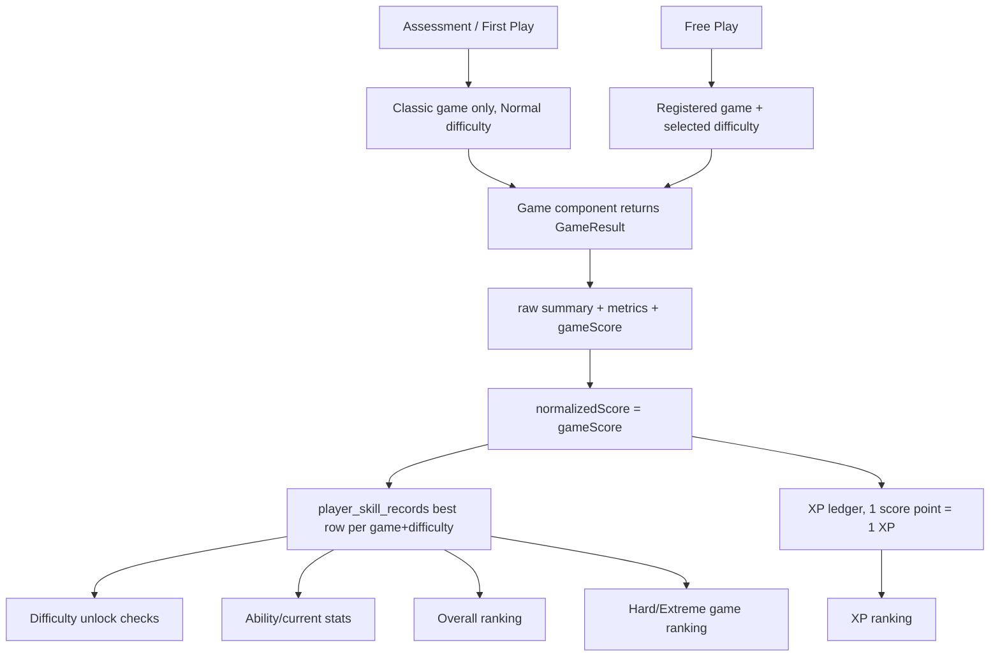

# Statling Game Scoring & Difficulty Specification

> **Source of truth**: current repository code and Supabase migrations at the time this document was written. Existing documentation was used only as orientation; game rules, difficulty values, scoring formulas, ranking metrics, and persistence behavior below were checked against implementation files.
> **Scope**: Free Play mini-games, Assessment scoring, Ability/Stat updates, difficulty unlocks, XP, player skill records, and ranking. This document does not describe pet-care mechanics except where they intersect with mini-game completion.

---

## 1. Game System Overview

Statling has six cognitive stats:

- `reaction`
- `memory`
- `focus`
- `judgment`
- `spatial`
- `reasoning`

`lib/game/game-registry.ts` registers two Free Play games per stat, for **12 total registered Free Play games**. The first game in each stat pool is the classic Assessment-compatible game; the second is a newer Free Play-oriented variant.

The central data path is:



### Assessment vs Free Play

Assessment and Free Play share the same result shape and scoring functions, but they do **not** use exactly the same game surface.

Assessment / First Play:

- Uses only the six classic games, one per stat.
- Starts each classic game through `enterStatGame()` in `components/brain-bet/game-flow.tsx`.
- Always sets `activeDifficulty` to `normal`.
- Several classic games use assessment-specific sequences or mode flags instead of the full Free Play difficulty table.
- Valid first attempts call the same `recordSkillCompletion()` path used by Free Play, so they can create Normal skill records and XP.
- Assessment retry attempts update the local intro result UI but intentionally skip skill record, XP, pet-memory, and mission side effects.

Free Play:

- Uses all 12 games from `GAME_POOL`.
- Lets the user choose `easy`, `normal`, `hard`, or `extreme`, subject to unlock rules.
- Calls the same completion path for valid attempts.
- Writes best skill records, awards XP, schedules Supabase sync, and feeds ranking.

### normalizedScore

There is no second normalization pass inside storage or ranking. In `lib/game/player-skill-storage.ts`, `normalizedScore` is the completed game's `gameScore`, rounded/clamped to `0..100` by the scoring layer before it is recorded.

The practical relationship is:

```text
game-specific raw fields -> scoring function -> gameScore (0..100) -> normalizedScore
```

### Ability / Stat

Each registered game maps to exactly one `StatId` in `lib/game/game-registry.ts`. Player skill records are grouped by stat category. `computeCurrentStats()` in `lib/game/player-skill-storage.ts` computes each current stat as the average representative score across that stat's registered games. Representative records exclude Easy and choose the highest attempted difficulty per game, not necessarily the numerically highest score.

### XP

`recordSkillCompletion()` adds XP using:

```text
addXp(loadXpState(), gameScore)
```

`lib/ranking/xp-ledger.ts` rounds and clamps the amount, so a valid completion awards approximately one XP per normalized score point. XP sync is scheduled through the `xp_totals` domain.

### Ranking

There are three ranking families:

- Overall ranking: averages representative `normalized_score` values by stat, then across the six stats. Easy is excluded.
- Game ranking: Hard/Extreme only, ranked by game-specific raw metric keys stored in `metrics`, not by `normalizedScore`.
- XP ranking: ranked by synced XP totals.

Global game ranking RPCs are in `supabase/migrations/20260827000000_phase3b7_game_leaderboard_rpcs.sql`. Friend-scoped equivalents are in `supabase/migrations/20260829000000_phase3g3_friend_ranking_rpcs.sql`.

---

## 2. Registered Free Play Games

Source: `lib/game/game-registry.ts`.

| game id | 표시 이름 | Ability/Stat | game category/type | component | 지원 난이도 | ranking 지원 여부 | raw record | normalizedScore |
|---|---|---:|---|---|---|---|---|---|
| `reaction-classic` | 신호 반응 | `reaction` | Classic reaction timing | `ReactionGame` | Easy/Normal/Hard/Extreme | Hard/Extreme game ranking | Yes | Yes |
| `reaction-dodge-run` | 장애물 피하기 | `reaction` | Lane dodge survival | `DodgeObstacleGame` | Easy/Normal/Hard/Extreme | Hard/Extreme game ranking | Yes | Yes |
| `memory-classic` | 패턴 기억 | `memory` | Grid memory | `MemoryGame` | Easy/Normal/Hard/Extreme | Hard/Extreme game ranking | Yes | Yes |
| `memory-story-recall` | 물건 기억 | `memory` | Visual object recall | `StoryMemoryGame` | Easy/Normal/Hard/Extreme | Hard/Extreme game ranking | Yes | Yes |
| `focus-classic` | 표적 찾기 | `focus` | Visual target search | `FocusGame` | Easy/Normal/Hard/Extreme | Hard/Extreme game ranking | Yes | Yes |
| `focus-color-target` | 특정 색만 클릭 | `focus` | Stroop/color target | `ColorTargetGame` | Easy/Normal/Hard/Extreme | Hard/Extreme game ranking | Yes | Yes |
| `judgment-classic` | 규칙 전환 | `judgment` | Rule switching | `JudgmentGame` | Easy/Normal/Hard/Extreme | Hard/Extreme game ranking | Yes | Yes |
| `decision-best-choice` | 무엇을 선택할까 | `judgment` | Binary decision/comparison | `BestChoiceGame` | Easy/Normal/Hard/Extreme | Hard/Extreme game ranking | Yes | Yes |
| `spatial-classic` | 회전 도형 찾기 | `spatial` | Mental rotation | `SpatialGame` | Easy/Normal/Hard/Extreme | Hard/Extreme game ranking | Yes | Yes |
| `spatial-fit-puzzle` | 퍼즐 맞추기 | `spatial` | Shape fitting puzzle | `FitPuzzleGame` | Easy/Normal/Hard/Extreme | Hard/Extreme game ranking | Yes | Yes |
| `reasoning-classic` | 규칙 찾기 | `reasoning` | Logical pattern reasoning | `ReasoningGame` | Easy/Normal/Hard/Extreme | Hard/Extreme game ranking | Yes | Yes |
| `reasoning-number-pattern` | 숫자 규칙 | `reasoning` | Number sequence reasoning | `NumberPatternGame` | Easy/Normal/Hard/Extreme | Hard/Extreme game ranking | Yes | Yes |

All 12 games can produce `MiniGamePerformanceRecord` entries. Game ranking RPCs accept only `hard` and `extreme`; Easy/Normal records still exist locally and in Supabase, but are not exposed through game leaderboard RPCs.

---

## 3. Difficulty System

Source: `lib/game/difficulty.ts`, `lib/config/difficulty.config.ts`, and per-game config files.

Common difficulty order:

```text
easy < normal < hard < extreme
```

Common multipliers:

| difficulty | time multiplier | load multiplier |
|---|---:|---:|
| Easy | `1.35` | `0.7` |
| Normal | `1.0` | `1.0` |
| Hard | `0.8` | `1.25` |
| Extreme | `0.65` | `1.5` |

Not every game uses both multipliers. Some games define explicit per-tier values instead.

### 3.1 `reaction-classic`

Sources: `lib/config/reaction.config.ts`, `lib/scoring/reaction.ts`.

| Field | Easy | Normal | Hard | Extreme |
|---|---:|---:|---:|---:|
| real trials | 2 | 4 | 6 | 8 |
| practice trials | 1 | 1 | 1 | 1 |
| signal delay | 1500-4000ms | 1500-4000ms | 1500-4000ms | 1500-4000ms |
| decoy chance | 0 | 0 | 0.25 | 0.45 |
| decoy flash | N/A | N/A | 280ms | 280ms |
| false-start penalty | 200ms | 200ms | 200ms | 200ms |
| anti-cheat invalid rule | repeated `<=80ms` reactions | same | same | same |
| 종료 조건 | all trials complete | all trials complete | all trials complete | all trials complete |

Assessment uses a separate fixed count of 3 real trials.

### 3.2 `reaction-dodge-run`

Sources: `lib/config/dodge-obstacle.config.ts`, `lib/scoring/dodge-obstacle.ts`.

| Field | Easy | Normal | Hard | Extreme |
|---|---:|---:|---:|---:|
| mode | fixed-time | fixed-time | fixed-time | endless |
| lane count | 3 | 3 | 3 | 3 |
| duration | 10s | 35s | 40s | no fixed cap |
| initial speed | 150 | 220 | 300 | 380 |
| speed ramp/sec | 3 | 4 | 6 | 8 |
| speed cap | 400 | 550 | 750 | 950 |
| spawn interval | 1700ms | 1400ms | 1100ms | 900ms |
| spawn ramp/sec | 6 | 8 | 10 | 12 |
| spawn floor | 750ms | 650ms | 550ms | 450ms |
| double obstacles | no | unlock 15s, chance 0.3 | unlock 6s, chance 0.5 | unlock 12s, chance 0.3 |
| scripted patterns | no | no | unlock 8s, chance 0.35 | unlock 30s, chance 0.22 |
| green gap patterns | no | no | no | unlock 20s, chance 0.12 |
| failure/종료 조건 | timer ends; collisions allowed | timer ends; collisions allowed | timer ends; collisions allowed | first collision ends run |

Extreme is the only true endless mini-game mode found in the current code.

### 3.3 `memory-classic`

Sources: `lib/config/memory.config.ts`, `lib/scoring/memory.ts`.

| Difficulty | Round 1 | Round 2 | Round 3 | 종료 조건 |
|---|---|---|---|---|
| Easy | 3x3, 3 targets, 1000ms | 3x3, 4 targets, 950ms | 4x4, 5 targets, 900ms | 3 rounds complete |
| Normal | 4x4, 5 targets, 900ms | 4x4, 6 targets, 850ms | 5x5, 7 targets, 800ms | 3 rounds complete |
| Hard | 5x5, 7 targets, 800ms | 5x5, 8 targets, 700ms | 6x6, 9 targets, 650ms | 3 rounds complete |
| Extreme | 6x6, 9 targets, 700ms | 6x6, 10 targets, 600ms | 7x7, 12 targets, 500ms | 3 rounds complete |

Assessment uses a separate sequence: 3x3/4 targets/900ms, 5x5/7 targets/750ms, 6x6/9 targets/650ms.

### 3.4 `memory-story-recall`

Sources: `lib/config/story-memory.config.ts`, `lib/game/story-memory-data.ts`, `lib/scoring/story-memory.ts`.

| Field | Easy | Normal | Hard | Extreme |
|---|---:|---:|---:|---:|
| shown objects | 5 | 7 | 9 | 11 |
| display time | 4s | 5s | 6s | 7s |
| question types | absent | absent | absent, color | absent, color |
| question count | 1 | 1 | 2 | 2 |
| similarity | low | low | medium | high |
| per-question time | 16200ms | 12000ms | 9600ms | 7800ms |
| choices | 4 | 4 | 4 | 4 |
| 종료 조건 | all questions answered/timed out | same | same | same |

The 16200/12000/9600/7800ms values come from base 12000ms multiplied by the common time multiplier.

### 3.5 `focus-classic`

Sources: `lib/config/focus.config.ts`, `lib/scoring/focus.ts`.

| Field | Easy | Normal | Hard | Extreme |
|---|---|---|---|---|
| real grid | 6x6 | 6x6 | 6x6 | 6x6 |
| real rounds | 3 | 3 | 3 | 3 |
| no-target rounds | 1 | 1 | 1 | 1 |
| shape pool | star | star/circle | all 5 shapes | all 5 shapes |
| round placements | 16, 20, 22 | 22, 26, 28 | 26, 30, 34 | 30, 34, 36 |
| similarity levels | 1, 1, 2 | 2, 2, 3 | 3, 4, 4 | 4, 5, 5 |
| round time | 6750/5130/4725ms | 5000/3800/3500ms | 4000/3040/2800ms | 3250/2470/2275ms |
| 종료 조건 | all rounds complete or timeout per round | same | same | same |

Assessment uses a separate placement/similarity sequence: 18/L1, 32/L3, 36/L4.

### 3.6 `focus-color-target`

Sources: `lib/config/color-target.config.ts`, `lib/scoring/color-target.ts`.

| Field | Easy | Normal | Hard | Extreme |
|---|---:|---:|---:|---:|
| rules | ink | ink | ink, meaning | ink, meaning |
| trial count | 5 | 20 | 24 | 24 |
| block size | 5 | 20 | 6 | 3 |
| incongruent ratio | 0.35 | 0.5 | 0.6 | 0.75 |
| per-trial time limit | 2200ms | 1800ms | 1600ms | 1400ms |
| color count | 3 | 4 | 5 | 5 |
| intro countdown | 3s | 3s | 3s | 3s |
| rule switch countdown | 3s | 3s | 3s | 3s |
| 종료 조건 | all trials complete or timed out | same | same | same |

### 3.7 `judgment-classic`

Sources: `lib/config/judgment.config.ts`, `lib/scoring/judgment.ts`.

| Field | Easy | Normal | Hard | Extreme |
|---|---:|---:|---:|---:|
| base duration | 10s | 10s | 10s | 10s |
| rule set | shape/count | shape/count | shape/count | shape/count |
| segment length | 10 | 7 | 6 | 4 |
| segment jitter | 0 | 0 | 0 | 1 |
| max choice count | 2 | 2 | 3 | 3 |
| queue preview | 6 | 6 | 6 | 6 |
| early segment length | 3 | 3 | 3 | 3 |
| later conflict ratio | 0.4-0.6 | 0.4-0.6 | 0.4-0.6 | 0.4-0.6 |
| combo time bonus | +900ms per 10 combo, max 2 | same | same | same |
| 종료 조건 | timer ends, possibly extended by combo | same | same | same |

Extreme is not endless; it is a faster, more switch-heavy fixed-time session.

### 3.8 `decision-best-choice`

Sources: `lib/config/best-choice.config.ts`, `lib/game/decision-scenarios.ts`, `lib/scoring/best-choice.ts`.

| Field | Easy | Normal | Hard | Extreme |
|---|---:|---:|---:|---:|
| round count | 5 | 6 | 7 | 8 |
| per-round time | 8s | 7s | 6s | 4s |
| source | static comparisons | static comparisons | generated mental-operation rounds | generated mental-operation rounds |
| operation types | static bank | static bank | number/arithmetic/alphabet/letterCount/closerTo | same, harder ranges/gaps |
| answer choices | 2 | 2 | 2 | 2 |
| 종료 조건 | all rounds answered/timed out | same | same | same |

### 3.9 `spatial-classic`

Sources: `lib/config/spatial.config.ts`, `lib/scoring/spatial.ts`.

| Field | Easy | Normal | Hard | Extreme |
|---|---|---|---|---|
| question levels | L1 x1, L3 x1, L4 x1 | L1 x1, L3 x1, L4 x1 | L1 x1, L3 x1, L4 x2 | L1 x1, L3 x2, L4 x2 |
| total questions | 3 | 3 | 4 | 5 |
| options | 4 | 4 | 4 | 4 |
| L1 time | 13500ms | 10000ms | 8000ms | 6500ms |
| L3 time | 10800ms | 8000ms | 6400ms | 5200ms |
| L4 time | 9450ms | 7000ms | 5600ms | 4550ms |
| distractors | mostly unrelated, limited similar | more similar, L4 mirror | mirror/similar heavy | mirror/similar heavy |
| 종료 조건 | all questions answered/timed out | same | same | same |

Difficulty weights are L1 `1.0`, L2 `1.3`, L3 `1.6`, L4 `2.0`. L2 is defined but not used by the current Free Play question-count table.

### 3.10 `spatial-fit-puzzle`

Sources: `lib/config/fit-puzzle.config.ts`, `lib/game/puzzle-levels.ts`, `lib/scoring/fit-puzzle.ts`.

| Field | Easy | Normal | Hard | Extreme |
|---|---|---|---|---|
| level ids | level-1, level-2 | level-3, level-4, level-5 | level-6, level-7, level-8 | level-9, level-10, level-11, level-12 |
| rounds | 2 | 3 | 3 | 4 |
| boards | 4x4, 5x4 | 6x5 | 7x5, 7x6 | 7x6, 8x6 |
| piece counts | 2, 3 | 3, 3, 4 | 3, 4, 4 | 6 each |
| time limits | 25s, 30s | 32s, 34s, 36s | 40s, 42s, 44s | 48s, 48s, 50s, 50s |
| snap tolerance | about 49px | 34px | about 27px | about 23px |
| 종료 조건 | all selected levels complete or time out | same | same | same |

Snap tolerance is computed from base 34px divided by the common load multiplier, with a 16px minimum.

### 3.11 `reasoning-classic`

Sources: `lib/config/reasoning.config.ts`, `lib/scoring/reasoning.ts`.

| Field | Easy | Normal | Hard | Extreme |
|---|---|---|---|---|
| question levels | L1 x3 | L1 x1, L2 x2 | L3 x4 | L4 x4 |
| total questions | 3 | 3 | 4 | 4 |
| options | 4 | 4 | 4 | 4 |
| time limits | L1 13500ms | L1 10000ms, L2 12000ms | L3 12000ms | L4 11700ms |
| 종료 조건 | all questions answered/timed out | same | same | same |

Assessment uses a separate fixed ramp: L1 x1, L3 x1, L4 x1.

### 3.12 `reasoning-number-pattern`

Sources: `lib/config/number-pattern.config.ts`, `lib/game/number-pattern-data.ts`, `lib/scoring/number-pattern.ts`.

| Field | Easy | Normal | Hard | Extreme |
|---|---:|---:|---:|---:|
| question count | 8 | 8 | 8 | 8 |
| question pool | easy-tagged only | normal-tagged only | hard-tagged only | extreme-tagged only |
| static bank size | 13 | 12 | 12 | 12 |
| per-question time | 20250ms | 15000ms | 12000ms | 9750ms |
| answer choices | 4 | 4 | 4 | 4 |
| 종료 조건 | all questions answered/timed out | same | same | same |

Assessment mode uses a fixed easy/normal/hard ramp by index and does not draw Extreme-tagged questions.

---

## 4. Extreme Mode Classification

| Category | Games | Code-grounded meaning |
|---|---|---|
| Endless Extreme | `reaction-dodge-run` | Extreme has no fixed duration and ends on first collision. Speed and spawn pressure continue ramping until caps. |
| Progressive Extreme | `judgment-classic` | Fixed-time, but the session is organized around short rule segments with jitter and 3-choice load; difficulty is expressed through rapid switching and conflict pressure. |
| Fixed Extreme | `reaction-classic`, `memory-classic`, `memory-story-recall`, `focus-classic`, `focus-color-target`, `decision-best-choice`, `spatial-classic`, `spatial-fit-puzzle`, `reasoning-classic`, `reasoning-number-pattern` | Extreme means a fixed number of trials/rounds/questions with harder parameters: more targets, tighter time limits, higher similarity, more distractors, harder question pools, or higher load. |
| 기타 | None found | No registered game has an Extreme tier that is literally identical to Hard in the checked config. |

Only `reaction-dodge-run` is a true endless/survival Extreme. Most Extreme modes are fixed-size challenge variants. `focus-color-target` has more frequent switching than Hard (`blockSize` 3 vs 6) but still has a fixed 24-trial cap, so it is classified as Fixed Extreme rather than Endless.

---

## 5. Difficulty Unlock System

Sources: `lib/game/difficulty-unlock.ts`, `lib/config/difficulty.config.ts`, `lib/game/player-skill-storage.ts`, `supabase/migrations/20260819000000_phase1_schema_and_rls.sql`.

Unlock rules are common across all registered games:

| Difficulty | Unlock rule |
|---|---|
| Easy | Always unlocked |
| Normal | Always unlocked |
| Hard | Best Normal `normalizedScore` for the same `gameId` is at least `60` |
| Extreme | Best Hard `normalizedScore` for the same `gameId` is at least `70` |

Important properties:

- Unlocks are per game, not per stat.
- A strong Normal score in `reaction-classic` does not unlock Hard for `reaction-dodge-run`.
- Unlock checks read best records from `PlayerSkillState`.
- The unlock system does not have its own table, boolean flag, or localStorage key.
- Local storage key: `statling.playerSkill.v1`.
- Supabase table: `player_skill_records`.
- Sync domain: `player_skill_records`.
- Account/device restore is available because the same best records sync to Supabase and restore back into local skill state.
- The unlock check uses `getBestScoreAtDifficulty()`, which reads stored records directly and is not filtered to the current ranking season.
- The Free Play UI may display current-season records separately through `getCurrentSeasonRecordAtDifficulty()`, so record display and unlock eligibility are intentionally not identical concepts.

---

## 6. Raw Record Specification

Source interfaces: `lib/game/types.ts`.

Each completed game returns a `GameResult` containing:

| Field | Meaning |
|---|---|
| `gameScore` | Internal composite score, already clamped to `0..100`; later stored as `normalizedScore` |
| `raw` | Human-readable primary/secondary record display |
| `difficulty` | `easy`, `normal`, `hard`, or `extreme` |
| `variant` | Optional game variant/mode label |
| `attempt` | Optional attempt metadata |

For skill persistence, `recordSkillCompletion()` additionally stores typed `raw` summary objects and `metrics` objects. Ranking reads from `metrics`, not from display `raw`.

### Raw summaries by game

| game id | raw summary type | 주요 fields | scoring fields | ranking metric fields |
|---|---|---|---|---|
| `reaction-classic` | `ReactionRawSummary` | `validTrials`, `falseStarts`, `averageReactionMs`, `medianReactionMs`, `bestReactionMs`, `consistency`, `medianReactionMsRaw` | `validTrials`, `medianReactionMs`, `falseStarts`, `consistency` | `medianReactionMs`, `consistency` |
| `reaction-dodge-run` | `DodgeObstacleRawSummary` | `obstaclesDodged`, `collisions`, `survivedMs`, `averageMoveReactionMs` | all listed fields; formula differs for fixed/endless mode | Hard: `obstaclesDodged`, `collisions`; Extreme: `survivedMs`, `obstaclesDodged` |
| `memory-classic` | `MemoryRawSummary` | `roundsCompleted`, `weightedAccuracy`, `averageAccuracy`, `perfectRounds`, `averageResponseTimeMs`, `averageAdjustedResponseTimeMs` | `weightedAccuracy`, `averageAdjustedResponseTimeMs` | `weightedAccuracy`, `averageAdjustedResponseTimeMs` |
| `memory-story-recall` | `StoryMemoryRawSummary` | `storyId`, `totalQuestions`, `correctAnswers`, `accuracy`, `averageResponseTimeMs` | `accuracy`, `averageResponseTimeMs` | `accuracy`, `averageResponseTimeMs` |
| `focus-classic` | `FocusRawSummary` | `roundsCompleted`, `totalTargetsPresent`, `correctTargetsFound`, `correctNoneCalls`, `missedTargets`, `falseClicks`, `timeouts`, `accuracy`, `weightedAccuracy`, `falseClickRate`, `missRate`, `averageResponseTimeMs` | `weightedAccuracy`, `missedTargets`, `falseClicks` | `weightedAccuracy`, `averageResponseTimeMs` |
| `focus-color-target` | `ColorTargetRawSummary` | `totalTrials`, `correctCount`, `wrongCount`, `timeoutCount`, `accuracy`, `averageReactionTimeMs`, `switchTrials`, `switchCorrect`, `switchAccuracy` | `accuracy`, `averageReactionTimeMs` | `accuracy`, `averageReactionTimeMs` |
| `judgment-classic` | `JudgmentRawSummary` | `processedBlocks`, `correctBlocks`, `wrongBlocks`, `overallAccuracy`, `maxCombo`, `averageResponseTimeMs`, `blocksPerSecond`, `switchTrials`, `switchCorrect`, `switchAccuracy`, `nonSwitchTrials`, `nonSwitchCorrect`, `nonSwitchAccuracy`, `conflictTrials`, `conflictCorrect`, `conflictAccuracy`, `switchCostMs`, `ruleSwitchCount` | `overallAccuracy`, `switchAccuracy`, `conflictAccuracy`, `correctBlocks` | `overallAccuracy`, `switchAccuracy` |
| `decision-best-choice` | `BestChoiceRawSummary` | `totalRounds`, `correctCount`, `accuracy`, `averageResponseTimeMs`, `timeouts` | `accuracy`, `averageResponseTimeMs` | `accuracy`, `averageResponseTimeMs` |
| `spatial-classic` | `SpatialRawSummary` | `totalQuestions`, `correctAnswers`, `overallAccuracy`, `difficultyWeightedAccuracy`, `mirrorQuestions`, `mirrorCorrect`, `mirrorAccuracy`, `averageResponseTimeMs`, `timeoutCount`, `accuracyByDifficulty` | `difficultyWeightedAccuracy`, `mirrorAccuracy`, `averageResponseTimeMs`, `timeoutCount` | `difficultyWeightedAccuracy`, `averageResponseTimeMs` |
| `spatial-fit-puzzle` | `FitPuzzleRawSummary` | `totalRounds`, `roundsCompleted`, `correctPlacements`, `misplacements`, `rotations`, `totalCompletionMs` | `totalCompletionMs`, `rotations`, `correctPlacements` | `totalCompletionMs`, `misplacements` |
| `reasoning-classic` | `ReasoningRawSummary` | `totalQuestions`, `correctAnswers`, `overallAccuracy`, `difficultyWeightedAccuracy`, `accuracyByDifficulty`, `accuracyByReasoningType`, `averageResponseTimeMs`, `timeoutCount` | `difficultyWeightedAccuracy`, `averageResponseTimeMs`, `timeoutCount` | `difficultyWeightedAccuracy`, `averageResponseTimeMs` |
| `reasoning-number-pattern` | `NumberPatternRawSummary` | `totalQuestions`, `correctAnswers`, `accuracy`, `hardCorrect`, `hardTotal`, `averageResponseTimeMs` | `accuracy`, `hardCorrect`, `hardTotal`, `averageResponseTimeMs` | `accuracy`, `averageResponseTimeMs` |

Units:

- Reaction and response time fields ending in `Ms` are milliseconds.
- Accuracy fields are ratios in the `0..1` range before scoring.
- Count fields are integer event/question/trial counts.
- `survivedMs` and `totalCompletionMs` are milliseconds.

---

## 7. Scoring Formulas

Source: `lib/scoring/*.ts`.

All scoring functions eventually use `clampScore()` from `lib/scoring/shared.ts`, which rounds and clamps to `0..100`. Reaction, memory, spatial, and number-pattern scoring use input-device normalization for timing where implemented:

```text
touch: subtract 50ms
mouse/keyboard: subtract 0ms
unknown: subtract 25ms
```

### Formula table

| game id | Score formula |
|---|---|
| `reaction-classic` | `validityRatio * 30 + speedScore(medianReactionMs, 200..500 descending) * 70` |
| `reaction-dodge-run` | Fixed-time: `dodgeRate * 70 + reactionScore(averageMoveReactionMs, 200..900 descending) * 30`; Endless: `dodgeRate * 50 + reactionScore * 25 + survivalScore(survivedMs, 5000..60000 ascending) * 25` |
| `memory-classic` | `weightedAccuracy * 85 + speedScore(averageAdjustedResponseTimeMs, 2500..9000 descending) * 15` |
| `memory-story-recall` | `accuracy * 85 + speedScore(averageResponseTimeMs, 2000..11000 descending) * 15` |
| `focus-classic` | `weightedAccuracy * 85 + cleanPlayBudget`, where clean play starts at 15 and is penalized by missed targets and false clicks |
| `focus-color-target` | `accuracy * 70 + speedScore(averageReactionTimeMs, 350..1500 descending) * 30` |
| `judgment-classic` | `overallAccuracy * 60 + switchAccuracy * 15 + conflictAccuracy * 15 + throughputScore(correctBlocks, 3..12 ascending) * 10` |
| `decision-best-choice` | `accuracy * 80 + speedScore(averageResponseTimeMs, 1200..6000 descending) * 20` |
| `spatial-classic` | `difficultyWeightedAccuracy * 60 + mirrorAccuracy * 20 + timeScore(averageResponseTimeMs, 3000..9000 descending) * 15 + timeoutScore * 5` |
| `spatial-fit-puzzle` | `timeRatio(1 - totalCompletionMs / totalTimeLimitMs) * 80 + manipulationScore`, where manipulation score starts at 20 and penalizes extra rotations |
| `reasoning-classic` | `difficultyWeightedAccuracy * 75 + timeScore(averageResponseTimeMs, 4000..13000 descending) * 15 + timeoutScore * 10` |
| `reasoning-number-pattern` | `accuracy * 75 + hardDifficultyBonus * 15 + timeScore(averageResponseTimeMs, 2500..13000 descending) * 10` |

### Scoring vs Ranking

`normalizedScore` is optimized for personal progress, unlocks, XP, and overall ranking. Game leaderboards deliberately use raw performance metrics instead:

| game id | leaderboard primary | direction | tiebreaker | direction |
|---|---|---:|---|---:|
| `reaction-classic` | `medianReactionMs` | lower is better | `consistency` | lower is better |
| `reaction-dodge-run` Hard | `obstaclesDodged` | higher is better | `collisions` | lower is better |
| `reaction-dodge-run` Extreme | `survivedMs` | higher is better | `obstaclesDodged` | higher is better |
| `memory-classic` | `weightedAccuracy` | higher is better | `averageAdjustedResponseTimeMs` | lower is better |
| `memory-story-recall` | `accuracy` | higher is better | `averageResponseTimeMs` | lower is better |
| `focus-classic` | `weightedAccuracy` | higher is better | `averageResponseTimeMs` | lower is better |
| `focus-color-target` | `accuracy` | higher is better | `averageReactionTimeMs` | lower is better |
| `judgment-classic` | `overallAccuracy` | higher is better | `switchAccuracy` | higher is better |
| `decision-best-choice` | `accuracy` | higher is better | `averageResponseTimeMs` | lower is better |
| `spatial-classic` | `difficultyWeightedAccuracy` | higher is better | `averageResponseTimeMs` | lower is better |
| `spatial-fit-puzzle` | `totalCompletionMs` | lower is better | `misplacements` | lower is better |
| `reasoning-classic` | `difficultyWeightedAccuracy` | higher is better | `averageResponseTimeMs` | lower is better |
| `reasoning-number-pattern` | `accuracy` | higher is better | `averageResponseTimeMs` | lower is better |

Source for ranking metric config: `lib/ranking/game-ranking-metrics.config.ts`.

---

## 8. Player Skill Records

Source: `lib/game/player-skill-storage.ts`, `supabase/migrations/20260819000000_phase1_schema_and_rls.sql`.

Local skill state:

```text
localStorage key: statling.playerSkill.v1
state version: 2
```

Stored record shape:

```text
completionId
gameId
statCategory
difficulty
normalizedScore
completedAt
raw
metrics
recordVersion
```

Persistence rules:

- Records are keyed by `gameId:difficulty`.
- Only the best `normalizedScore` for that exact game+difficulty replaces the previous row.
- `recordVersion` is set to `CURRENT_RANKING_SEASON` when recorded.
- Current ranking season is version `2` in `lib/ranking/ranking-season.ts`.
- A local completion schedules Supabase sync for `player_skill_records`.

Supabase table:

```text
public.player_skill_records
primary key: (user_id, game_id, difficulty)
difficulty check: easy/normal/hard/extreme
normalized_score check: 0..100
raw: jsonb
metrics: jsonb
record_version: integer
```

The Phase 1 migration comment states the table is designed for up to 12 games x 4 difficulties = 48 best rows per user.

---

## 9. Ranking Specification

### Overall ranking

Overall ranking is based on `normalized_score`, not raw metrics.

The server-side overall leaderboard logic:

- Reads `player_skill_records`.
- Filters to `record_version = 2`.
- Excludes Easy.
- Picks each user's representative record per game by highest difficulty attempted.
- Averages representative records by stat.
- Averages the six stat scores into one overall score.

Because representative record selection prefers difficulty tier over score value, a Hard record can represent a game even if its score is lower than the user's Normal record.

### Game ranking

Game ranking is Hard/Extreme only.

The global RPCs:

- `get_game_leaderboard_top`
- `get_my_game_rank`

The friend-scoped RPCs:

- `get_friend_game_leaderboard_top`
- `get_my_friend_game_rank`

All game ranking RPCs mirror the metric config in SQL. They rank by metric values inside `player_skill_records.metrics`, not by `normalized_score`.

### XP ranking

XP ranking uses the XP ledger / synced `xp_totals` domain. Mini-game completions add XP equal to the rounded game score. This is intentionally separate from skill-record ranking: a user can gain XP from repeated valid completions even if the completion does not replace their best skill record.

---

## 10. Important Edge Cases

- Abandoned Free Play runs do not call `recordSkillCompletion()`, so they do not write skill records, award XP, or update ranking state.
- Assessment retries intentionally do not award extra XP or skill records.
- Easy records can be stored but do not count for representative overall ranking.
- Easy and Normal are not eligible for game leaderboard RPCs.
- Difficulty unlock eligibility is lifetime best per game/difficulty in local skill state, not current-season leaderboard eligibility.
- Game leaderboard values come from `metrics`; changing a scoring formula alone does not automatically change leaderboard ordering unless the metric payload or RPC mapping changes.
- `normalizedScore` is a storage/ranking name for `gameScore`; it is not a percentile, z-score, or cross-game statistical normalization.

---

## 11. Primary Code References

- `lib/game/game-registry.ts`
- `lib/game/difficulty.ts`
- `lib/game/difficulty-unlock.ts`
- `lib/game/player-skill-storage.ts`
- `lib/game/types.ts`
- `lib/config/difficulty.config.ts`
- `lib/config/reaction.config.ts`
- `lib/config/memory.config.ts`
- `lib/config/focus.config.ts`
- `lib/config/judgment.config.ts`
- `lib/config/spatial.config.ts`
- `lib/config/reasoning.config.ts`
- `lib/config/story-memory.config.ts`
- `lib/config/color-target.config.ts`
- `lib/config/dodge-obstacle.config.ts`
- `lib/config/best-choice.config.ts`
- `lib/config/fit-puzzle.config.ts`
- `lib/config/number-pattern.config.ts`
- `lib/scoring/*.ts`
- `lib/ranking/game-ranking-metrics.config.ts`
- `lib/ranking/game-leaderboard.ts`
- `lib/ranking/xp-ledger.ts`
- `components/brain-bet/game-flow.tsx`
- `components/brain-bet/screens/grow-game-screen.tsx`
- `supabase/migrations/20260819000000_phase1_schema_and_rls.sql`
- `supabase/migrations/20260826000000_phase3b5_followup_fix_ambiguous_column.sql`
- `supabase/migrations/20260827000000_phase3b7_game_leaderboard_rpcs.sql`
- `supabase/migrations/20260829000000_phase3g3_friend_ranking_rpcs.sql`
