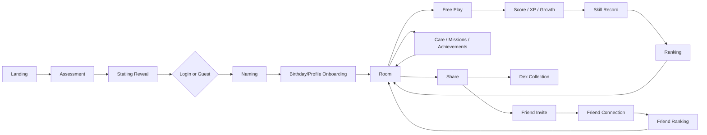
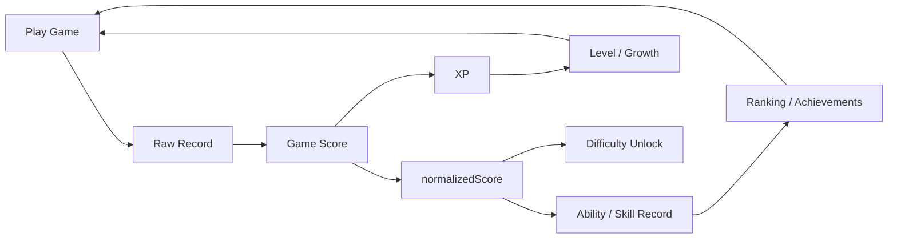
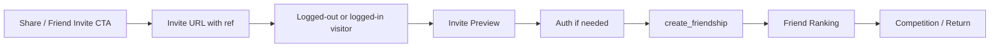
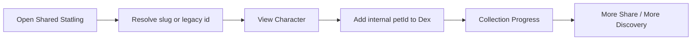
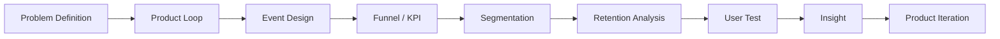

# Statling 포트폴리오 케이스 스터디

> **Source of truth**: 최초 작성 시 repository HEAD `9c1d124`, 전체 185 commits. §1.1과 §10.1은 이후 HEAD `4756253`(2026-09-02)까지의 Production QA/data-quality 조사를 반영해 추가했다. 기존 문서는 탐색 보조 자료로 참고했지만, 아래 제품/기술 주장은 repository에 보이는 코드, migration, Git history 기준으로만 작성했다.  
> **범위**: 이 문서는 구현된 제품 시스템을 취업 포트폴리오에서 설명하기 위한 케이스 스터디다. 향후 사용자 테스트 데이터가 뒷받침하기 전까지 실제 사용자 성과, retention lift, conversion 개선, survey 결과를 주장하지 않는다.

---

## 1. Executive Summary

Statling은 짧은 인지형 Assessment를 개인화된 캐릭터로 변환하고, 그 결과를 반복 플레이, 성장, 랭킹, 공유, 친구 비교 루프로 확장한 브라우저 기반 제품이다. 현재 구현은 6개 능력치 진단, 30개 정적 Statling 캐릭터 프로필, 12개 Free Play 미니게임, XP/성장, achievement, global/friend ranking, share link, Dex collection, Supabase 기반 계정/동기화 계층을 포함한다. 아키텍처는 local-first Next.js 앱이며, 사용자는 게스트로 즉시 시작한 뒤 계정을 만들면 Supabase Auth/Postgres/RLS/RPC를 통해 데이터가 migration/restore된다. 측정 계층은 GA4와 PostHog를 병렬로 사용하며, 현재 measurement plan 기준 42개 GA4 custom event, 21개 PostHog product event, 4개 funnel, 31개 KPI 후보가 정리되어 있다. 이 프로젝트의 포트폴리오 가치는 "성격 테스트를 만들었다"가 아니라, 사용자 행동이 event data, database state, scoring, ranking, privacy boundary, user-test hypothesis까지 추적 가능한 제품/데이터 시스템으로 연결되어 있다는 점이다. 현재 증거는 구현 완료와 사용자 테스트 준비 상태를 뒷받침하지만, 실제 제품 성과 주장은 아직 사용자 테스트와 analytics 데이터가 필요하다.

실사용자 홍보 직전 단계에서는 구현을 "완성했다"에서 멈추지 않고, Production 환경 기준으로 실제 데이터가 정확히 수집되는지를 별도로 검증하는 단계를 거쳤다. 이 과정에서 실제로 데이터 신뢰성에 영향을 주는 문제 4건(§10.1)을 발견해 원인을 코드/SDK 레벨로 특정하고 수정, Production 재검증까지 완료했다 — 이는 "기능이 동작한다"와 "그 기능이 만드는 데이터를 믿을 수 있다"가 서로 다른 검증 단계라는 것을 실제로 보여주는 근거다.

---

## 1.1 My Role

이 프로젝트는 단독으로 진행했으며, 아래 범위는 실제 git history(단일 author)와 이 문서가 인용하는 코드/migration/ADR로 뒷받침되는 것만 적었다.

| 영역 | 구체적으로 한 일 | 근거 |
|---|---|---|
| Product design | 진단→캐릭터→성장→소셜 루프 설계, 6개 능력치/30개 캐릭터/12개 미니게임 밸런싱 | §2, §8 |
| Data architecture | local-first + Supabase 계정 migration/restore/continuous sync 설계 및 구현, RLS/RPC 보안 경계 설계 | ADR-001/002/003, `docs/DATA_ARCHITECTURE.md` |
| Measurement design | GA4/PostHog 이중 taxonomy 설계, 42개 GA4 + 21개 PostHog 이벤트 정의, PII 배제 설계 | ADR-013, `docs/ANALYTICS_GAP_AUDIT.md` |
| Production QA / data-quality investigation | 실 Production 환경에서 전체 사용자 여정 재현, 데이터 신뢰성 문제 발견 시 코드/SDK 레벨 root-cause 규명 | §10.1 |
| Fix & validation | 발견한 문제를 최소 변경으로 수정하고, 코드 리뷰에 그치지 않고 실측(REST 직접 조회, 재현 시나리오)으로 재검증 | §10.1, ADR-017~021 |

---

## 2. Product Overview

Statling의 현재 사용자 여정은 “진단 → 캐릭터 → 관계/성장 → 반복 플레이 → 소셜/랭킹 → 재방문”으로 구성된다. 게스트도 진단과 플레이를 시작할 수 있고, 계정을 만들면 로컬 진행 상태가 Supabase로 이관되어 다른 기기에서 복원된다.

**현재 구현 기준 제품 흐름**

| 단계 | 사용자가 보는 경험 | 구현상 연결 |
|---|---|---|
| Landing | 서비스 진입, 결과/공유 링크 진입 | Next.js app flow, share route |
| Assessment | 6개 핵심 능력 게임 기반 진단 | assessment game flow + scoring |
| Statling Reveal | 능력 조합에 맞는 캐릭터 공개 | static pet profile matching |
| Login/Guest | 저장 없이 체험하거나 계정 저장 | Supabase Auth + local-first state |
| Naming | Statling 이름 확정 | local pet state, profile/migration retry |
| Birthday/Profile | Statling birthday + 선택 profile fields | `confirmed_at`, `profiles.birth_date`, `profiles.gender` |
| Room | 홈/관계/성장 중심 화면 | pet care, XP, missions, achievements |
| Free Play | 12개 미니게임 반복 플레이 | game registry + difficulty + scoring |
| XP/Growth | 점수가 XP와 성장으로 전환 | XP state and sync |
| Ranking | global/friend leaderboard | Supabase ranking RPCs |
| Friend | invite, connect, compare | `friend_code`, `friendships`, friend ranking RPCs |
| Share/Dex | 공유된 Statling 열람과 수집 | slug URL + internal pet id Dex |
| Return | 복원/동기화된 상태로 재방문 | session restore + continuous sync |

---

## 3. Problem Definition

현재 코드 구조에서 확인되는 제품 문제는 “진단 결과를 일회성 콘텐츠로 끝내지 않고 반복 사용 이유가 있는 제품으로 확장하는 것”이다. Assessment는 사용자의 초기 능력 프로필을 만들지만, 그 자체만으로는 재방문 동기가 약하다. Statling은 이 결과를 캐릭터, 이름, 생일, 방, 돌봄, XP, 미션, 랭킹, 친구 비교, 공유/Dex 수집으로 이어 붙여 반복 행동의 근거를 만든다.

이 문서에서 “초기 기획 의도”라고 단정하지 않는 이유는 중요하다. Git history와 코드가 증명하는 것은 기능이 어떤 순서로 생겼고 현재 어떤 루프를 형성하는지이지, 창업/기획 당시의 심리적 동기를 직접 증명하지는 않는다. 따라서 포트폴리오에서는 “처음부터 이런 의도였다”보다 “현재 구현은 이런 제품 문제를 해결하는 구조로 진화했다”라고 말하는 편이 더 정확하다.

---

## 4. Project Evolution

Git history는 `2026-07-23`의 초기 커밋부터 `2026-08-26`의 `9c1d124`까지 185개 커밋으로 이어진다. 기존 `DEVELOPMENT_HISTORY.md`가 `4e54742` 기준 184개 커밋까지 정리했고, 현재 HEAD에는 achievement notification sync 수정 커밋이 하나 더 있다.

| Phase | 기간/근거 | 문제 | 변경 | 결과 | 새로 생긴 문제 |
|---|---:|---|---|---|---|
| 1. Initial Product Shell | 2026-07-23~24 | 진단/캐릭터 제품의 기본 화면 필요 | 초기 Next.js UI, 온보딩, 시각 정체성 구성 | 사용자가 진입할 수 있는 기본 플로우 형성 | 실제 진단 로직과 기록 저장 필요 |
| 2. Assessment Games | 2026-07-24~25 | 능력 기반 결과를 만들 입력 데이터 필요 | Reaction, Memory, Focus, Judgment, Spatial, Reasoning 계열 게임 추가 | 6-stat Assessment 가능 | 결과를 캐릭터/관계 경험으로 바꿔야 함 |
| 3. Character Reveal & Share | 2026-07-27~08-01 | 점수만으로는 감정적 보상이 약함 | Statling profile, reveal, share text/URL | 진단 결과가 캐릭터 경험으로 변환 | 재방문/반복 플레이 동기 필요 |
| 4. Room & Pet Care | 2026-08-02~10 | 결과 확인 후 이탈 가능성 | Room, care, autonomous behavior, UI polishing | 캐릭터와 관계를 유지하는 홈 생성 | 반복 행동을 계량화할 성장 시스템 필요 |
| 5. Free Play, XP, Missions | 2026-08-06~18 | 진단 이후 할 일이 부족함 | Free Play, XP, missions, achievements, local ranking | 점수 기반 반복 루프 생성 | 계정/기기 간 지속성 필요 |
| 6. Supabase Auth & Sync | 2026-08-19~22 | 로컬 데이터만으로는 cross-device/leaderboard 한계 | 20-table RLS schema, Auth, migration, restore, continuous sync | 게스트 시작 + 계정 복원 구조 확보 | cross-user ranking/friendship은 RLS만으로 부족 |
| 7. Analytics & Server Ranking | 2026-08-10~23 | 제품 개선에 필요한 측정/랭킹 데이터 필요 | GA4, PostHog, nickname, global XP/overall/game ranking RPCs | 측정 가능한 제품 루프와 real leaderboard 확보 | social comparison scope 필요 |
| 8. Share, Dex, URL Stability | 2026-08-09~25 | 공유 링크와 캐릭터 수집 경험 필요 | public slug, legacy URL support, Dex, share hardening | 공개 URL과 내부 id를 분리 | friend invite token 누출 범위 관리 필요 |
| 9. Friend System | 2026-08-24~25 | 사용자 간 비교/초대 루프 필요 | `friend_code`, `friendships`, invite preview, friend ranking, friend analytics | social loop 구현 | RPC signature/idempotency와 privacy review 필요 |
| 10. Profile/Birthday & Sync Polish | 2026-08-25~26 | 온보딩 감정선과 multi-device consistency 보강 | birthday/profile onboarding, achievement notification sync fix | user-test 직전 제품 완성도 향상 | 실제 사용자 검증 데이터 필요 |

---

## 5. Core Product Loops

### Ability / Game Loop

이 루프는 실제 구현된 12개 Free Play 게임, scoring module, XP state, player skill record, difficulty unlock, ranking/achievement 경로로 구성된다. `normalizedScore`는 별도 통계 정규화 계층이라기보다 현재 scoring 결과를 skill/unlock/ranking eligibility에 전달하는 표준 점수 필드로 쓰인다.

### Social Loop

친구 초대는 일반 공유와 분리되어 있다. 일반 공유는 `ref`를 넣지 않고, 명시적 friend invite action만 `friend_code`를 포함한 URL을 만든다.

### Collection Loop

Dex는 public slug가 아니라 internal pet id를 저장한다. 이 분리는 공유 URL 안정성과 내부 데이터 일관성을 동시에 지키는 장치다.

---

## 6. Data Architecture As Product Infrastructure

Statling의 데이터 구조는 UX 기능을 직접 가능하게 하는 제품 인프라다. 게스트-first 경험은 localStorage를 통해 즉시 시작되고, 계정 생성 후에는 gated migration과 continuous sync가 장기 보존과 cross-device restore를 담당한다.

| 제품 요구 | Data/Backend mechanism | 가능해진 사용자 경험 |
|---|---|---|
| 가입 전 즉시 체험 | local-first state | 로그인 장벽 없이 Assessment/Room 진입 |
| 계정 생성 후 데이터 보존 | local snapshot migration, `profiles.migrated_at` | 게스트 진행 상태를 계정으로 이전 |
| 다른 기기 복원 | Supabase restore + sync freshness | returning login에서 진행 상태 회복 |
| cross-user leaderboard | `SECURITY DEFINER` ranking RPCs | 전체/친구 랭킹 표시 |
| 친구 연결 | 128-bit `friend_code`, canonical `friendships` row | raw UUID 없이 초대/연결 |
| 사용자별 보안 | RLS + `auth.uid()` policies | 본인 데이터 중심 접근 |
| 민감 profile data | nullable Supabase-only fields | guest 미수집, analytics payload 제외 |
| 공유 URL 안정성 | public slug + legacy id fallback | 기존 공유 링크 유지 |

Supabase는 단순 저장소가 아니라 제품 기능의 경계다. RLS는 사용자별 데이터 접근을 제한하고, RPC는 RLS로 표현하기 어려운 ranking/friend cross-user 연산을 좁은 서버 함수로 처리한다.

---

## 7. Measurement-Driven Product Design

현재 구현은 “성과가 증명된 제품”이 아니라 “성과를 측정할 준비가 된 제품”에 가깝다. GA4는 acquisition/traffic과 넓은 행동 이벤트에, PostHog는 product/funnel/retention 분석에 쓰이도록 분리되어 있다.

| 영역 | 구현된 측정 | 지금 가능한 포트폴리오 주장 | 데이터가 필요한 주장 |
|---|---|---|---|
| Acquisition | GA4 page/acquisition/UTM 기반 | 유입 분석 설계가 있다 | 어떤 채널 CAC/activation이 좋다 |
| Activation | Assessment start/complete, reveal, room entry | activation funnel을 추적할 수 있다 | 특정 단계 전환율이 높다/낮다 |
| Engagement | Free Play, care, XP, missions, achievements | repeat action events가 있다 | 특정 게임이 retention을 올린다 |
| Social | share/friend invite/friend connected/friend ranking | social loop instrumentation이 있다 | friend feature가 재방문을 증가시킨다 |
| Retention | return/revisit 관련 지표 설계 | D1/D7 분석 프레임이 있다 | D1/D7이 얼마다 |

현재 measurement plan 기준 수치:

| Item | Count / Choice |
|---|---:|
| GA4 custom events | 42 |
| PostHog product events | 21 |
| Funnel definitions | 4 |
| KPI candidates | 31 |
| Recommended North Star candidate | `Activated Relationship Days` |

중요한 포트폴리오 포인트는 이벤트 수 자체가 아니라, 각 이벤트가 제품 질문으로 연결된다는 점이다. 예를 들어 `friend_connected`는 단순 클릭 수가 아니라 “친구 연결 이후 ranking view와 return behavior가 달라지는가”라는 분석 질문으로 이어진다.

---

## 8. Game & Scoring Design Summary

현재 Free Play registry에는 12개 게임이 등록되어 있으며, 6개 능력치에 2개 게임씩 연결된다. Assessment는 최초 6개 계열 게임을 사용하고, Free Play는 12개 전체와 선택 난이도를 사용한다. 일부 scoring/record 구조는 공유되지만, Assessment와 Free Play는 목적이 다르다: Assessment는 초기 ability profile을 만들고, Free Play는 반복 플레이/XP/skill record/ranking을 만든다.

| 항목 | 현재 구현 |
|---|---|
| Game count | 12 Free Play games |
| Ability model | 6 stats: reaction, memory, focus, judgment, spatial, reasoning 계열 |
| Difficulty | Easy, Normal, Hard, Extreme |
| Unlock | Hard: same game Normal `normalizedScore >= 60`; Extreme: Hard `normalizedScore >= 70` |
| Raw record | game-specific metrics such as reaction time, correct/wrong count, combo, elapsed time |
| Score | game-specific scoring functions convert raw record to score |
| normalizedScore | skill/unlock/ranking-facing score field; current docs identify it as score-derived, not a separate statistical normalization |
| XP | game score is added to XP state |
| Skill record | local `statling.playerSkill.v1`, synced to `player_skill_records` |
| Ranking | global/friend RPCs; game ranking is Hard/Extreme focused and uses raw metric fields from stored records |

포트폴리오 관점에서 이 부분은 작지만 완결된 데이터 파이프라인이다. 사용자 행동이 raw record를 만들고, raw record가 score로 변환되며, score가 XP와 skill state를 갱신하고, skill state가 ranking/achievement/unlock의 입력이 되며, 그 결과가 다시 재방문 이유로 돌아온다.

---

## 9. Key Architecture Decisions

| 결정 | 맥락 / 문제 | 선택 | 대안 | Trade-off | 결과 |
|---|---|---|---|---|---|
| Local-first + gated migration | Users should start before signup | Always write local first, migrate once after account readiness | account-required from first action | migration edge cases, especially confirmed-but-unnamed pet | guest UX and account persistence both possible |
| Supabase as backend layer | Need Auth, DB, RLS, ranking RPCs | Supabase Auth/Postgres/RLS/RPC | custom backend or Firebase | complex logic moves to PL/pgSQL | one backend surface for identity, storage, ranking, friendship |
| `SECURITY INVOKER` default | Most migration RPCs touch caller-owned rows | Use INVOKER unless cross-user access requires DEFINER | make all RPCs DEFINER | every DEFINER needs higher review | RLS remains a second safety layer for most RPCs |
| Server-side ranking RPCs | Client cannot rank across users under RLS | Dedicated global/friend ranking RPCs | client-side aggregation | SQL duplication and DEFINER risk | real leaderboard without broad table access |
| Opaque `friend_code` | Invite should not expose account UUID | 128-bit random token, lazy-generated | use raw `user_id` or nickname | code is capability-like and not currently rotatable | shareable invite without raw UUID exposure |
| Canonical friendship row | Friendship is symmetric | one ordered pair row, RPC-only mutation | two directional rows | asymmetric states need new schema | no duplicate/desynced pair state |
| Public slug vs internal petId | URLs need readability without breaking old links | slug for share URLs, internal id everywhere else | migrate all identifiers to slug | two identifiers to keep straight | stable public URLs with zero DB migration |
| GA4 + PostHog separation | Need acquisition and product analytics | separate typed event layers | one merged abstraction | paired events require convention | clearer analytics purpose per tool |

---

## 10. Engineering Problems & Debugging Stories

| Story | 증상 | 원인 | 조사 / 수정 | 검증 / 교훈 |
|---|---|---|---|---|
| Guest migration after naming | Confirmed pet without name could migrate too early | `migrated_at` would block later name upload | migration waits until pet is confirmed and named; naming confirm retries migration | lesson: one-time gates must be written last and only after complete data is ready |
| Multi-device sync freshness | Returning account state could disagree across devices | local/server snapshots needed freshness arbitration | restore/sync flow and freshness marker work added across migration/sync commits | lesson: local-first products need restore semantics, not just upload |
| Achievement notification sync | Achievement notification state could diverge across devices | notification/read state needed sync coverage | HEAD `9c1d124` fixes achievement notification state sync | lesson: “cosmetic” notification state is still product state |
| Overall leaderboard SQL issue | ranking RPC ambiguity risk | SQL column names collided or were unclear | migration follow-up fixed ambiguous-column behavior | lesson: ranking SQL needs explicit aliases and repeatable formulas |
| `gen_random_bytes` search_path | friend code generation hardening hid extension function | `search_path = public` did not include Supabase `extensions` schema | follow-up migration widened search path to `public, extensions` | lesson: security hardening can break extension resolution |
| `create_friendship` return shape | Need to know whether connection was newly created | `CREATE OR REPLACE` cannot change `RETURNS TABLE` OUT columns | migration used `DROP FUNCTION` + `CREATE FUNCTION` and reissued grants | lesson: RPC signature changes have operational consequences |
| Share URL slug migration | Existing shared links could break | internal Korean id was originally public URL segment | slug-first + legacy-id fallback, no redirect | lesson: public URLs are compatibility contracts |
| Analytics production/config hardening | Measurement needs production-safe routing | analytics libraries and env config needed explicit separation | GA4/PostHog layers and event catalogs were added separately | lesson: instrumentation is product infrastructure, not a late add-on |

위 항목은 repository에서 확인 가능한 debugging story다. production traffic에서 실제로 관측된 incident라고 주장하지 않는다.

---

## 10.1 Featured Data-Quality Investigations

일반적인 버그 픽스보다 데이터 분석 직무 관점에서 더 설명할 가치가 큰 4건을 선별했다. 모두 "기능은 정상 동작하는 것처럼 보인다"와 "그 기능이 만드는 데이터를 실제로 믿을 수 있다"가 서로 다른 질문이라는 것을 실제로 확인한 사례다. 각 사례는 Product design → Data architecture → Measurement design → Production QA → Discovery → Root-cause analysis → Fix → Validation → Real-user analysis readiness 흐름으로 정리했다.

### 1. PostHog Anonymous → Identified History Disconnect

- **Product design**: 방문자는 계정 없이 바로 Assessment를 시작할 수 있어야 한다(guest-first).
- **Data architecture**: PostHog는 비용 절감을 위해 `person_profiles:'identified_only'`로 설정되어 있다 — 식별 전 방문자에게는 Person을 만들지 않는다.
- **Measurement design**: 회원가입 시 `posthog.identify(supabase_user_id)`를 호출해 익명 행동과 가입 후 행동을 하나의 Person으로 연결하도록 설계되어 있었다.
- **Production QA**: 실제 Production 브라우저로 "Assessment 플레이 → 회원가입" 흐름을 완주한 뒤 PostHog Person Activity를 직접 확인했다.
- **Discovery**: 가입 후 Person Activity에 가입 **이전** 이벤트(`assessment_started`, `game_started`, `game_completed`)가 전혀 없었다 — 가입 이후 이벤트만 존재했다.
- **Root-cause analysis**: `identify()` 호출 자체(인자, 시점, `$anon_distinct_id`)는 코드 재검토로 문제가 없음을 먼저 확인했다. 실제 배포된 `posthog-js` SDK 소스(`_hasPersonProcessing()`)를 직접 읽어, `identified_only` 모드에서는 `identify()` 이전 이벤트가 애초에 Person을 생성하지 않는다는 것 — 즉 merge할 대상 자체가 없었다는 정확한 원인을 특정했다.
- **Fix**: Assessment가 실제로 시작되는 시점에만 `posthog.createPersonProfile()`을 호출해, 전환 가능성이 있는 방문자만 선택적으로 person processing을 켰다(비용 절감 의도는 유지).
- **Validation**: SDK 호출 레벨은 코드로 재검증했고, `$anon_distinct_id` 연결이 실제 값 기준으로 정상 동작함을 확인했다. Funnel/Insight 레벨의 최종 검증은 PostHog 프로젝트 대시보드 접근이 필요해 별도 확인 항목으로 남겨두었다 — "코드로 확인 가능한 것"과 "대시보드에서 확인해야 하는 것"을 섞어서 보고하지 않았다.
- **왜 위험했는가**: 이 문제를 방치했다면 "어떤 Assessment 행동이 실제 전환/리텐션과 상관관계가 있는가"라는, 이 제품의 핵심 분석 질문 자체에 Person 단위로는 영원히 답할 수 없었을 것이다 — 사용자 경험에는 영향이 없지만, 분석 데이터의 근본적인 신뢰성 문제였다.

### 2. Cross-Account Local State Contamination

- **Product design**: guest는 계정 없이 즉시 시작할 수 있어야 하고, 로그인 상태에서 새로고침해도 진행 상황이 사라지면 안 된다.
- **Data architecture**: 이 두 요구 때문에 로그아웃이 `localStorage`를 지우지 않도록 설계되어 있었다(local-first, ADR-002).
- **Measurement design**: XP/레벨/업적 등은 `continuous sync`를 통해 로그인된 계정의 Supabase row에 실시간으로 반영된다.
- **Production QA**: "같은 브라우저에서 계정 A 사용 후 로그아웃하고 계정 B로 새로 가입하면 어떻게 되는가"를 실제로 재현했다.
- **Discovery**: 신규 계정 B가 이미 성장한 상태(A의 XP/레벨)로 시작하는 것처럼 보였고, 이 값이 B의 실제 Supabase row(`xp_totals`, `pet_care_state`)에도 그대로 기록될 수 있음을 확인했다.
- **Root-cause analysis**: 계정 소유권을 검증하는 owner-guard가 pet profile 하나에만 적용되어 있었고, XP/업적/미션/Room 등 나머지 15개 로컬 도메인에는 검증 로직 자체가 없었다는 정확한 gap을 코드 전수 조사로 특정했다.
- **Fix**: owner-mismatch가 감지되면 18개 계정 소유 도메인 전체를 초기화하고, marker를 "주인 없음" 상태로 되돌려 이후 정상 마이그레이션이 새 계정을 claim하도록 최소 변경으로 수정했다.
- **Validation**: 로컬 dev 서버 + 실제 Supabase 프로젝트로 두 시나리오를 모두 실측했다 — (1) 오염 시나리오가 실제로 차단되는지, (2) 그 수정이 guest→최초가입이라는 정상 경로까지 망가뜨리지 않는지. 둘 다 REST로 직접 Supabase row를 조회해 확인했다(수정만 하고 "될 것이다"로 끝내지 않았다).
- **왜 위험했는가**: 이 문제는 사용자 경험(신규 계정이 이상하게 시작함)과 데이터 신뢰성(랭킹/활동 지표가 실제로 오염됨) 양쪽에 동시에 영향을 준다 — "신규 사용자"라는 세그먼트 정의 자체가 깨지는 P0급 데이터 무결성 문제였다.

### 3. GA4 Initialization Race

- **Measurement design**: 회원가입 직후 온보딩 퍼널(`profile_setup_view` → `profile_setup_complete` → `home_enter`)을 GA4로 추적하도록 설계되어 있었다.
- **Production QA**: 실제 신규 계정 생성 흐름을 GA4 dataLayer 캡처와 함께 재현했다.
- **Discovery**: 위 이벤트들이 타이밍에 따라 간헐적으로 GA4에 도달하지 않았다 — 재현이 쉽지 않은 산발적 결측이라 원인 파악이 특히 어려운 유형이었다.
- **Root-cause analysis**: `trackEvent()`가 `window.gtag`가 아직 함수로 준비되지 않은 시점(스크립트가 `afterInteractive`로 로드되기 전, 예: OAuth 리다이렉트 직후처럼 페이지가 이례적으로 이른 시점에 마운트되는 화면)에 호출되면 이벤트를 조용히 버리고 있었다는 것을 코드 레벨로 확인했다.
- **Fix**: Google이 공식 문서화한 `dataLayer.push(arguments)` shim을 추가해, gtag.js가 아직 로드되지 않았어도 이벤트가 큐에 쌓였다가 로드된 즉시 정상 처리되도록 수정 — 새 메커니즘을 발명하지 않고 벤더 표준 패턴을 그대로 적용했다.
- **Validation**: 코드 리뷰로 큐잉 로직이 중복 발송을 만들지 않음을 확인했다(같은 함수가 호출당 정확히 한 번만 `gtag(...)`를 호출).
- **왜 위험했는가**: 이런 유형의 유실은 "이벤트가 아예 없다"가 아니라 "가끔 없다"이기 때문에, 퍼널 수치를 볼 때 실제 이탈과 계측 유실을 구분할 수 없어 온보딩 개선 의사결정 자체를 잘못된 방향으로 이끌 수 있는 조용한 위험이다.

### 4. Google OAuth CTA Stuck After Cancellation

- **Product design**: Google 로그인은 버튼 클릭 즉시 로딩 상태로 전환되어야 하고, 실패/취소 후에는 다시 시도할 수 있어야 한다.
- **Production QA**: Google 동의 화면에서 의도적으로 취소한 뒤 브라우저 뒤로가기로 앱에 복귀하는 흐름을 실제로 테스트했다.
- **Discovery**: "이동하는 중..." 상태의 버튼이 다시 활성화되지 않아 그 세션에서는 회원가입 자체를 진행할 수 없었다.
- **Root-cause analysis**: Google 동의 화면에서의 취소는 앱의 콜백 라우트를 거치지 않는다 — 브라우저가 back/forward cache(bfcache)로 리다이렉트 직전 페이지 인스턴스를 그대로 복원하면서, `true`로 설정된 loading state가 그대로 얼어붙는다는 브라우저 lifecycle 레벨의 원인을 특정했다.
- **Fix**: `pageshow` 이벤트의 `persisted` 플래그(실제 bfcache 복원인지 판별하는 표준 신호)를 감지해 loading state를 해제하도록 수정. Google 버튼과 이메일/비밀번호 버튼의 loading state도 분리해, 한쪽이 멈춰도 다른 가입 경로까지 막지 않도록 했다.
- **Validation**: diff 기준으로 수정 범위를 재확인했다(이 세션에서는 실제 브라우저 재현 테스트까지는 반복하지 않음 — 별도 세션에서 구현·검증됨을 git 커밋으로 확인).
- **왜 위험했는가**: 이 문제는 순수 UX 리스크다 — Google 로그인을 시도하다 마음이 바뀐 사용자가 그 세션에서는 어떤 방법으로도 가입을 완료할 수 없게 되어, 전환 퍼널의 특정 구간에서 완전한 막다른 길이 생긴다.

---

## 11. Security & Privacy By Design

Statling의 보안 설계는 “client convenience”보다 “data boundary”를 우선한다. 모든 주요 app table은 RLS 아래에 있고, 대부분의 user-owned 데이터는 `auth.uid()` 기준으로 접근한다. Cross-user 기능은 table access를 넓히지 않고 RPC로 좁힌다.

| 영역 | 설계 |
|---|---|
| RLS | app tables are RLS-enabled; user-owned rows are scoped to current user |
| Migration RPCs | `SECURITY INVOKER`, so RLS still applies inside replace functions |
| Ranking RPCs | `SECURITY DEFINER`, but output is limited to ranking fields |
| Friendship mutation | no direct INSERT/DELETE path; `create_friendship`/`remove_friendship` only |
| Friend identifier | `friend_code`, not raw UUID |
| Invite preview | only anon-accessible RPC; exact code match, nickname-only output |
| Optional profile fields | `birth_date`/`gender` nullable, guest-hidden, no local mirror |
| Analytics minimization | custom payloads do not include `friend_code`, raw user id, nickname, birth date, or gender |

포트폴리오에서 함께 말해야 할 caveat도 있다. invite `ref`는 URL query에 존재하고, anon preview에 대한 repo-visible rate limiting은 확인되지 않았으며, client-origin game score는 서버 검증 구조가 아니다. friend code rotation/revocation도 현재 구현되어 있지 않다.

---

## 12. User Testing Strategy

사용자 테스트의 목적은 구현된 loop가 실제 사용자에게 이해 가능한 가치와 반복 동기를 만드는지 검증하는 것이다.

| Wave | 질문 | 현재 instrumented evidence | 필요한 사용자 증거 |
|---|---|---|---|
| Smoke test | Can users finish Assessment without confusion? | assessment start/complete, reveal events | screen recordings, drop-off notes |
| Activation test | Do users reach Room and name Statling? | reveal, save/login, naming, room events | conversion by step |
| First play test | Which Free Play games feel clear/rewarding? | game start/complete, score, XP | game-level completion and qualitative feedback |
| Progression test | Do unlocks/XP motivate replay? | difficulty/score/XP/achievement events | repeat sessions, score distribution near thresholds |
| Social test | Do share/friend flows make sense? | share, invite opened, friend connected, friend ranking viewed | invite open-to-connect rate, participant comments |
| Retention test | Do users return D1/D7? | return/room/free-play/care events | cohort retention |
| Survey/interview | What story do users think the product tells? | not analytics-only | qualitative themes and quotes |

정확한 포트폴리오 표현은 "이 질문을 측정할 수 있게 구현했다"이지 "이미 답을 얻었다"가 아니다. 답은 실제 참여자 데이터가 있어야 한다.

**실사용자 유입 후 채울 분석 질문 목록** (현재는 계측만 되어 있고 답은 없음 — QA/synthetic 데이터가 아니라 real-user 데이터가 쌓여야 답할 수 있다):

- Assessment completion — 몇 %가 6게임을 완주하는가, 어느 게임에서 가장 많이 이탈하는가
- Signup conversion — Save 화면 노출 대비 실제 가입 전환율은 얼마인가
- First Free Play activation — 가입 후 첫 Free Play까지 도달하는 비율과 소요 시간은
- Replay behavior — 어떤 게임이 재플레이율이 높은가(§10.1에서 확인했듯 Free Play는 현재 `completion_result`로 재시도를 구분하지 못하므로, 이 질문은 게임별 재입장 빈도로 근사해야 함)
- Ability/game preference — 어떤 능력치/게임에 실제 플레이가 몰리는가
- Retention — D1/D7/D30 재방문율, attendance streak과 재방문의 상관관계
- Feedback — 실제 만족도/재사용 의향 분포, 어떤 세그먼트가 낮은 점수를 주는가
- Difficulty progression — Hard/Extreme 해금이 실제로 재방문을 유도하는가(`tier_unlocked` 이벤트 기반)

---

## 13. Current Project Status

| 상태 | 범위 |
|---|---|
| Implemented | Assessment, Statling reveal, naming, birthday/profile onboarding, Room, care, 12 Free Play games, XP, missions, achievements, global/friend ranking, share, Dex, friend invite/connect/remove, Supabase auth/migration/sync |
| Verified from repo | 185 commits, 14 migrations in existing docs, 20 app tables in schema docs, 42 GA4 custom events, 21 PostHog product events, 12 Free Play games |
| Ready for user test | Funnel/event framework, user-test plan, privacy guidance, core product loops |
| Known issues / caveats | no actual user data yet; some measurement gaps remain; invite `ref` URL exposure risk; no friend-code rotation; client-side score trust; provider abstraction mismatch in ranking |
| Not yet validated | activation rate, retention, social-loop lift, game balance, user attachment, survey sentiment |

---

## 14. What This Project Demonstrates

| 역량 | 근거 |
|---|---|
| Product thinking | one-time assessment converted into retention/social/collection loops |
| Data modeling | Supabase schema, RLS, migration history, skill records, friendships |
| Product analytics | GA4/PostHog event taxonomy, funnels, KPI candidates |
| SQL/backend judgment | ranking RPCs, RLS, INVOKER/DEFINER split |
| Privacy-by-design | optional demographics, analytics minimization, raw UUID avoidance |
| Game data design | raw record -> score -> XP -> skill -> ranking pipeline |
| Debugging | migration gates, RPC signature fix, search_path fix, sync consistency |
| Experiment readiness | user-test plan and measurement gaps explicitly documented |
| Documentation quality | architecture, history, data, analytics, scoring, security, portfolio docs |

---

## 15. Data Analyst Portfolio Angle

Statling은 단순 dashboard 프로젝트가 아니라 data analyst 포트폴리오로 설명할 수 있다. 제품 질문을 정의하고, 사용자 행동을 instrument하고, event/state data를 모델링하고, privacy boundary를 지키며, 사용자 검증을 위한 hypothesis를 준비했기 때문이다.

| Analyst Step | 지금 증명 가능한 것 | 사용자 데이터가 필요한 것 |
|---|---|---|
| Problem definition | current loop structure and hypotheses | which problem users actually feel |
| Instrumentation | GA4/PostHog/Supabase data paths | live event quality checks |
| Funnel design | 4 funnel definitions | conversion rates |
| Segmentation | by source/game/social path/profile state possible | segment sizes and behavior |
| Retention | D1/D7 framework possible | actual cohort retention |
| Experimentation | test plan and metrics defined | before/after or A/B result |
| Insight | code-based assumptions documented | evidence-backed recommendations |

---

## 16. Interview Story Bank

| 질문 | 핵심 포인트 / 근거 |
|---|---|
| What is Statling? | assessment-to-character product with repeatable game/social loops |
| Why is this more than a personality test? | Room, XP, ranking, friend, Dex, return loops |
| What was the hardest data architecture problem? | guest local-first state to account sync/restore |
| How did you design ranking safely? | server RPCs, RLS boundary, limited output |
| Why not expose raw user IDs in invite links? | 128-bit `friend_code` capability token |
| How did you handle privacy? | no custom analytics payload for sensitive fields |
| What is the main KPI? | candidate `Activated Relationship Days`, still needs validation |
| How would you test product-market fit? | activation, engagement, social, retention waves |
| What debugging story shows depth? | `create_friendship` DROP+CREATE or `gen_random_bytes` search_path |
| What would you improve first after user tests? | largest funnel drop-off or confusing game/social step |
| How are scores connected to product behavior? | raw record -> score -> XP/skill/unlock/ranking |
| What is a known limitation? | no actual user outcome data yet; client-side score trust |
| What trade-off are you proud of? | local-first guest UX with explicit migration gate |
| What would you not claim yet? | retention/social lift without cohort data |

---

## 17. Portfolio Evidence Inventory

| 증거 | 증명하는 것 | 포트폴리오 사용처 |
|---|---|---|
| Git history, 185 commits | real project evolution over time | development timeline |
| Supabase migrations | backend/data/security implementation | architecture proof |
| `docs/DEVELOPMENT_HISTORY.md` | phase-by-phase history | project narrative |
| `docs/ARCHITECTURE_DECISION_LOG.md` | explicit trade-off reasoning | decision section |
| `docs/DATA_ARCHITECTURE.md` | data flow and sync map | data infrastructure section |
| `docs/ANALYTICS_MEASUREMENT_PLAN.md` | event/funnel/KPI plan | analytics portfolio section |
| `docs/GAME_SCORING_AND_DIFFICULTY.md` | scoring/difficulty/ranking model | game data section |
| `docs/SECURITY_AND_PRIVACY.md` | risk and privacy audit | trust/security section |
| `docs/USER_TEST_AND_ANALYSIS_PLAN.md` | validation plan | research/readiness section |
| Source code and migrations | claims can be traced to implementation | interview backup |

---

## 18. Missing Evidence

| 주장 영역 | 현재 있는 것 | 주장 전 필요한 것 |
|---|---|---|
| Activation quality | funnel events and plan | real conversion rates |
| Retention | return-event framework | D1/D7/D14 cohort data |
| Social effect | friend/share instrumentation | invite and friend ranking cohorts |
| Game balance | scoring/difficulty implementation | score distributions and replay rates |
| User attachment | pet care/room loop | survey/interview evidence |
| UX clarity | implemented flow | moderated test notes |
| Analytics quality | event taxonomy | live QA and event integrity checks |
| Product improvement | hypotheses | before/after iteration result |
| Portfolio impact | technical evidence | user outcome evidence |

---

## 19. Portfolio Page Blueprint

| 섹션 | 보여줄 내용 |
|---|---|
| 01 Project Overview | one-sentence product, screenshots, current scope |
| 02 Problem | one-time assessment lacks repeat motivation |
| 03 Product | user journey and three product loops |
| 04 My Role | product/data/backend/frontend/instrumentation scope, only if personally true |
| 05 Architecture | local-first + Supabase + RLS/RPC diagram |
| 06 Data & Measurement | GA4/PostHog/Supabase event-state model |
| 07 Key Decisions | 5-8 trade-off cards from this document |
| 08 User Test | hypotheses, waves, recruitment, metrics |
| 09 Analysis | reserved for real funnel/retention/survey results |
| 10 Improvement | reserved for data-driven iterations |
| 11 Result | no fake numbers; use readiness until data exists |
| 12 Lessons | what the implementation taught about product/data systems |

09-11 섹션에는 임의 성과 숫자를 넣지 않는다. 실제 데이터가 생기기 전까지는 “planned measurement” 또는 “validation pending”으로 표시한다.

---

## 20. Resume Bullet Candidates

- Built a Next.js/Supabase web product connecting 6-stat assessment, 30 Statling character profiles, 12 Free Play mini-games, XP, ranking, sharing, and friend comparison.
- Designed a local-first guest experience with account migration, restore, and continuous sync through Supabase Auth/Postgres/RLS.
- Implemented a leaderboard architecture using server-side RPCs for global and friend-scoped ranking while preserving row-level data boundaries.
- Instrumented product analytics with 42 GA4 custom events and 21 PostHog product events mapped to activation, engagement, social, and retention funnels.
- Designed a privacy-conscious friend system using 128-bit opaque invite codes, canonical friendship rows, RPC-only mutation, and minimal anonymous preview.
- Documented game scoring from raw records through normalized score, XP, skill records, difficulty unlocks, and ranking metrics across 12 mini-games.
- Produced architecture, data, analytics, security, user-test, and portfolio documentation that separates implemented evidence from unvalidated product claims.

---

## 21. Claims That Must Wait For User Data

| 아직 주장하면 안 되는 문장 | 필요한 데이터 |
|---|---|
| “Retention improved by X%” | cohort retention before/after or experiment result |
| “Friend features increased return visits” | connected vs non-connected retention comparison |
| “Users felt attached to Statling” | survey/interview responses and behavioral proxies |
| “The onboarding is intuitive” | moderated usability test and drop-off data |
| “Ranking motivates replay” | ranking exposure to replay conversion |
| “Difficulty unlock is well balanced” | score distribution and unlock rate by game |
| “Share loop is viral” | invite/share open, connect, and downstream activation rates |
| “This achieved product-market fit” | retention, repeat usage, qualitative demand, and growth signals |

---

## 22. Final Portfolio Narrative Candidates

### Narrative A: Data-Driven Product System

Statling은 Assessment 경험에서 출발해 측정 가능한 product loop로 확장된 프로젝트로 설명할 수 있다. 가장 강한 포트폴리오 각도는 raw user action이 assessment record, game score, XP, skill record, ranking, analytics event, user-test hypothesis로 이어지는 과정을 보여주는 것이다. 이 narrative는 instrumentation, funnel design, privacy, evidence discipline을 강조하므로 data analyst/product analyst 역할에 잘 맞는다.

### Narrative B: Local-First Product Architecture

Statling의 가장 기술적인 이야기는 guest-first architecture다. 사용자는 바로 시작할 수 있고, 이후 계정을 만들면 로컬 데이터가 계정으로 이전되며 다른 기기에서 복원된다. 이 narrative는 local state, Supabase persistence, RLS, sync freshness, partial failure recovery의 trade-off를 보여주므로 product-minded engineering이나 data infrastructure 성격의 역할에도 잘 맞는다.

### Narrative C: Social Retention Loop

Statling의 가장 growth-oriented한 이야기는 solo assessment를 share, Dex, friend invite, friend ranking으로 확장한 점이다. 구현은 이미 instrumented 상태지만, 정직한 케이스 스터디 결론은 “viral이 증명됐다”가 아니라 “검증할 준비가 됐다”이다. 이 narrative는 초기 제품 상호작용을 반복 사용과 측정 가능한 social behavior로 바꾸는 방법을 묻는 인터뷰에 적합하다.

---

## Closing Position

현재 repository는 Statling에 작동하는 product/data architecture, scoring/ranking system, privacy-conscious account/friend infrastructure, analytics/user-test framework가 있음을 증명한다. 아직 증명하지 못하는 것은 실제 사용자 성과다. 다음 증거 층은 controlled user test와 live analytics에서 나와야 한다: activation conversion, D1/D7 retention, game replay distribution, social invite conversion, qualitative comprehension, before/after iteration result가 그 핵심이다.
