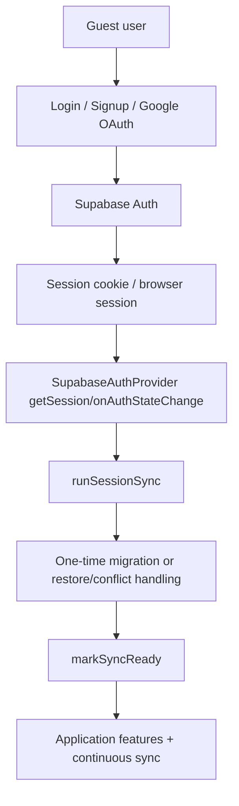
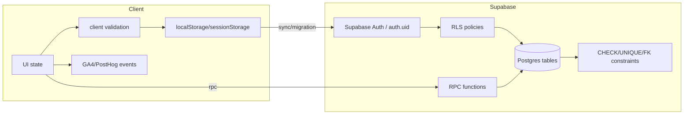
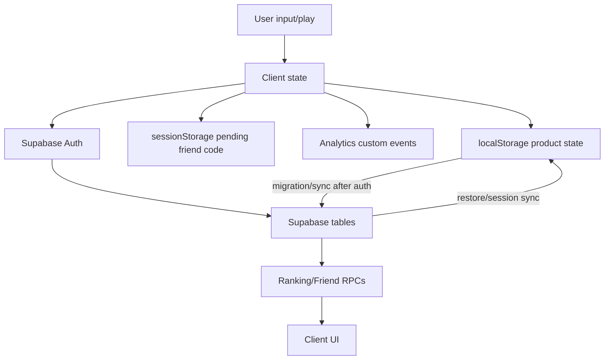

# Statling Security & Privacy

> **Source of truth**: current repository code and Supabase migrations at HEAD. This document summarizes what can be verified from `supabase/migrations/`, auth/client code, analytics code, share/friend code, and storage modules. Production dashboard settings that are not represented in the repo are marked `UNKNOWN`.
> **Scope**: authentication, Supabase/RLS/RPC permissions, friend system security, profile privacy, analytics privacy, share URL privacy, local/session storage, trust boundaries, controls, risks, and QA evidence.

---

## 1. 조사 범위

Checked migration files:

| Migration | Security/privacy surface checked |
|---|---|
| `20260819000000_phase1_schema_and_rls.sql` | Base schema, 20 application tables, RLS, grants, owner policies, triggers |
| `20260820000000_phase2b_replace_rpcs.sql` | `SECURITY INVOKER` replace RPCs and grants |
| `20260822000000_phase2d6_followup_sync_updated_at.sql` | `profiles.last_sync_*` sync markers |
| `20260823000000_phase3b2_profile_nickname.sql` | `profiles.nickname` |
| `20260824000000_phase3b3_xp_leaderboard_rpcs.sql` | XP ranking RPCs |
| `20260825000000_phase3b5_overall_leaderboard_rpcs.sql` | Overall ranking RPCs |
| `20260826000000_phase3b5_followup_fix_ambiguous_column.sql` | Overall ranking RPC replacement/hardening |
| `20260827000000_phase3b7_game_leaderboard_rpcs.sql` | Game ranking RPCs |
| `20260828000000_phase3g2_friend_connection.sql` | `friend_code`, `friendships`, friend create/remove RPCs |
| `20260828010000_phase3g2_followup_gen_random_bytes_search_path.sql` | `get_or_create_my_friend_code` `search_path` fix |
| `20260829000000_phase3g3_friend_ranking_rpcs.sql` | Friend ranking RPCs |
| `20260830000000_phase3g4_friend_invite_preview.sql` | anon-readable invite preview RPC |
| `20260831000000_phase3g5_followup_create_friendship_is_new.sql` | `create_friendship` return-shape update |
| `20260901000000_phase3i1_profile_birthday.sql` | optional `birth_date` / `gender` profile fields |

Checked application areas:

- Supabase clients: `lib/supabase/client.ts`, `lib/supabase/server.ts`
- Auth provider/callback: `lib/auth/supabase-auth-provider.tsx`, `app/auth/callback/route.ts`
- Friend invite flow: `lib/friends/*`, `components/share/friend-invite-cta.tsx`, `components/brain-bet/game-flow.tsx`
- Share URL builders: `lib/share/build-share-text.ts`, `app/share/[petId]/[[...stats]]/share-page-client.tsx`
- Analytics: `lib/analytics/ga.ts`, `lib/analytics/analytics.ts`, `lib/analytics/posthog.ts`, `components/analytics/posthog-identify.tsx`
- Local/session storage modules under `lib/`

---

## 2. Supabase / Database Security

### Table Access Summary

All application tables have RLS enabled in migrations. `anon` receives no direct table grants in the checked migrations. The base model is `authenticated` access only, constrained by `auth.uid()`.

| Table | RLS | Direct grants to `authenticated` | Client can read other users directly? | Direct mutation pattern |
|---|---|---|---|---|
| `profiles` | Yes | `select`, `update` | No, `profiles_select_own` | Update own row only; insert by trigger |
| `pets` | Yes | `select`, `insert`, `update` | No | Own insert/update; no delete |
| `player_skill_records` | Yes | `select`, `insert`, `update` | No | Own best records only |
| `xp_totals` | Yes | `select`, `insert`, `update` | No | Own XP only |
| `achievements` | Yes | `select`, `insert`, `update` | No | Own achievements only |
| `daily_missions` | Yes | `select`, `insert`, `update` | No | Own missions only |
| `attendance` | Yes | `select`, `insert`, `update` | No | Own attendance only |
| `activity_counters` | Yes | `select`, `insert`, `update` | No | Own counters only |
| `pet_care_state` | Yes | `select`, `insert`, `update` | No | Own care state only |
| `room_state` | Yes | `select`, `insert`, `update` | No | Own room state only |
| `room_items` | Yes | `select`, `insert`, `update`, `delete` | No | Own placed items only |
| `room_inventory` | Yes | `select`, `insert` | No | Own append-only inventory |
| `room_care_state` | Yes | `select`, `insert`, `update` | No | Own room care state only |
| `deco_placement_items` | Yes | `select`, `insert`, `update`, `delete` | No | Own placed decoration only |
| `deco_inventory` | Yes | `select`, `insert` | No | Own append-only inventory |
| `pet_memory` | Yes | `select`, `insert`, `update` | No | Own pet memory only |
| `dialogue_memory` | Yes | `select`, `insert`, `update` | No | Own dialogue memory only |
| `user_notes` | Yes | `select`, `insert`, `delete` | No | Own notes; immutable except delete |
| `dex_entries` | Yes | `select`, `insert` | No | Own append-only Dex entries |
| `friendships` | Yes | `select` only | Only rows where caller is a party | Mutation RPC-only |

### RLS Pattern

The standard policy shape is:

```sql
using (auth.uid() = user_id)
with check (auth.uid() = user_id)
```

For `profiles`, the owner column is `id`. For `friendships`, select is allowed only when `auth.uid() = user_id_a or auth.uid() = user_id_b`.

### RPC Inventory

| Function | Mode | Callable by | Purpose | Cross-user access? | Output restriction |
|---|---|---|---|---|---|
| `handle_new_user()` | `SECURITY DEFINER` | trigger only | Create `profiles` row after `auth.users` insert | No user-facing RPC | N/A |
| `guard_pet_identity_immutable()` | trigger | trigger only | Prevent confirmed pet identity overwrite | No | N/A |
| `replace_room_items(jsonb)` | `SECURITY INVOKER` | authenticated | Atomic own-room replace | No, RLS applies | N/A |
| `replace_deco_placement_items(jsonb)` | `SECURITY INVOKER` | authenticated | Atomic own-decoration replace | No, RLS applies | N/A |
| `replace_user_notes(jsonb)` | `SECURITY INVOKER` | authenticated | Atomic own-notes replace | No, RLS applies | N/A |
| `get_xp_leaderboard_top(integer)` | `SECURITY DEFINER` | authenticated | Global XP ranking | Yes | rank/nickname/XP only |
| `get_my_xp_rank()` | `SECURITY DEFINER` | authenticated | Caller XP rank | Yes | caller rank/nickname/XP |
| `get_overall_leaderboard_top(integer)` | `SECURITY DEFINER` | authenticated | Global overall ranking | Yes | rank/nickname/score only |
| `get_my_overall_rank()` | `SECURITY DEFINER` | authenticated | Caller overall rank | Yes | caller rank/nickname/score |
| `get_game_leaderboard_top(text,text,integer)` | `SECURITY DEFINER` | authenticated | Global game ranking | Yes | rank/nickname/metric values |
| `get_my_game_rank(text,text)` | `SECURITY DEFINER` | authenticated | Caller game rank | Yes | caller rank/nickname/metric values |
| `get_or_create_my_friend_code()` | `SECURITY DEFINER` | authenticated | Lazy-generate caller's friend code | Reads/writes caller profile | caller code only |
| `create_friendship(text)` | `SECURITY DEFINER` | authenticated | Resolve code and create friendship | Yes | connected/nickname/is_new_connection |
| `remove_friendship(text)` | `SECURITY DEFINER` | authenticated | Resolve code and remove friendship | Yes | removed boolean |
| `get_friend_overall_ranking()` | `SECURITY DEFINER` | authenticated | Friend-scoped overall ranking | Yes, friends only | rank/nickname/friend_code/score/is_me |
| `get_friend_xp_ranking()` | `SECURITY DEFINER` | authenticated | Friend-scoped XP ranking | Yes, friends only | rank/nickname/friend_code/XP/is_me |
| `get_friend_game_ranking(text,text)` | `SECURITY DEFINER` | authenticated | Friend-scoped game ranking | Yes, friends only | rank/nickname/friend_code/metric/is_me |
| `get_friend_invite_preview(text)` | `SECURITY DEFINER` | anon + authenticated | Pre-login invite preview | Exact code lookup | nickname only |

`get_friend_invite_preview` is the only checked client-callable RPC granted to `anon`.

---

## 3. Authentication Security

### Current Auth Structure

The active provider is Supabase-backed:

- `lib/auth/auth-provider.tsx` exports `SupabaseAuthProvider`.
- Browser client uses `NEXT_PUBLIC_SUPABASE_URL` and `NEXT_PUBLIC_SUPABASE_ANON_KEY`.
- Server route handler uses the same public Supabase URL/anon key with cookie integration.
- No service-role key was found in the checked app client/server factories.

Supported auth paths:

- Email/password signup: `supabase.auth.signUp`.
- Email/password login: `supabase.auth.signInWithPassword`.
- Google OAuth: `supabase.auth.signInWithOAuth({ provider: 'google' })`.
- Logout: `supabase.auth.signOut`, with local sync session cleared before awaiting Supabase.

OAuth/email callback:

- `app/auth/callback/route.ts` exchanges the `code` for a Supabase session.
- It redirects to the bare origin after exchange.
- Original path/query is not preserved by that callback route.

### Auth Flow



### Guest to Login Transition

Guest gameplay is local-first. Once a session exists:

- `SupabaseAuthProvider` calls `runSessionSync`.
- Local data may be migrated to Supabase or restored from Supabase.
- Sync readiness is withheld while a Statling identity conflict is unresolved.
- Pending friend invite intent uses `sessionStorage`, not `localStorage`, to survive a same-tab auth redirect without persisting indefinitely.

### Auth State and Storage

Application code uses many `localStorage` keys for game/product state. It does not directly store Supabase access tokens under app-owned `statling.*` keys. Supabase SDK session persistence/cookies are managed by the SDK and `@supabase/ssr`; those are distinct from application gameplay storage.

The old local-only auth backend still exists in `lib/auth/local-auth-store.ts` with `statling:auth:*` keys, but current `lib/auth/auth-provider.tsx` exports the Supabase provider, not the local provider.

### Cross-user Protection

For normal tables, user A cannot directly read or mutate user B because:

- Tables have RLS enabled.
- Policies compare row owner to `auth.uid()`.
- Grants are to `authenticated`, but RLS still filters rows.

For cross-user features that need exceptions, access is through limited `SECURITY DEFINER` RPCs whose outputs intentionally avoid raw user ids and sensitive profile fields.

### Cross-Account Local State Protection (client-side, distinct from RLS)

The RLS-based protection above covers two *simultaneously authenticated* accounts reading each other's Supabase rows. It does not by itself cover a *sequential* same-browser case: account A logs out, account B signs up on the same device. Logout does not clear `localStorage` (by design, so a page reload while still signed in never loses data), so A's leftover local game state (XP, level, skill records, missions, achievements, Room) could previously be inherited by B on-screen and, through continuous sync, written into B's own (RLS-valid, correctly-owned) Supabase row — reproduced and confirmed 2026-09-02.

Fixed via `lib/pets/local-data-owner.ts`'s `statling.localDataOwner.v1` marker (`null` = unclaimed / owned by nobody yet, a real value = "this device's local state currently matches exactly this account") plus `lib/pets/reset-foreign-account-state.ts`, which wipes all 18 account-owned local domains and resets the marker to unclaimed the moment an owner mismatch is detected. Verified on a local dev server against the real Supabase project for both directions: (1) A→logout→B: B's local state and Supabase rows (`xp_totals`, `pet_care_state`, etc.) came back as clean defaults, not A's values; (2) guest→first-signup: a guest's genuinely-earned progress was not wiped and migrated to Supabase correctly. See `docs/ARCHITECTURE_DECISION_LOG_KO.md` ADR-019 for the full design.

---

## 4. Friend System Security

### `friend_code`

| Property | Current implementation |
|---|---|
| Storage | `profiles.friend_code` |
| Generation | `encode(gen_random_bytes(16), 'hex')` |
| Length/entropy | 32 hex chars, 128 bits |
| Raw UUID? | No |
| Uniqueness | unique index `idx_profiles_friend_code` |
| Creation time | Lazy, first `get_or_create_my_friend_code()` call |
| Collision handling | retries on `unique_violation`, up to 5 attempts |
| Self-invite handling | `create_friendship` rejects `v_target = v_uid` |
| Invalid code | create raises; preview returns zero rows; remove returns `false` |
| Security meaning | Capability token: possession of the code enables a friend request/connection attempt |

`friend_code` is not merely a display identifier. Because there is no second accept/approve step, it is the access-control boundary for initiating a friendship. That is acceptable only because it is high entropy and not derived from UUID, nickname, or public slug.

### `friendships`

| Property | Current implementation |
|---|---|
| Shape | one row per relationship |
| Columns | `user_id_a`, `user_id_b`, `created_at` |
| Ordering | `user_id_a < user_id_b` enforced by `friendships_ordered` |
| Self relationship | blocked by `friendships_no_self` |
| Duplicate prevention | primary key `(user_id_a, user_id_b)` |
| RLS | select own relationship only |
| Direct insert/update/delete | no policy and no grant |
| Mutation path | `create_friendship` / `remove_friendship` only |

The canonical pair design prevents both `A-B` and `B-A` from existing separately.

### Friend Ranking

Friend ranking RPCs compute their own scope from `auth.uid()` plus rows in `public.friendships`. They do not accept a user id, friend code, or arbitrary population parameter.

Outputs include:

- `rank`
- `nickname`
- `friend_code`
- ranking metric
- `is_me`

Outputs do **not** include:

- raw `user_id`
- email
- `birth_date`
- `gender`
- full raw game record
- unrelated profile columns

Returning `friend_code` in friend ranking is a deliberate trade-off: every non-self row is already a confirmed friend, and the code lets the client remove a friend without ever receiving the raw user id.

### Friend Invite Preview

`get_friend_invite_preview(p_friend_code)` is the one anon-accessible RPC.

| Question | Answer |
|---|---|
| Why anon? | A guest opening an invite link needs to see the inviter nickname before login. |
| Function mode | `SECURITY DEFINER`, `language sql stable` |
| Access | `anon` and `authenticated` |
| Input | exact `friend_code` |
| Output | `nickname` only |
| Unknown/invalid code | zero rows |
| Side effects | none |
| Exposes UUID/email/birth_date/gender? | No |
| Abuse risk | exact-code lookup can reveal nickname if a valid code is known or guessed; high entropy mitigates guessing, but leaked codes remain usable capability tokens |

Remaining risk: rate limiting / abuse controls for repeated preview calls are not visible in repository code. Supabase dashboard/API gateway settings are therefore `UNKNOWN`.

---

## 5. Profile Privacy

Profile-related fields currently include base migration fields plus later columns:

| Field | Purpose | Storage | Nullable | Client readable | Other-user readable | Analytics exposure | Privacy sensitivity |
|---|---|---|---|---|---|---|---|
| `id` | Auth-linked profile id | Supabase `profiles` | No | Own row only | Not directly; not returned by ranking/friend RPCs | PostHog `distinct_id` after login | Sensitive identifier |
| `legacy_device_id` | Migration support | Supabase `profiles` | Yes | Own row only | No | Not in typed custom events | Internal |
| `migrated_at` | One-time local migration gate | Supabase `profiles` | Yes | Own row only | No | Not in typed custom events | Internal |
| `last_sync_*` fields | Sync/restore freshness | Supabase `profiles` | Varies | Own row only | No | Not in typed custom events | Internal |
| `nickname` | Ranking/friend display name | Supabase `profiles` | Yes | Own row only directly | Yes through ranking/friend/preview RPCs | Not sent as custom analytics payload | Public display name / caution |
| `friend_code` | Friend invite capability token | Supabase `profiles` | Yes | Own row directly; friends via friend ranking | Friends via friend ranking; preview lookup by exact code returns nickname, not code | Not sent as custom analytics payload, but may be in URL query | Security token / caution |
| `birth_date` | Optional profile birthday | Supabase `profiles` | Yes | Own row only | No | No custom event payload found | Sensitive |
| `gender` | Optional profile gender | Supabase `profiles` | Yes | Own row only | No | No custom event payload found | Sensitive |

### `birth_date` / `gender`

Verified behavior:

- Both are nullable.
- Input is hidden for signed-out users in the birthday/profile screen.
- `birth_date` has DB constraint: null or not in the future.
- `gender` has DB constraint limiting values to `female`, `male`, `other`, `prefer_not_to_say`.
- Client validation rejects future dates and uses a 120-year soft UX floor.
- Writes go through `updateProfileBirthday()` to the caller's own `profiles` row.
- They are not part of localStorage migration domains.
- They are not included in share URLs.
- They are not returned by ranking or friend RPCs.
- No typed GA4/PostHog custom event payload includes either field in the checked analytics code.

---

## 6. Analytics Privacy

### Direct Custom Event Payloads

Status categories:

- `SAFE`: verified not to include sensitive value directly.
- `CAUTION`: not directly sensitive, but can identify behavior or public display state.
- `RISK`: current code sends a sensitive token/value directly.
- `UNKNOWN`: not verifiable from repo, usually dashboard/vendor-side config.

| Data | GA4/PostHog custom payload status | Evidence / note |
|---|---|---|
| nickname | `SAFE` | Not in typed event payloads; ranking RPC may display nickname in UI, but analytics events do not send it directly. |
| Statling name | `SAFE` | PostHog `naming_completed` sends `name_length`, not the string. |
| email | `SAFE` | Auth events send `method`; PostHog identify uses `user.id`, not email. |
| Supabase UUID | `CAUTION` | PostHog `identify(user.id)` sends UUID as distinct id; custom product events do not include raw UUID properties. |
| `friend_code` / `ref` | `SAFE` for custom payload; `CAUTION` for URL/pageview | Friend events send `pet_id` or source/ranking type, not code. But invite URLs carry `?ref=<friend_code>`. |
| `birth_date` | `SAFE` | No custom event payload found. |
| `gender` | `SAFE` | No custom event payload found. |
| free-text feedback | `CAUTION` | GA4 feedback payload sends rating/satisfaction/reuse categories; repository code should be checked before assuming no text in vendor UI. PostHog input masking covers recordings, not necessarily all analytics integrations. |
| page URL / query string | `CAUTION` | PostHog manual `$pageview` and GA4 pageviews may include current URL. Friend invite `ref` can appear in URL. Exact dashboard URL-stripping settings are `UNKNOWN`. |
| session recording input values | `SAFE` in code | `maskAllInputs: true` in PostHog init. Vendor-side final behavior/settings still should be QA-verified. |

### GA4 vs PostHog

GA4:

- Loaded by `components/analytics/google-analytics.tsx`.
- Custom events go through typed `trackEvent`.
- Broad traffic/acquisition role.

PostHog:

- Initialized in `lib/analytics/posthog.ts`.
- `capture_pageview: false`; app sends manual pageviews through `PostHogPageview`.
- `person_profiles: 'identified_only'`.
- `maskAllInputs: true`.
- `PostHogIdentify` calls `posthog.identify(user.id)` on login and `posthog.reset()` on logout.
- `lib/analytics/posthog.ts`'s `ensurePersonProfileCreated()` calls `posthog.createPersonProfile()` once, at Assessment start, to opt that anonymous visitor into person processing before `identify()` — closes an anonymous→identified history-linking gap found in Production QA (2026-09-02, see `docs/ARCHITECTURE_DECISION_LOG_KO.md` ADR-020). No PII is involved — it only changes whether already-anonymous events attach to a Person, never sets a person property.

Important distinction:

```text
Custom event payloads do not include friend_code,
but URL/pageview collection can still see ?ref=<friend_code>.
```

This is not fully controllable from the typed event layer. Dashboard-side URL masking/redaction is `UNKNOWN` from repository code.

---

## 7. Share URL Privacy

### URL Components

| Component | Example | Privacy/security meaning |
|---|---|---|
| public slug | `/share/cheese-cat` | Public species/catalog representation, not user-specific |
| legacy internal pet id | `/share/01_...` | Still supported; identifies character species, not account |
| stats path | optional path segments | Represents shared result/stat context, not raw profile fields |
| UTM | `utm_source`, `utm_medium`, `utm_campaign`, `utm_content` | Attribution metadata |
| friend ref | `ref=<friend_code>` | Capability token for friend invite |
| OG metadata | generated from share route | Public preview content for shared page |

### General Share vs Friend Invite

`buildShareUrl()` stamps fixed share UTM:

```text
utm_source=statling_share
utm_medium=referral
utm_campaign=user_share
utm_content=<share_context>
```

`buildFriendInviteUrl()` wraps `buildShareUrl()` and adds:

```text
ref=<friend_code>
```

Current privacy posture:

- General share links do not include `ref`.
- Only explicit friend-invite links include `friend_code`.
- Public slug is separated from internal account identity.
- `ref` may be stored in browser history, server/CDN logs, referrer headers, GA4/PostHog pageview URLs, or screenshots. Repository code does not prove URL-query redaction in external tools.

Recommendation: treat friend invite URLs as capability URLs. Do not paste them into public posts unless the user intends broad friendability.

---

## 8. Local Storage / Session Storage Security

Application-owned storage found in code:

| Storage | Key / pattern | Data | Contains PII? | Server sync | Risk |
|---|---|---|---|---|---|
| `localStorage` | `statling.deviceId.v1` | anonymous device id | Pseudonymous | Used for device-scoped local data | CAUTION |
| `localStorage` | `statling.petProfile.v3` | pet identity, stats, name, confirmation state | May include Statling name | Yes after auth | CAUTION |
| `localStorage` | `statling.introProgress.v1` | assessment progress/results | No direct PII | Migration/session logic | Internal |
| `localStorage` | `statling.playerSkill.v1` | game records, raw/metrics, normalized scores | Behavioral data | Yes | CAUTION |
| `localStorage` | `statling.xp.v1` | XP totals | Behavioral | Yes | Low/CAUTION |
| `localStorage` | `statling.dailyMissions.v1` | mission progress | Behavioral | Yes | Low |
| `localStorage` | `statling.achievements.v1` | achievement state | Behavioral | Yes | Low |
| `localStorage` | `statling.achievements.notified.v1` | notified achievement ids | No | No/derived | Low |
| `localStorage` | `statling.attendance.v1` | visit streaks | Behavioral | Yes | CAUTION |
| `localStorage` | `statling.activityCounters.v1` | counters | Behavioral | Yes | CAUTION |
| `localStorage` | room/deco inventory and placement keys scoped by device id | room/deco state | No direct PII | Yes for many domains | Low |
| `localStorage` | pet care/memory/dialogue/user-notes keys scoped by device id | care state, remembered answers, free-text notes | Can contain user-entered preferences/free text | Yes for some domains | CAUTION |
| `localStorage` | `statling.dex.v1` | met character ids | No direct PII | Yes | Low |
| `localStorage` | `statling.landingVariant.v1` | A/B variant | No | No | Low |
| `localStorage` | `statling.onboardingSeen.v1` | onboarding seen flag | No | No | Low |
| `localStorage` | `statling:audio:*` | audio preferences/migration flags | No | No | Low |
| `localStorage` | `statling:auth:*` | old local auth users/session | Potential credential-like placeholder data | Not active provider | CAUTION, legacy fallback code exists |
| `sessionStorage` | `statling.pendingFriendCode.v1` | pending invite code | Capability token | Consumed after auth | CAUTION |

Supabase SDK auth/session storage is not directly written by application storage modules. It is managed by Supabase/`@supabase/ssr` and cookies/browser storage according to SDK behavior.

Browser storage caveat: any XSS vulnerability would make same-origin local/session storage readable. The repo does not show a custom CSP configuration; CSP status is `UNKNOWN`.

---

## 9. Server vs Client Trust Boundary



Client decides:

- UI flow and display state.
- Local-first gameplay progress.
- Client-side validation and derived scores before upload.
- Analytics event emission.
- When to call sync/RPC functions.

Server/database enforces:

- Identity through Supabase Auth and `auth.uid()`.
- Ownership through RLS.
- Data shape through constraints.
- Confirmed pet identity immutability.
- Friend relationship canonicalization and self-friend prevention.
- Cross-user ranking/friend reads only through limited RPCs.

Important trust boundary:

- Mini-game scores and raw metrics originate on the client. The database constrains score range and ownership but does not independently verify gameplay correctness. This is acceptable for a casual product, but not anti-cheat secure.

---

## 10. Security Controls Inventory

| Control | Threat | Implementation | Layer | Status |
|---|---|---|---|---|
| RLS on application tables | Cross-user table reads/writes | `alter table ... enable row level security` on all app tables | DB | IMPLEMENTED |
| `auth.uid()` owner policies | User A accessing user B rows | `using/with check (auth.uid() = user_id/id)` | DB | IMPLEMENTED |
| No anon table grants | Anonymous table access | grants only to `authenticated` in migrations | DB | IMPLEMENTED |
| `SECURITY INVOKER` replace RPCs | Definer bypass for own-row replace | Phase 2B replace functions use invoker | DB/RPC | IMPLEMENTED |
| Narrow `SECURITY DEFINER` RPCs | Needed cross-user ranking/friend access | ranking/friend functions with fixed outputs | DB/RPC | IMPLEMENTED |
| `set search_path = public` | search_path hijack in definer functions | ranking/friend definer functions | DB/RPC | IMPLEMENTED |
| No dynamic SQL in RPCs | SQL injection inside definer function | params compared with `=`/CASE only | DB/RPC | IMPLEMENTED |
| CHECK constraints | Invalid stat/score/date/range data | difficulty, score, stat distinct, gender, birth_date, care ranges | DB | IMPLEMENTED |
| Unique constraints | duplicate account/pair/token records | PKs, friend code unique index | DB | IMPLEMENTED |
| Canonical friendship pair | duplicate directional friendships | `user_id_a < user_id_b` | DB | IMPLEMENTED |
| RPC-only friendship mutation | forged relationship rows | no insert/update/delete policy/grant on `friendships` | DB/RPC | IMPLEMENTED |
| Raw UUID non-exposure | account id leakage | ranking/friend outputs omit user ids | RPC/API | IMPLEMENTED |
| Analytics PII exclusion | sensitive data in custom events | typed event payloads avoid email/name/birth_date/gender/friend_code | Client | IMPLEMENTED |
| Input masking | session recording captures form values | `maskAllInputs: true` | Analytics SDK | IMPLEMENTED in code |
| URL query redaction | `ref` captured in pageview/logs | No repo evidence of redaction | Analytics/infra | UNKNOWN |
| Rate limiting | brute force invite preview/RPC abuse | No repo-side rate limiting found | Infra | UNKNOWN |
| CSP/XSS hardening | same-origin storage exfiltration | No repo evidence of CSP config | App/infra | UNKNOWN |

---

## 11. Threat / Risk Register

| Severity | Risk | Evidence | Impact | Existing mitigation | Recommended follow-up |
|---|---|---|---|---|---|
| P1 | Friend invite `ref` is a capability token in URLs | `buildFriendInviteUrl` adds `ref=<friend_code>` | Leaked link can let holder preview nickname and attempt connection | 128-bit random code; general share excludes `ref`; connection requires explicit action | Consider code rotation/revocation and URL redaction in analytics/logging |
| P1 | `ref` may be captured by pageview URL, browser history, logs, or referrer | share route reads `useSearchParams().get('ref')`; analytics pageviews can collect URLs. `ref` is scoped to `/share/[petId]` routes only (`lib/friends/pending-friend-code.ts` / `friend-invite-cta.tsx`) — a 2026-09-01 Production QA pass confirmed a plain `/` visit with unrelated UTM params does not trigger this path, but `/share/[petId]?ref=...` itself was not re-verified against live GA4/PostHog dashboards in that pass | Token exposure outside custom payload controls | Custom events do not include `friend_code`; only explicit friend invite includes ref | Configure GA4/PostHog/server log redaction if available; verify dashboard settings — **still not resolved, keep as open risk** |
| P1 | No repo-visible rate limiting for anon invite preview | `get_friend_invite_preview` granted to `anon` | Scripted exact-code attempts possible | 128-bit entropy; exact match only; nickname only | Add/verify Supabase/API rate limiting before public promotion |
| P2 | Client-originated game scores are not server-verified | score/raw metrics produced client-side and synced | Users can tamper with local storage or requests to affect rankings | score range checks; ownership; ranking season/version | Accept for casual beta or add anti-cheat/server validation later |
| P2 | Browser localStorage contains behavioral and free-text memory data | user notes/dialogue/pet memory storage modules | Same-device privacy risk; XSS would expose data | RLS after sync; PostHog input masking | CSP review, avoid storing unnecessary free text, provide user reset/export/delete policy |
| P2 | PostHog identify uses Supabase UUID | `posthog.identify(user.id)` | Pseudonymous but stable identifier in analytics vendor | no email/token properties; reset on logout | Document analytics processor policy; restrict dashboard access |
| P2 | Friend ranking returns friend codes for friends | friend ranking RPC outputs `friend_code` | Friends can retain/remove/reuse codes | confirmed friends already had code; avoids raw UUID exposure | Consider separate friend edge id or remove-token if rotation is added |
| P3 | Legacy local auth store exists in repo | `lib/auth/local-auth-store.ts`, inactive provider | Confusion during review; potential if re-enabled | active provider exports Supabase provider | Keep documented as inactive or remove when no longer needed |
| P3 | Optional demographics can be overused in analysis | `profiles.birth_date`, `profiles.gender` | small-sample re-identification/bias | optional, guest-hidden, not in analytics payload | Aggregate only; avoid cross-segmentation in small cohorts |

No P0 blocker was identified from repository evidence alone. Production settings and live database permissions still require direct environment QA.

---

## 12. Security QA Evidence

Repository-evidenced checks:

| Check | Repository evidence | Status from repo |
|---|---|---|
| anon direct table access blocked | no anon table grants in migrations | Evidenced by schema |
| anon create friendship blocked | `create_friendship` revoked from anon, granted authenticated | Evidenced by grants |
| anon remove friendship blocked | `remove_friendship` revoked from anon, granted authenticated | Evidenced by grants |
| self invite blocked | `create_friendship` raises when target equals caller | Evidenced by function body |
| invalid friend code create behavior | `create_friendship` raises not found/invalid | Evidenced by function body |
| invalid preview behavior | preview returns zero rows | Evidenced by SQL function |
| direct `friendships` insert blocked | no insert policy/grant | Evidenced by schema |
| non-friend ranking exposure blocked | friend ranking scope derived from `auth.uid()` + `friendships` only | Evidenced by RPC CTEs |
| invite preview returned fields | preview returns `nickname` only | Evidenced by return table |
| raw UUID not returned by ranking/friend RPCs | comments and selected output columns omit user ids | Evidenced by RPC SQL |

Needs production/live QA:

- Confirm grants actually match migration output in the deployed Supabase project.
- Attempt anon RPC calls against all authenticated-only RPCs.
- Attempt direct PostgREST insert/update/delete against `friendships`.
- Attempt user A direct select of user B `profiles`, `pets`, `player_skill_records`.
- Verify GA4/PostHog URL handling for `?ref=`.
- Verify rate limiting / abuse controls.

### Production QA Evidence — `feedback` table (live-tested, 2026-09-02)

Unlike the rest of this section (repository/schema evidence only), the checks below were run directly against the real deployed Supabase project via REST, with two real throwaway test accounts, after confirming the `public.feedback` migration (previously committed to git but never applied — see `docs/DEVELOPMENT_HISTORY.md` §5.1 A) was actually run.

| Check | Result |
|---|---|
| Own account INSERT | `201` success |
| Own account SELECT | `200`, only own row returned |
| Own account UPDATE | `200` success |
| Different account SELECT of my row | `200`, empty array — row invisible, not an error |
| Different account INSERT spoofing my `user_id` | `403`, blocked by RLS `with check` |
| Unauthenticated (anon) SELECT | `401`, no `anon` grant exists |

This directly satisfies the "Attempt user A direct select of user B" and "confirm grants match migration output" items above, scoped to `feedback` specifically — the same checks have not been repeated for `friendships`/`profiles`/`pets`/`player_skill_records` and those remain `UNKNOWN`/repo-evidenced only. Free-text feedback fields (`comment`, `*OtherText`, `*Detail`) were confirmed to be stored in Supabase but confirmed absent from the GA4 `feedback_submit` event payload in the same test run (a real submission's payload contained only `rating`/`satisfaction_reason`/`reuse_intent`).

---

## 13. Privacy Data Flow



Data that moves to Supabase:

- pet profile and stats
- skill records, raw/metrics, XP
- achievements, missions, attendance, counters
- care/room/deco/Dex/memory/user notes depending on sync domain
- optional `birth_date` / `gender` for signed-in users only
- friendships and friend codes

Data that does not move through typed custom analytics payloads:

- `birth_date`
- `gender`
- email
- raw friend code
- nickname/name string
- full user notes/free-text answers

Boundary controls:

- Client validation happens before writes for UX.
- RLS/constraints apply at the DB boundary.
- `SECURITY DEFINER` RPCs bypass RLS only for specific cross-user reads/writes and must constrain outputs themselves.

---

## 14. Data Classification

| Classification | Examples | Notes |
|---|---|---|
| Public | public pet slug, species catalog id, OG/share page content | Not account identity by itself |
| Internal | `migrated_at`, sync markers, record versions, timestamps | Operational/product state |
| User-private | pet profile, skill records, XP, achievements, care state, room/deco state, Dex, attendance | Protected by RLS; may be synced |
| Sensitive | `birth_date`, `gender`, user notes/free text, dialogue memory preferences | Avoid analytics payloads and small-sample segmentation |
| Security credential/token | Supabase session/cookies managed by SDK; `friend_code` as capability token; pending friend code in sessionStorage | `friend_code` is not auth, but it grants social action capability |
| Derived analytics | event counts, normalized scores, ranking views, share events, PostHog distinct id | Pseudonymous behavioral data |
| Public display/caution | nickname, friend ranking rows | Shared in ranking/friend contexts; not a secret |

---

## 15. 발견된 Architecture / Privacy 특징

### Strongest Security Design

The strongest design is the database-first ownership model: every application table has RLS enabled and owner checks based on `auth.uid()`. Cross-user behavior is not implemented by loosening table policies; it is implemented through limited RPCs.

### Weakest Privacy Surface

The weakest privacy surface is URL-based friend invites. Custom events avoid `friend_code`, but `?ref=<friend_code>` can still travel through URL surfaces outside the typed analytics layer.

### Most Important Friend-System Decision

The key friend-system decision is treating `friend_code` as a high-entropy capability token and preventing direct `friendships` writes. This keeps raw user ids out of the client while still allowing invite-based connection.

### Analytics Caution

Typed analytics payloads are conservative, but automatic pageview URL collection is a separate path. Friend invite URLs should be tested in GA4/PostHog dashboards before wider public testing.

### User Test Blocker?

No repository-evidenced P0 blocker was found. Before public Wave 1/Wave 2 testing, the important checks are:

- deployed Supabase grants/RLS match migrations
- anon cannot call authenticated-only RPCs
- friend invite `ref` URL handling is understood/redacted where possible
- internal/test traffic filtering is prepared

---

## Security & Privacy Portfolio Highlights

| Highlight | Problem | Threat | Design choice | Trade-off | Result |
|---|---|---|---|---|---|
| RLS-first data model | Users need account sync without cross-user leakage | forged PostgREST requests | Enable RLS on every app table and require `auth.uid()` ownership | Every new table needs policy discipline | Direct user-private data access stays own-row only |
| `SECURITY INVOKER` default | RPCs can accidentally bypass RLS | function bug leaks/deletes other users' rows | Use invoker for own-row replace RPCs | SQL must rely on caller grants/RLS | RLS remains a second safety layer |
| Narrow `SECURITY DEFINER` exceptions | Ranking/friends need cross-user reads | broad definer functions leak data | Specific RPCs with fixed outputs and grants | More PL/pgSQL review burden | Cross-user features ship without broad table policies |
| Friend capability token | Users need shareable invite links | raw UUID exposure or guessable id | 128-bit random `friend_code` | leaked links remain powerful | No raw account id in invite URL |
| RPC-only friendship mutation | Two-party relationship integrity | arbitrary client-inserted friendships | no `friendships` write grants; create/remove RPCs only | future mutations need new RPCs | direct forged writes are blocked |
| Anon invite preview with minimal output | Guests need pre-login context | anon data exposure | exact-code read-only RPC returning nickname only | first anon exception in schema | Better invite UX with bounded exposure |
| Analytics minimization | Product analytics needs behavior data | PII in event payloads | typed payloads omit email/name/birth_date/gender/friend_code | URL/pageview still needs vendor review | Safer custom event taxonomy |
| Optional demographics kept separate | Profile questions may help later analysis | sensitive data overcollection | nullable Supabase-only fields, no analytics payload | unavailable for guests/offline personalization | Lower leakage surface |

---

## 16. Code References

- `supabase/migrations/20260819000000_phase1_schema_and_rls.sql`
- `supabase/migrations/20260820000000_phase2b_replace_rpcs.sql`
- `supabase/migrations/20260824000000_phase3b3_xp_leaderboard_rpcs.sql`
- `supabase/migrations/20260826000000_phase3b5_followup_fix_ambiguous_column.sql`
- `supabase/migrations/20260827000000_phase3b7_game_leaderboard_rpcs.sql`
- `supabase/migrations/20260828000000_phase3g2_friend_connection.sql`
- `supabase/migrations/20260828010000_phase3g2_followup_gen_random_bytes_search_path.sql`
- `supabase/migrations/20260829000000_phase3g3_friend_ranking_rpcs.sql`
- `supabase/migrations/20260830000000_phase3g4_friend_invite_preview.sql`
- `supabase/migrations/20260831000000_phase3g5_followup_create_friendship_is_new.sql`
- `supabase/migrations/20260901000000_phase3i1_profile_birthday.sql`
- `lib/supabase/client.ts`
- `lib/supabase/server.ts`
- `lib/auth/supabase-auth-provider.tsx`
- `app/auth/callback/route.ts`
- `lib/friends/pending-friend-code.ts`
- `lib/analytics/ga.ts`
- `lib/analytics/analytics.ts`
- `lib/analytics/posthog.ts`
- `components/analytics/posthog-identify.tsx`
- `lib/share/build-share-text.ts`
- `app/share/[petId]/[[...stats]]/share-page-client.tsx`

