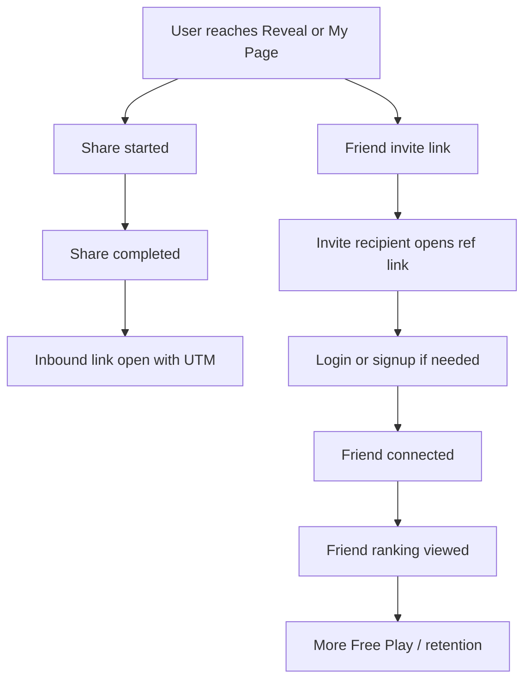

# Statling User Test & Analysis Plan

> **Source of truth**: current implementation plus the existing measurement/game documentation in this repository, especially `docs/ANALYTICS_MEASUREMENT_PLAN.md` and `docs/GAME_SCORING_AND_DIFFICULTY.md`.
> **Principle**: this is not a QA checklist and not a fictional results report. It is an execution plan for recruiting early users, collecting quantitative/qualitative evidence, finding product problems, prioritizing improvements, and re-measuring after changes.
> **No invented benchmarks**: where Statling has no baseline yet, success is defined as `Baseline required`, `Directional signal`, or `Compare between cohorts`, not as arbitrary conversion targets.

---

## 1. User Test Objective

The test should answer whether Statling's current product loop is understandable, motivating, repeatable, and socially shareable.

The core question is not simply:

```text
Do users like Statling?
```

The better test structure is:

```text
Can a new visitor understand the promise,
complete the assessment,
care about the resulting Statling,
enter Room,
find meaningful actions,
return later,
and optionally share or connect with friends?
```

### Product Value

| Question | Evidence |
|---|---|
| Do users understand the concept of Statling? | Landing comprehension, assessment start, interview answers |
| Do users trust or accept the Assessment result? | Assessment completion, reveal dwell/feedback, result-specific comments |
| Do users feel attachment to their Statling? | Confirmation/naming, Room interaction, share intent, qualitative language |
| Is there a reason to return? | D1/D7 Room return, Free Play/care/mission behavior, interview answers |

### Usability

| Question | Evidence |
|---|---|
| Can users finish Assessment without help? | Assessment start -> complete, observed confusion by game/stage |
| Is Reveal -> confirmation -> Room natural? | Reveal -> naming -> first Room funnel |
| Do users understand Room actions? | first Room behavior, pet interaction events, observation notes |
| Are Free Play / Ranking / Mission / Share / Friend discoverable? | feature adoption events and observation checklist |

### Engagement

| Question | Evidence |
|---|---|
| Which features are actually used? | feature adoption rates by Room users |
| Which games invite repeat play? | repeated `game_completed` by `game_id`/difficulty |
| How far do users progress? | difficulty unlock state, XP, missions, achievements |
| Do XP / Ranking / Mission loops motivate repeated use? | sequence analysis after first XP/ranking/mission action |

### Retention

| Question | Evidence |
|---|---|
| Do users come back the next day? | D1 Room / meaningful interaction retention |
| Do users come back within a week? | D7 Room / Free Play / care retention |
| What do returning users do? | returning `home_entered` followed by game/care/ranking/share |

### Virality / Social

| Question | Evidence |
|---|---|
| Do users share results? | `share_started`, `share_completed`, UTM inbound traffic |
| Do users send friend invites? | currently partial: friend invite link open/connection measured, invite creation gap exists |
| Do invited users connect? | `friend_invite_opened` -> login/signup -> `friend_connected` |
| Does Friend Ranking add engagement? | connected vs non-connected engagement comparison |

---

## 2. Core Hypotheses

| ID | Area | Hypothesis | Why it matters | Metric | Success Signal | Priority |
|---|---|---|---|---|---|---|
| H01 | Activation | Users who start Assessment have enough motivation to reach Reveal. | The whole product promise depends on completing the diagnostic loop. | Assessment Start -> Assessment Complete -> Reveal Reach | Baseline required; inspect drop-off by game/stage | P0 |
| H02 | Activation | Reveal creates enough curiosity for users to confirm/name a Statling. | Reveal is the emotional handoff from test to companion. | Reveal -> `naming_completed` -> first `home_entered` | Directional signal; compare feedback from confirmers vs non-confirmers | P0 |
| H03 | Product Value | Users understand that Statling combines ability assessment and pet-like growth. | Misunderstanding here weakens every downstream feature. | Survey comprehension + observed first-session behavior | Qualitative majority can describe the service in their own words | P0 |
| H04 | Usability | Assessment instructions are clear enough without moderator help. | Confusion creates false ability scores and early abandonment. | Game-level completion, observed hesitation/help requests | Directional signal; identify problematic game/stage | P0 |
| H05 | Engagement | First Room users can find at least one meaningful action without prompting. | Room is the post-activation hub. | first Room -> care/free play/mission/ranking/share action | Baseline required; observation confirms discoverability | P0 |
| H06 | Engagement | Free Play is the main repeatable activity after first Room entry. | It drives XP, skill records, difficulty unlocks, and ranking. | Room users with `game_started`/`game_completed`; games per user | Directional signal; compare with care/mission usage | P0 |
| H07 | Game | Some mini-games produce much higher repeat play than others. | Game preference should guide tuning and content priority. | repeat completions by `game_id`, difficulty, normalizedScore | Compare between games/cohorts, no fixed target yet | P1 |
| H08 | Game | Difficulty unlocks create progression motivation rather than frustration. | Hard/Extreme unlocks are a core long-term game loop. | Normal >=60, Hard >=70 unlock progression, retry/repeat behavior | Directional signal; inspect score distribution near thresholds | P1 |
| H09 | Game | Extreme mode attracts highly engaged users but is not necessary for first-session value. | Extreme is a late-stage challenge, especially `reaction-dodge-run` endless mode. | Extreme attempts/users, time-to-first Extreme, retention after Extreme | Compare advanced users vs non-Extreme users | P2 |
| H10 | Engagement | Ranking views are followed by additional Free Play attempts. | Ranking should create competitive motivation. | `ranking_view`/`friend_ranking_viewed` -> later `game_completed` | Compare ranking viewers vs non-viewers | P1 |
| H11 | Engagement | Mission/Achievement claims increase short-term return behavior. | Reward loops may create structured goals. | claim events -> next-day Room/game/care return | Directional signal; compare claimers vs non-claimers | P1 |
| H12 | Retention | Meaningful first-day actions predict D1/D7 return better than page visits alone. | Retention should measure product value, not accidental revisit. | first-day game/care/claim -> D1/D7 meaningful retention | Compare cohorts with raw counts | P0 |
| H13 | Social | Sharing is stronger after Reveal than from My Page for new users. | Reveal has a fresher emotional moment. | share_context by `character_result` vs `my_page` | Compare share start/completion and inbound UTM | P1 |
| H14 | Social | Friend connection increases repeat engagement. | Friend Ranking is intended to make performance social. | `friend_connected` -> Free Play/ranking/D7 retention | Compare connected vs non-connected users; correlation only | P1 |
| H15 | Acquisition | Landing A/B variant affects Assessment Start more than downstream retention. | Copy/layout may improve entry without changing core product value. | `landing_experiment_viewed` -> Assessment Start/Room/D1 | Directional evidence + qualitative comments, not significance-only | P1 |

---

## 3. User Recruitment Plan

Statling is an early personal project, not a mature service with high traffic. Recruitment should prioritize fast learning, traceable behavior, and honest feedback over statistically powered tests.

### Wave 0 - Internal / Known Users

| Item | Plan |
|---|---|
| Purpose | Find fatal UX problems, confusing copy, mobile issues, analytics breakage, and obvious funnel blockers. |
| Suggested size | 5-8 people. |
| Recruitment | Friends, classmates, close contacts, people comfortable giving blunt feedback. |
| Method | Moderated screen-share or in-person observation; ask them to think aloud but avoid coaching. |
| Key hypotheses | H03, H04, H05, analytics/data-quality checks. |
| Move to next wave when | No P0 blocker remains; Assessment -> Reveal -> Room works for most observed users; analytics events arrive with expected properties. |

### Wave 1 - Small External Test

| Item | Plan |
|---|---|
| Purpose | Test first-impression value, activation, Assessment completion, first Room engagement, and survey response quality with less-biased users. |
| Suggested size | 15-30 people. |
| Recruitment | Acquaintances-of-acquaintances, small online communities, private posts, student/job-prep networks. |
| Method | Unmoderated link plus short survey; optional 15-minute interviews for 5-8 users. |
| Key hypotheses | H01, H02, H06, H12, H13. |
| Move to next wave when | Core activation data is readable, no severe funnel blocker dominates results, and qualitative feedback points to fixable issues. |

### Wave 2 - Wider Promotion

| Item | Plan |
|---|---|
| Purpose | Compare acquisition channels, observe retention, measure social/share/friend loops, and identify scalable improvement priorities. |
| Suggested size | 50-150 visitors, depending on reachable channels. |
| Recruitment | Threads, Instagram, Naver Blog, Tistory, portfolio/community posts, direct sharing. |
| Method | Public UTM links, lightweight survey, dashboard monitoring, selected follow-up interviews. |
| Key hypotheses | H07-H15. |
| Continue when | Source-level funnel and D1/D7 cohorts are analyzable with raw counts; top issues have clear proposed fixes and re-test metrics. |

---

## 4. Recruitment Channel Tracking

Current implementation supports generic promotional UTM links through `lib/campaign/build-campaign-url.ts`. This builder accepts arbitrary:

```text
utm_source
utm_medium
utm_campaign
utm_content
```

In-app share links use a separate fixed UTM scheme from `lib/share/build-share-text.ts`:

```text
utm_source=statling_share
utm_medium=referral
utm_campaign=user_share
utm_content=<share_context>
```

The two should stay separate: promotional UTM answers "where did this tester come from"; share UTM answers "which in-app share surface produced this inbound visit."

### UTM Naming Convention

| Channel | `utm_source` | `utm_medium` | `utm_campaign` | Example `utm_content` |
|---|---|---|---|---|
| Threads | `threads` | `social` | `beta_launch` | `assessment_hook_01`, `pet_growth_01` |
| Instagram Story | `instagram` | `social_story` | `beta_launch` | `story_card_01` |
| Instagram Bio | `instagram` | `social_profile` | `beta_launch` | `bio_link` |
| Naver Blog | `naver_blog` | `blog` | `beta_launch` | `longform_review_01` |
| Tistory | `tistory` | `blog` | `beta_launch` | `devlog_01` |
| Direct known users | `direct_known` | `direct` | `wave0` or `wave1` | `friend_dm_01` |
| Portfolio/community | `community` | `referral` | `beta_launch` | `portfolio_note_01` |

Example:

```text
/?utm_source=threads&utm_medium=social&utm_campaign=beta_launch&utm_content=assessment_hook_01
```

Compatibility:

- GA4 can read UTM traffic attribution through page/session acquisition.
- PostHog can expose initial/current UTM properties from pageview URLs.
- `landing_experiment_viewed` is intentionally independent of UTM and stores only variant `A`/`B`.

---

## 5. Test Timeline

| Timing | What to do | What to analyze |
|---|---|---|
| Pre-launch | Analytics QA, production smoke, UTM links, survey, observation guide, test-account policy. | Event arrival, property shape, UTM preservation, guest/auth transition, internal traffic markers. |
| Day 0 | Start Wave 0 or Wave 1 traffic. | Real-time P0/P1 monitoring: broken flow, missing events, severe confusion. |
| Day 1 | Review first-session data. | Activation funnel, first Room action, survey responses, obvious device/browser issues. |
| Day 2-3 | Read qualitative feedback and early repeat behavior. | Game completion/repeat, feature adoption, confusion themes, share attempts. |
| Day 7 | Run D7 cohort review. | Visit retention, Room retention, meaningful interaction retention, connected vs non-connected behavior. |
| Week 2 | Decide first improvement batch. | Prioritize by impact, frequency, funnel relevance, confidence, effort. |
| After improvement | Re-measure same funnel and issue metrics. | Before/after comparison with raw counts and qualitative confirmation. |

---

## 6. Quantitative Data Collection Plan

| Category | Event/Data | Source | GA4 / PostHog / Supabase | User-level 가능 여부 | Analysis purpose |
|---|---|---|---|---|---|
| Acquisition | source/medium/campaign/content | URL UTM, pageview | GA4/PostHog | Yes in PostHog; aggregate in GA4 | Channel quality and funnel comparison |
| Acquisition | landing variant exposure | `landing_experiment_viewed` | PostHog | Yes | A/B exposure and downstream conversion |
| Activation | assessment start | `assessment_start`, `assessment_started` | GA4/PostHog | Yes in PostHog | Entry into core loop |
| Activation | game start/complete during assessment | `mini_game_*`, `game_started/completed` | GA4/PostHog | Yes in PostHog | Game-level drop-off and confusion |
| Activation | assessment complete | `assessment_complete`, `assessment_completed` | GA4/PostHog | Yes in PostHog | Diagnostic completion |
| Activation | reveal | `statling_reveal`, `statling_revealed` | GA4/PostHog | Yes in PostHog | Result reach and character assignment |
| Activation | naming/confirmation proxy | `naming_completed`, `egg_hatch_start` | GA4/PostHog | Yes in PostHog | Confirmation into owned Statling |
| Activation | Room entry | `home_enter`, `home_entered` | GA4/PostHog | Yes in PostHog | Activation terminal point |
| Engagement | Free Play start/complete | `free_play_start/complete`, `game_started/completed` | GA4/PostHog | Yes in PostHog | Game participation and repeat |
| Engagement | normalizedScore/difficulty | `game_completed`, `player_skill_records` | PostHog/Supabase | Yes | Score distribution, unlock progression |
| Engagement | XP | `free_play_complete.xp_earned`, `xp_totals` | GA4/Supabase | Yes for account-linked Supabase | Growth and repeat activity |
| Engagement | ranking | `ranking_view`, `friend_ranking_viewed`, ranking RPC data | GA4/PostHog/Supabase | Partial | Competitive feature usage |
| Engagement | mission/achievement | mission and achievement events/tables | GA4/PostHog/Supabase | Yes | Goal/reward loop adoption |
| Engagement | pet interaction | `care_action_completed`, `pet_action` | GA4/PostHog | Yes in PostHog | Room behavior and care loop |
| Retention | D1/D7 page revisit | `$pageview`, GA4 pageview | GA4/PostHog | Yes in PostHog | Visit retention |
| Retention | D1/D7 Room return | `home_entered{returning}` | PostHog | Yes | Product retention |
| Retention | meaningful return | returning game/care/claim | PostHog/Supabase | Yes | Core retention |
| Social | share intent/success | `share_started`, `share_completed`, GA share events | GA4/PostHog | Yes in PostHog | Share UX and intent |
| Social | friend invite open | `friend_invite_opened` | GA4/PostHog | Yes in PostHog | Recipient-side invite traffic |
| Social | friend connected | `friend_connected`, `friendships` | GA4/PostHog/Supabase | Yes | Social conversion |
| Social | friend ranking | `friend_ranking_viewed` | GA4/PostHog | Yes | Post-connection engagement |

---

## 7. Qualitative Research Plan

Analytics can show where behavior changed; it cannot fully explain why. Qualitative research should cover:

- What users thought Statling was before starting.
- Whether Assessment felt fair, fun, too long, or confusing.
- Whether the revealed Statling felt personally meaningful.
- Whether Room made the next action obvious.
- Whether Free Play, Ranking, Mission, Share, and Friend features were discovered naturally.
- What users would return for.
- What they would share, and with whom.

Recommended methods:

- Wave 0: moderated observation with think-aloud.
- Wave 1: short survey after first session plus optional interview.
- Wave 2: survey + follow-up interviews with selected segments such as completers, drop-offs, sharers, and returners.

---

## 8. Survey Design

Keep the survey short enough to complete in 3-5 minutes.

| # | Question | Type | Analysis purpose |
|---:|---|---|---|
| 1 | Before starting, what did you think Statling would do? | Short answer | Landing comprehension |
| 2 | I understood what to do during the Assessment. | 5-point Likert | Assessment usability |
| 3 | Which Assessment game, if any, felt confusing? | Multiple choice + optional text | Game-specific UX issue detection |
| 4 | The resulting Statling felt connected to my answers/performance. | 5-point Likert | Result trust/value |
| 5 | I wanted to keep or name my Statling. | 5-point Likert | Attachment/confirmation motivation |
| 6 | After entering Room, I knew what to do next. | 5-point Likert | Room usability |
| 7 | Which features did you notice? | Multiple choice | Feature discoverability |
| 8 | Which feature did you actually want to use again? | Multiple choice | Engagement intent |
| 9 | Which mini-game was the most fun? | Multiple choice | Game preference |
| 10 | Which mini-game felt too easy, too hard, or unfair? | Short answer | Difficulty/scoring tuning |
| 11 | Would you come back tomorrow? Why or why not? | Short answer | Retention motivation |
| 12 | Would you share your result or invite a friend? Why or why not? | Short answer | Social motivation/barrier |
| 13 | What was the most confusing or inconvenient moment? | Short answer | Issue discovery |
| 14 | Overall, how likely are you to recommend Statling to a friend? | 5-point scale | Directional satisfaction |

Privacy note:

- Do not ask survey respondents to enter email, nickname, `friend_code`, birth date, or gender unless there is an explicit reason and consent.
- If survey responses are later linked to analytics users, use a privacy-safe voluntary code or session label, not raw personal identifiers.

---

## 9. Observation Checklist

Use this for Wave 0 and selected Wave 1 sessions.

| Stage | Observe without leading |
|---|---|
| Landing | Does the user understand the service goal? Do they find the CTA? |
| Assessment intro | Do they read instructions? Do they know this is a six-game flow? |
| Game rules | Which game causes hesitation, wrong first action, or verbal confusion? |
| Assessment pacing | Do they feel the flow is too long before Reveal? |
| Reveal | Do they pause, read, smile, question, dismiss, or try to share? |
| Confirmation | Can they find the continue/confirm/naming action? |
| Room first action | What do they tap first without instruction? |
| Free Play | Do they discover it? Can they choose game/difficulty? |
| Ranking | Do they understand global/friend/game/XP ranking scopes? |
| Mission/Achievement | Do they notice reward goals? |
| Share/Friend | Do they understand the difference between general share and friend invite? |
| Navigation | Do they use back/restart/logout unexpectedly? |
| Mobile/device | Any layout, touch, loading, or performance problem? |

Moderator principle:

- Ask "What are you thinking?" rather than "Click this."
- Record hesitation and misinterpretation before helping.
- Only intervene if the user is truly stuck or the test cannot continue.
- Mark every intervention in notes so the session is not mistaken for unaided success.

---

## 10. Core Funnel Analysis

### Funnel A - Activation

| Step | Event | Conversion | Drop-off to inspect | Segmentation |
|---|---|---|---|---|
| Acquisition | pageview + UTM | visitors by source | bad links, wrong landing, low CTA intent | source/medium/campaign/content |
| Landing exposure | `landing_experiment_viewed` | exposed users | variant imbalance, localStorage issues | variant, source |
| Assessment Start | `assessment_started` | start / exposed | unclear CTA or weak promise | variant, guest/member |
| Assessment Complete | `assessment_completed` | complete / start | game confusion, length, mobile issues | game, device, source |
| Reveal | `statling_revealed` | reveal / start | completion-to-result breakage | top_stat, character_id |
| Confirmation/Naming | `naming_completed` | naming / reveal | weak attachment, auth friction | guest/member, character_id |
| Room | `home_entered{first_time}` | Room / start | post-confirm transition issues | source, variant, top_stat |

### Funnel B - First Game

| Step | Event | Conversion | Drop-off to inspect | Segmentation |
|---|---|---|---|---|
| Room | `home_entered` | Room users | N/A | first_time/returning |
| Free Play Start | `game_started{mode:'free_play'}` | start / Room | discoverability | game_id, difficulty |
| Game Complete | `game_completed{mode:'free_play'}` | complete / start | abandonment, difficulty, confusion | game_id, difficulty, score |
| Second Game | second `game_completed` | second complete / first complete | repeat motivation | first game, score band |

Current gap: abandoned games are inferred from start-without-complete; there is no explicit `game_abandoned` event.

### Funnel C - Social

| Step | Event | Conversion | Drop-off to inspect | Segmentation |
|---|---|---|---|---|
| Share/Friend Invite | `share_started`, `share_completed` | share complete / share start | web share failure, PNG friction | share_context, channel |
| Invite Open | `friend_invite_opened` | invite opens | cannot fully compute sender-side rate yet | UTM, source |
| Login/Signup | GA4 `login`/`sign_up` | auth / invite open | auth friction | source, device |
| Friend Connected | `friend_connected` | connection / invite open | pending invite loss, invalid code, auth drop-off | direct/resumed |
| Friend Ranking | `friend_ranking_viewed` | ranking view / connected | value after connection | ranking_type |

Current gap: friend invite created/sent is not a separate event.

---

## 11. Retention Analysis Plan

Separate page revisit from meaningful retention.

| Retention type | Definition | Current calculability |
|---|---|---|
| Visit Retention | User has GA4/PostHog pageview on D1/D7 after first visit. | Possible, but weakest product signal. |
| Room Retention | User has `home_entered{returning}` on D1/D7 after first Room. | Possible in PostHog. |
| Engagement Retention | User returns and performs Free Play, care action, ranking, mission, achievement, share, or friend action. | Possible from PostHog event sequences. |
| Core Retention | User returns and performs game completion or Statling interaction. | Possible; recommended primary early retention view. |
| Account-linked Retention | Supabase records update after first account-linked activity. | Possible only for authenticated users; excludes guest-only users. |

Report retention with raw counts:

```text
D1 Room Retention: 6 / 18 users, not just 33%
```

For small samples, treat retention percentages as directional and pair them with session notes.

---

## 12. Mini Game Analysis

Source for game model: `docs/GAME_SCORING_AND_DIFFICULTY.md`.

### Common game metrics

| Metric | Definition |
|---|---|
| Start rate | `game_started` users by `game_id` / eligible Room or Free Play users |
| Completion rate | `game_completed` / `game_started` by `game_id` |
| Repeat rate | users with 2+ completions for same `game_id` |
| Score distribution | `normalized_score` distribution by game/difficulty |
| Difficulty progression | Normal >=60 unlock path to Hard; Hard >=70 unlock path to Extreme |
| Ranking participation | Hard/Extreme records and ranking views by game |
| Abandonment proxy | starts without completion in same session/window |

### Game-specific interpretation

| game id | Watch for |
|---|---|
| `reaction-classic` | Very low median reaction may indicate device/input artifacts; false starts can reveal unclear timing rules. |
| `reaction-dodge-run` | Extreme is endless and collision-ending; measure survival/retry as challenge appeal. |
| `memory-classic` | Score cliffs around larger grids can reveal memory-load tuning issues. |
| `memory-story-recall` | Low completion or poor accuracy may mean object/question wording is unclear. |
| `focus-classic` | Missed targets/false clicks distinguish visual overload from misunderstanding. |
| `focus-color-target` | Wrong/timeout rates by Hard/Extreme show whether Stroop switching is fun or punitive. |
| `judgment-classic` | Switch accuracy and conflict accuracy reveal rule-switching comprehension. |
| `decision-best-choice` | Timeouts vs wrong answers separate slow reading from wrong logic. |
| `spatial-classic` | Mirror accuracy and response time expose rotation difficulty. |
| `spatial-fit-puzzle` | Misplacements/rotations and completion time identify manipulation friction. |
| `reasoning-classic` | Timeout count and level-weighted accuracy show whether reasoning load is too high. |
| `reasoning-number-pattern` | Hard/extreme accuracy and response time show sequence difficulty curve. |

Classification questions:

- Popular game: high starts, completions, repeat play, and positive comments.
- Repeat-play game: repeat completions even without highest satisfaction survey score.
- High-drop-off game: start without complete or many timeouts.
- Too easy: score distribution piles near 90-100 with low repeat motivation.
- Too hard/unfair: low scores, high timeouts/wrong counts, frustration comments.
- Extreme appeal: unlocked users attempt Extreme and then continue playing.

---

## 13. Feature Adoption Analysis

| Feature | Adoption definition | Required data | Analysis question |
|---|---|---|---|
| Assessment | `assessment_started` and `assessment_completed` | GA4/PostHog | Do users enter and finish the core diagnostic? |
| Room | first `home_entered` | GA4/PostHog | Does activation reach the product hub? |
| Free Play | `game_started/completed{mode:'free_play'}` | GA4/PostHog | Is there a repeatable activity after Room? |
| XP | XP earned event or `xp_totals` increase | GA4/Supabase | Does progress accumulation correlate with return? |
| Ranking | `ranking_view`, `friend_ranking_viewed` | GA4/PostHog | Does competition motivate more games? |
| Mission | `daily_mission_view/claimed` | GA4/PostHog/Supabase | Do goal prompts drive action? |
| Achievement | unlock/claim events | GA4/PostHog/Supabase | Are achievements noticed and claimed? |
| Pet interaction | `care_action_completed`, `pet_action` | GA4/PostHog | Does companion care create engagement? |
| Share | `share_started/completed` | GA4/PostHog | Do users want to externalize results/pet? |
| Dex | `collection_view`, `collection_statling_view`, `dex_entries` | GA4/Supabase | Does collection motivate exploration? |
| Friend Invite | `friend_invite_opened`, `friend_connected` | GA4/PostHog/Supabase | Does social onboarding convert? |
| Friend Ranking | `friend_ranking_viewed` | GA4/PostHog | Do connected users compare records? |

---

## 14. Segmentation Strategy

| Segment | Use | Caution |
|---|---|---|
| acquisition channel | Compare source quality and funnel shape. | Small channels need raw counts, not overread percentages. |
| new / returning | Separate first impression from habit behavior. | GA4/PostHog identity boundaries can differ. |
| guest / authenticated | Understand auth friction and account-linked restore. | Guest-to-auth stitching must be checked. |
| Landing A/B variant | Evaluate copy/layout effect. | Variant is localStorage-based, not server-side assignment. |
| Statling type | See if certain characters produce more attachment/share. | Character comes after Assessment, so it is not a pre-treatment segment. |
| Ability/top stat | Analyze result trust and game preference by dominant stat. | Same post-treatment caution as Statling type. |
| game preference | Identify repeatable games and friction-heavy games. | Assessment exposure can bias classic game familiarity. |
| difficulty progression | Study unlock and challenge loops. | Hard/Extreme only available after thresholds. |
| sharer / non-sharer | Compare social intent and retention. | Sharing is self-selected; do not infer causation directly. |
| friend-connected / non-friend | Compare social engagement. | Friend users are likely more motivated already. |
| retained / churned | Identify first-day behavior patterns. | Use both qualitative and quantitative evidence. |
| birth_date / gender | Optional demographic analysis only if sample and consent justify it. | Optional, guest-inaccessible, sensitive, and not sent to analytics payloads. Avoid over-segmentation. |

---

## 15. Landing A/B Test Analysis

Current implementation:

- Variant assignment lives in `lib/experiments/landing-variant.ts`.
- Assignment is 50:50 random and persisted in `localStorage` key `statling.landingVariant.v1`.
- Exposure is tracked by PostHog event `landing_experiment_viewed` with `variant: 'A' | 'B'`.
- The variant system is deliberately independent of UTM.

Analysis plan:

| Area | Metric |
|---|---|
| Assignment | exposure count by variant |
| Primary conversion | `landing_experiment_viewed` -> `assessment_started` |
| Secondary conversion | exposure -> `assessment_completed`, `statling_revealed`, `home_entered` |
| Downstream behavior | first Free Play, share, D1 Room return by variant |
| Qualitative | user description of landing promise by variant |

Measurement gaps:

- No server-side experiment assignment.
- Small early sample will not support significance claims.
- Variant persistence is browser-local; cross-device behavior can duplicate a person across variants.

Use A/B results as directional evidence paired with observation/survey feedback.

---

## 16. Social / Viral Analysis

### Social flow



### Candidate metrics

| Metric | Definition | Current status |
|---|---|---|
| Share Rate | users with `share_started` / reveal or My Page users | Available |
| Share Completion Rate | `share_completed` / `share_started` | Available |
| Invite Open Rate | `friend_invite_opened` / invite sent | Partial, because invite sent/generated is not directly tracked |
| Invite -> Connection Conversion | `friend_connected` / `friend_invite_opened` | Available with attribution caveats |
| Connected-user engagement | game/ranking/retention after `friend_connected` | Available |
| Connected vs non-connected retention | retention comparison by friend status | Available, but correlation only |

Correlation vs causation:

- If friend-connected users retain better, that does not prove friend features caused retention.
- Connected users may be more motivated or socially primed.
- Treat this as prioritization evidence unless a controlled test is later introduced.

---

## 17. Issue Classification Framework

| Priority | Definition | Examples |
|---|---|---|
| P0 | Service unusable, data loss/corruption, security/privacy issue, or core funnel impossible. | Assessment cannot complete; login breaks; friend invite exposes sensitive data. |
| P1 | Blocks activation or a major core loop for many users. | Users cannot understand Room; reveal-to-confirm drop-off caused by unclear UI. |
| P2 | Reduces engagement but does not block core use. | One game feels unfair; ranking is hard to find. |
| P3 | Polish/minor UX. | Wording, spacing, low-frequency confusion. |

Issue template:

| Field | Description |
|---|---|
| Issue | Short title |
| Evidence | Analytics, observation, survey, screenshot, repro |
| User impact | What user goal is blocked or weakened |
| Frequency | Count and denominator |
| Funnel stage | Acquisition / Activation / Engagement / Retention / Social |
| Analytics evidence | Relevant event/data |
| Qualitative evidence | Quote or observation |
| Priority | P0/P1/P2/P3 |
| Proposed change | Smallest reasonable fix |
| Re-test metric | Metric to compare after improvement |

---

## 18. Improvement Decision Framework

Use a lightweight score:

```text
Priority Score = (Impact x Frequency x Core Funnel Relevance x Confidence) / Effort
```

Suggested scale: 1-3 for each input.

| Factor | Meaning |
|---|---|
| Impact | How strongly the issue affects user value or conversion. |
| Frequency | How often it appears in data or sessions. |
| Core Funnel Relevance | Whether it touches Assessment, Reveal, Room, first game, or retention. |
| Confidence | Strength of evidence across analytics + qualitative data. |
| Effort | Expected implementation/design cost. |

Decision rule:

- Fix P0 immediately.
- For P1/P2, prefer high-confidence issues in the core funnel.
- Do not optimize low-sample vanity differences before resolving observed comprehension and completion problems.

---

## 19. Analysis Cadence

| Cadence | Focus |
|---|---|
| Daily | P0/P1 issues, event failures, funnel crash, UTM mistakes, severe mobile bugs. |
| Every 2-3 days | Activation, first-session behavior, game completion/repeat, survey themes, observation synthesis. |
| Weekly | D1/D7 retention, segment comparison, social/friend analysis, A/B directional review, improvement backlog update. |
| After each improvement | Before/after metric check, qualitative confirmation, regression scan. |

---

## 20. First Analysis Backlog

| Priority | Analysis | Data | Decision |
|---|---|---|---|
| P0 | Confirm analytics events arrive in production. | GA4/PostHog debug views | Continue or fix instrumentation/config. |
| P0 | Verify UTM links resolve to production URL. | campaign URLs, pageviews | Use or correct recruitment links. |
| P0 | Activation funnel first pass. | pageview -> Assessment -> Reveal -> Room | Identify largest core drop-off. |
| P0 | Assessment game-level drop-off. | `game_started/completed` assessment | Fix confusing/broken game stages. |
| P0 | Reveal -> Room conversion. | `statling_revealed`, `naming_completed`, `home_entered` | Improve confirmation/naming if needed. |
| P0 | First Room action analysis. | events after first `home_entered` | Clarify Room if users do nothing. |
| P0 | Internal/test traffic contamination check. | known test accounts, UTM, timestamps | Exclude internal sessions. |
| P1 | Free Play participation by source/variant. | Room users, `game_started` | Decide whether Free Play discoverability needs work. |
| P1 | Game completion and repeat by `game_id`. | `game_completed` | Prioritize game tuning. |
| P1 | Score distribution by game/difficulty. | `normalized_score`, `player_skill_records` | Detect too-easy/too-hard tiers. |
| P1 | Difficulty unlock funnel. | Normal >=60, Hard >=70 records | Decide whether thresholds/tuning need review. |
| P1 | Ranking view -> later game attempts. | ranking events + game events | Assess competition loop. |
| P1 | Mission/achievement claim behavior. | claim events | Decide whether rewards are visible/motivating. |
| P1 | Share start -> completion. | share events | Improve share UI/channel handling. |
| P1 | Friend invite open -> connected. | friend events, auth events | Improve invite/auth flow if drop-off is high. |
| P1 | D1 Room retention. | first Room cohort, returning Room | Identify first-day predictors. |
| P1 | Meaningful D1 retention. | returning game/care/claim | Distinguish real product retention from revisit. |
| P2 | Landing A/B directional comparison. | variant exposure + funnel | Decide whether copy/layout change is promising. |
| P2 | Connected vs non-connected engagement. | friendships/friend events/game events | Decide social feature emphasis. |
| P2 | Dex/customization/audio adoption. | GA4 events, Supabase | Decide whether secondary features need surfacing. |
| P2 | Survey theme coding. | survey/interview data | Convert qualitative issues into backlog items. |
| P2 | Device/browser issue scan. | observation, session recordings if allowed | Prioritize mobile/layout fixes. |

---

## 21. Stop / Continue / Iterate Criteria

### Continue

Continue the current product direction when:

- Users can explain the product concept after first session.
- Most observed users can complete Assessment without heavy help.
- Reveal creates attachment or curiosity in qualitative feedback.
- Room users perform at least one meaningful action.
- Early returners exist and their behavior is understandable.

### Iterate

Iterate specific funnels/features when:

- One stage has repeated drop-off plus clear qualitative confusion.
- A mini-game shows high abandonment or frustration.
- Share/friend intent exists but the flow fails.
- Ranking/mission/XP is used but not understood.

### Reconsider

Reconsider the value proposition when:

- Users complete the flow but still cannot describe why Statling matters.
- Reveal does not create attachment, trust, or curiosity.
- Return intent is absent in both behavior and interviews.
- Multiple improvements fail to change the same core issue.

Do not judge the whole product from one small KPI. Combine quantitative behavior, qualitative feedback, and observed interaction patterns.

---

## 22. Re-measurement Plan

Use a simple before/change/after record for each improvement.

| Field | Description |
|---|---|
| Problem | What user issue was found |
| Evidence | Funnel data, observation, survey quote, screenshots |
| Change | What was changed |
| Target Metric | The event/funnel/behavior expected to move |
| Before | Raw count and rate before change |
| After | Raw count and rate after change |
| Interpretation | Improved, unchanged, worse, or inconclusive |
| Follow-up | Keep, iterate, revert, or test again |

Example:

```text
Problem: users did not find Free Play after entering Room
Evidence: 3/12 observed users tapped nothing after Room; low first-session game_started
Change: improve Room navigation affordance
Target Metric: first Room -> free_play game_started
Before: raw count + rate
After: raw count + rate
Interpretation: directional only unless sample grows
```

---

## 23. Data Quality Checklist

| Check | Statling-specific note |
|---|---|
| Event duplicates | React StrictMode and remounts can duplicate effects; several events use refs, but dashboards should still inspect duplicates. |
| Event omissions | Abandoned games and friend invite creation are not directly captured. |
| GA4/PostHog parity | Events are intentionally not one unified taxonomy; map equivalent steps before comparing. |
| Guest/auth transition | PostHog identify uses Supabase auth state; validate anonymous-to-auth continuity. |
| UTM preservation | Promotional UTM and in-app share UTM are separate systems. |
| Friend invite query | `ref` is in URL; valid preview fires `friend_invite_opened`. Invalid opens are a gap. |
| Timestamp/timezone | Use a consistent timezone for D1/D7 cohorts; document whether using KST or UTC. |
| Test account contamination | Exclude known QA accounts and Wave 0 links from public analysis. |
| Internal traffic | Use UTM/content labels and account names to identify internal sessions. |
| Bot traffic | Watch single-page bounces, odd user agents, and no-product-action sessions. |
| Duplicate users | Same person may appear as guest and authenticated, or across devices. |
| Session boundary | App has internal state transitions, so custom events matter more than route pageviews. |
| Small sample | Always show raw counts beside percentages. |

---

## 24. Test Account / Internal Traffic Policy

Can do without code changes:

- Use dedicated QA accounts with a consistent nickname prefix such as `QA_`.
- Use dedicated UTM values such as `utm_source=internal_qa`, `utm_campaign=wave0`.
- Maintain a manual list of internal Supabase user ids / PostHog distinct ids.
- Exclude Wave 0 from public acquisition/retention analysis unless explicitly labeled.
- Mark observation sessions separately from unmoderated tests.

Needs future implementation for cleaner filtering:

- Admin/internal user flag in Supabase.
- Analytics property such as `is_internal`.
- Environment-based suppression of analytics in local/dev.
- Dedicated dashboard filters for QA traffic.

---

## 25. Privacy & Ethics

Sensitive or identifying data in Statling:

| Data | Current handling / analysis caution |
|---|---|
| `birth_date` | Optional Supabase profile field; not mirrored locally; not sent in analytics payloads. Use only aggregate analysis if justified. |
| `gender` | Optional Supabase profile field; not sent in analytics payloads. Avoid over-segmentation in small samples. |
| nickname | Public-ish in ranking/friend preview, but do not export into survey dashboards unnecessarily. |
| Statling name | Analytics sends `name_length`, not the name string. Preserve that pattern. |
| authentication | Supabase user id may be used for account-linked analytics identity; do not expose raw ids in reports. |
| friend relationship | Social graph is sensitive. Report aggregate connected/non-connected behavior, not named pairs. |
| friend_code/ref | Capability-like invite token. Do not put raw codes in survey exports or screenshots. |
| analytics identifiers | Treat PostHog/GA ids as pseudonymous personal data. |

PostHog session recording is configured with `maskAllInputs: true`. Keep this privacy posture in mind when using qualitative playback: summarize behavior, not personal data.

For small samples, avoid cross-segmentation that can re-identify users, such as gender x exact age x friend status x source.

---

## 26. Final User Test Execution Checklist

### Before Launch

- [ ] Production URL works.
- [ ] GA4 and PostHog load in production.
- [ ] UTM links prepared per channel.
- [ ] Survey link ready.
- [ ] Observation checklist ready.
- [ ] QA/test account list prepared.
- [ ] Known measurement gaps documented.

### Wave 0

- [ ] 5-8 known users recruited.
- [ ] Observe Assessment -> Reveal -> Room.
- [ ] Confirm core events arrive.
- [ ] Log P0/P1 issues with evidence.
- [ ] Fix only blockers before wider testing.

### Wave 1

- [ ] 15-30 less-biased users recruited.
- [ ] Use tracked links.
- [ ] Collect survey responses.
- [ ] Run first activation and game analysis.
- [ ] Interview selected users.

### Wave 2

- [ ] Public channel UTM links posted.
- [ ] Channel-level funnel monitored.
- [ ] Social/friend loop monitored.
- [ ] D1/D7 cohorts prepared.

### Daily Monitoring

- [ ] P0/P1 issues.
- [ ] Funnel crash.
- [ ] Analytics anomaly.
- [ ] UTM/source mistakes.
- [ ] Internal traffic contamination.

### D1

- [ ] Room return.
- [ ] Meaningful interaction return.
- [ ] First-day behavior predictor review.

### D7

- [ ] D7 raw count and rate.
- [ ] Retained vs churned behavior comparison.
- [ ] Qualitative feedback synthesis.

### Improvement

- [ ] Issue priority assigned.
- [ ] Before metric captured.
- [ ] Proposed change tied to one re-test metric.

### Re-test

- [ ] Same funnel checked after change.
- [ ] Raw counts reported.
- [ ] Interpretation marked as improved/unchanged/worse/inconclusive.
- [ ] Portfolio evidence archived.

---

## 27. Portfolio Evidence Plan

The portfolio story should show the process, not only positive results.

| Evidence | What to save |
|---|---|
| Initial hypotheses | This document's hypothesis table before user data arrives. |
| Measurement plan | Funnel/event mapping from `ANALYTICS_MEASUREMENT_PLAN.md`. |
| Game spec | `GAME_SCORING_AND_DIFFICULTY.md` as the scoring/ranking basis. |
| Funnel screenshot | Activation and first-game funnel with raw counts. |
| Dashboard | Acquisition, activation, engagement, retention, social pages. |
| User feedback | Coded themes and anonymized quotes. |
| Found issues | Issue template entries with evidence and priority. |
| Before UI | Screenshot/video of original problematic flow. |
| After UI | Screenshot/video of improved flow. |
| Before/after metric | Same metric before and after, with raw counts. |
| Decision log | Why a change was prioritized or deferred. |
| Failed hypothesis | A hypothesis that data did not support and what was learned. |

Good portfolio framing:

```text
I built the product, instrumented the core journey, recruited early users,
combined behavior data with observation/survey feedback, identified the
highest-leverage bottlenecks, shipped improvements, and re-measured the same
funnel instead of relying on subjective preference alone.
```

---

## 28. Measurement Gaps

Current code can support a strong early test, but several questions remain partial:

| Gap | Why it matters |
|---|---|
| No explicit `game_abandoned` event | Start-without-complete can infer abandonment but is less precise. |
| No Free Play menu impression | Participation denominator starts at Room or game start, not menu view. |
| No friend invite created/sent event | Sender-side invite rate cannot be measured cleanly. |
| No invalid invite open event | Broken/expired/wrong `ref` traffic is hard to diagnose. |
| No connection failure reason event | Friend conversion drop-off is harder to debug. |
| Global ranking has GA4 event but no PostHog counterpart | Product-level ranking cohort analysis is weaker than friend ranking. |
| No save/profile screen impression events | Auth/profile conversion denominators are proxies. |
| No explicit restored-vs-same-device return event | Sync value is difficult to isolate. |
| No built-in internal traffic flag | QA filtering requires naming/UTM/manual exclusion. |

These are future instrumentation candidates, not changes made by this document.

---

## 29. Connection To Existing Measurement Plan

This user-test plan uses the existing measurement plan as follows:

- Acquisition and UTM conventions align with the GA4/PostHog role split.
- Activation funnels reuse `assessment_started`, `assessment_completed`, `statling_revealed`, `naming_completed`, and `home_entered`.
- Engagement analysis reuses `game_started`, `game_completed`, care, mission, achievement, ranking, and share events.
- Mini-game analysis uses the 12-game registry and scoring/ranking definitions from `GAME_SCORING_AND_DIFFICULTY.md`.
- Privacy guidance preserves the current design where `birth_date`, `gender`, raw names, and `friend_code` are not sent as custom analytics payloads.

---

## 30. 조사 요약

| Item | Count / result |
|---|---:|
| Defined user test waves | 3 |
| Core hypotheses | 15 |
| Recruitment channels | 7 |
| Core funnels | 3 |
| Retention definitions | 5 |
| Mini-game analysis targets | 12 games |
| Feature adoption targets | 12 features |
| Segmentation dimensions | 12 |
| Survey questions | 14 |
| Observation checklist stages | 12 |
| First analysis backlog items | 22 |
| Data quality checks | 13 |
| Measurement gaps | 9 |
| Portfolio evidence items | 12 |

Primary files/documents connected:

- `docs/ANALYTICS_MEASUREMENT_PLAN.md`
- `docs/GAME_SCORING_AND_DIFFICULTY.md`
- `lib/analytics/ga.ts`
- `lib/analytics/analytics.ts`
- `lib/analytics/posthog.ts`
- `components/analytics/posthog-analytics.tsx`
- `components/brain-bet/game-flow.tsx`
- `components/brain-bet/screens/landing-experiment.tsx`
- `lib/experiments/landing-variant.ts`
- `lib/campaign/build-campaign-url.ts`
- `lib/share/build-share-text.ts`

